```{r setup, include=FALSE}
options(htmltools.dir.version = FALSE)
```

<style>

.remark-slide-number {
  position: inherit;
}

.remark-slide-number .progress-bar-container {
  position: absolute;
  bottom: 0;
  height: 6px;
  display: block;
  left: 0;
  right: 0;
}

.remark-slide-number .progress-bar {
  height: 100%;
  background-color: #EB811B;
}

.orange {
  color: #EB811B;
}
</style>

# Introduction

.font180[**Danilo Freire**]

.font120[
* Eu sou brasileiro

* Masters from the Graduate Institute Geneva

* PhD in Political Economy at King's College London

* Postdoctoral Research Associate in the Political Theory Project

* Political violence, collective action, public service provision, experimental methods, machine learning

* [http://danilofreire.github.io](http://danilofreire.github.io)
* [danilo_freire@brown.edu](mailto:danilo_freire@brown.edu)
]
---

background-image: url(neymar.jpg)

class: clear
---

background-image: url(carnaval.jpg)

class: clear
---

class: clear

background-image: url(sp.png)
---

class: inverse, center, middle

# What about you?

<html><div style='float:left'></div><hr color='#EB811B' size=1px width=720px></html> 
---

# Introduce yourself

.font150[
* What is your name?

* Where do you come from?

* Tell me something I don't know about your city or country

* Why are you taking this course?
]
---

class: clear

background-image: url(liberdade.jpg)
---

class: inverse, center, middle

# Course logistics

<html><div style='float:left'></div><hr color='#EB811B' size=1px width=720px></html> 
---

# Logistics

.font150[
* We meet every Tuesday from 16:00 to 18:30 at [101 Thayer Street (VGQ 1st fl) 116B](http://brown.edu/Facilities/Facilities_Management/maps/index.php#building/VGQUADA)

* All course information will be available at [http://danilofreire.github.io/pols1824w](http://danilofreire.github.io/pols1824w)

* I might update the syllabus over the course (but probably not very much)

* Office hours: at your convenience (please e-mail me first)

* Office address: [8 Fones Alley, first floor, office 114](https://goo.gl/maps/MRQNS9EC9Qv)
]
---

# Learning objectives

.font150[
* Become familiar with recent theories about the causes and consequences of political violence 
]
--
.font150[
* Learn how to write referee reports
]
--
.font150[
* Write a term paper that can potentially become an academic article
]
--
.font150[
* Improve your presentation skills and receive real-time feedback like in an academic conference
]
--
.font150[
* .orange[Have interesting and thought-provoking discussions with your colleagues]
]
---

# Grading

.font150[
* **Participation**: 15%
  - Ask questions, bring suggestions, help your colleagues

* **Three referee reports**: 45%
  - About 5 pages long, one per section of the course (civil wars, genocide, terrorism)

* **Final project**: 40%
  - About 20 page long, any topic covered in the course, groups of 3
	- Submit a one-page summary for review on *1st of October*, review your colleagues' work (1 week)
	- Discuss your paper on the *19th of November*
	- Present the results on the *17th of December*
]
---

class: inverse, center, middle

# Questions?

<html><div style='float:left'></div><hr color='#EB811B' size=1px width=720px></html> 

---

class: inverse, center, middle

# Week 01: Long-Term Perspectives

<html><div style='float:left'></div><hr color='#EB811B' size=1px width=720px></html> 

---

# Long-Term Trends on War and Peace

.font150[
* **Questions**: 
	- Is there more conflict today than in the 1950s?
	- What about crime? Are societies in general more violent than they were 60 years ago? 
	- Are Western countries more likely to be victims of terrorism?]
--
.font150[
* **No.**
]
--
.font150[
* **No.**
]
--
.font150[
* You guessed it: **No.** 
]
---

# Crime in the US

.center[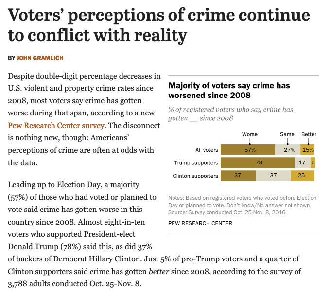]
---

# Crime in the US

.center[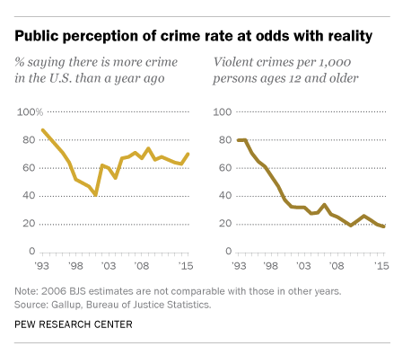]

.center[Source: [Pew Research](http://pewrsr.ch/2fxLhfk)]
---

# Crime in the UK

.center[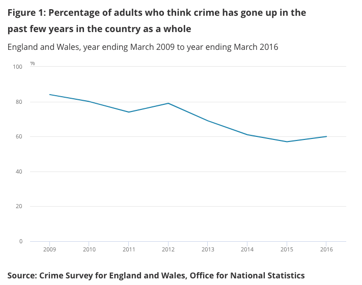]

.center[Source: [Office for National Statistics](https://www.ons.gov.uk/peoplepopulationandcommunity/crimeandjustice/articles/publicperceptionsofcrimeinenglandandwales/yearendingmarch2016)]
---

# Crime in the UK

.center[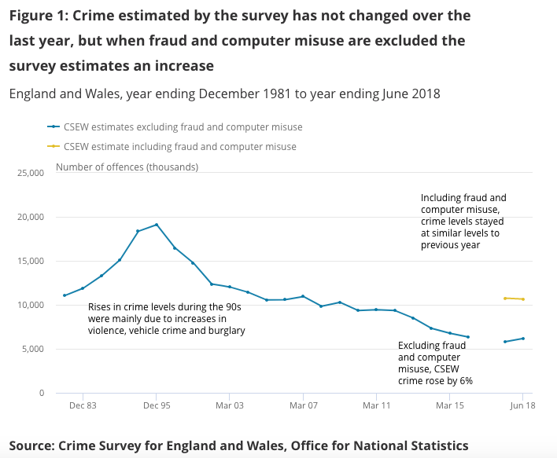]

.center[Source: [Office for National Statistics](https://www.ons.gov.uk/peoplepopulationandcommunity/crimeandjustice/bulletins/crimeinenglandandwales/yearendingjune2018)]
---

# Are we hard-wired to like bad news? 

.center[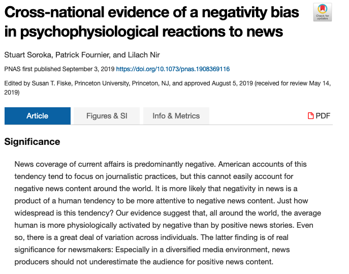]

.center[Source: [Soroka et al (2019)](https://doi.org/10.1073/pnas.1908369116)]
---

# Are we hard-wired to like bad news? 

.center[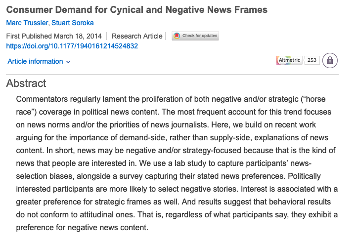]

.center[Source: [Trussler and Suroka (2017)](https://journals.sagepub.com/doi/abs/10.1177/1940161214524832?etoc=)]
---

# Short-term bias

S&P 500 annual returns

.center[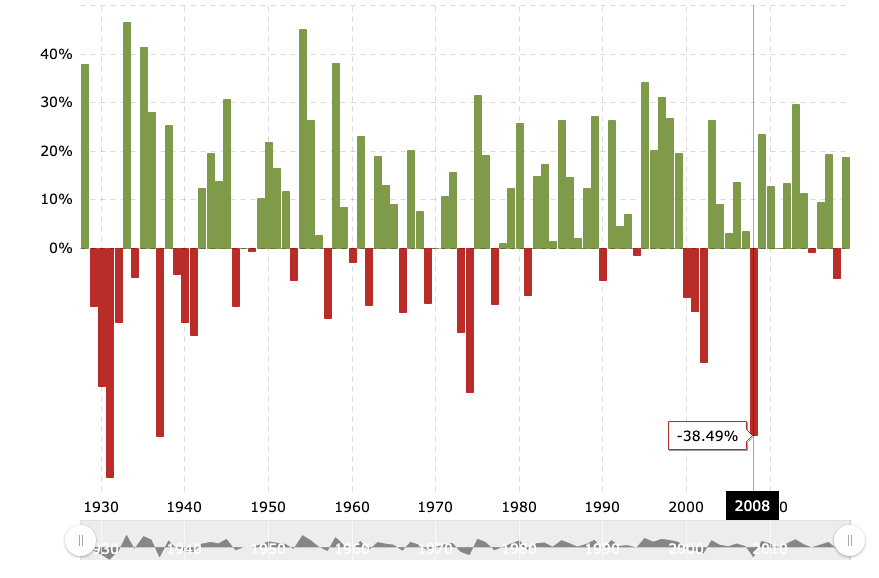]

.center[Source: [Macrotrends (2019)](https://www.macrotrends.net/2526/sp-500-historical-annual-returns)]
---

# Short-term bias 

.center[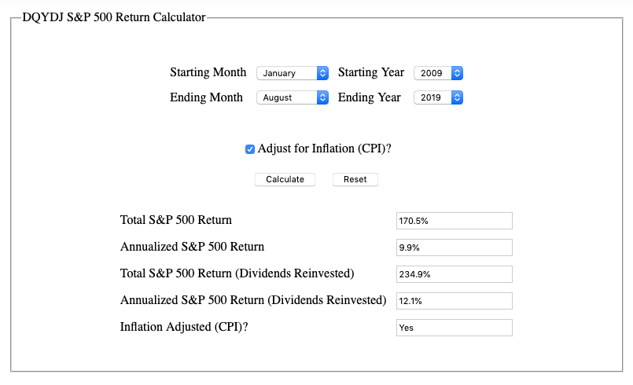]

.center[Source: [Dow Jones (2019)](https://dqydj.com/sp-500-return-calculator/)]
---

# Short-term bias 

DAX 30 Index

.center[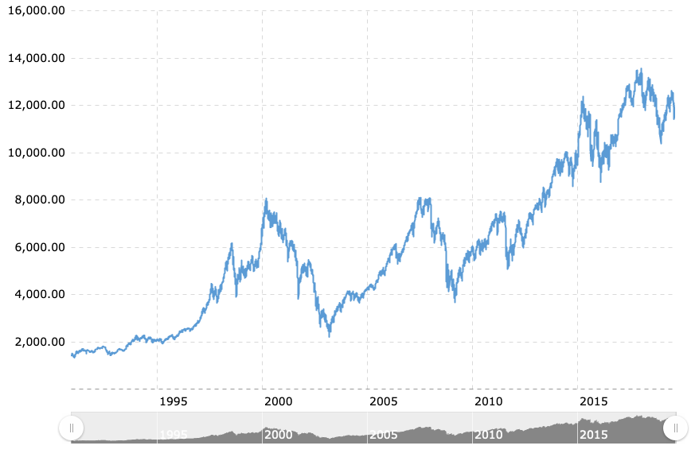]

.center[Source: [Macrotrends (2019)](https://www.macrotrends.net/2595/dax-30-index-germany-historical-chart-data)]
---

# Short-term bias 

Ibovespa Index

.center[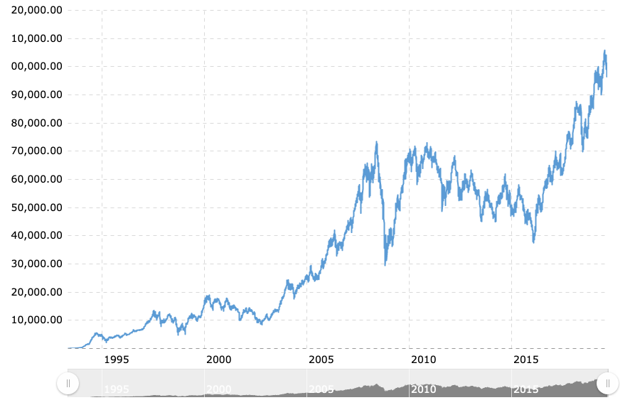]

.center[Source: [Macrotrends (2019)](https://www.macrotrends.net/2597/bovespa-index-brazil-historical-chart-data)]
---

# Long-term view of the economy

.font150[
* **Question**: Imagine you had US$10,000 in 1942 and you invested it in the S&P500. How much money do you think you would have today?  
]
--
.font150[
* Let Warren Buffett answer that question for you:  
]

.center[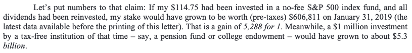]

.center[Source: 2018 Letter to the Shareholders of Berkshire Hathaway Inc: <http://www.berkshirehathaway.com/letters/2018ltr.pdf>]
---

# Long-term view of global violence

.center[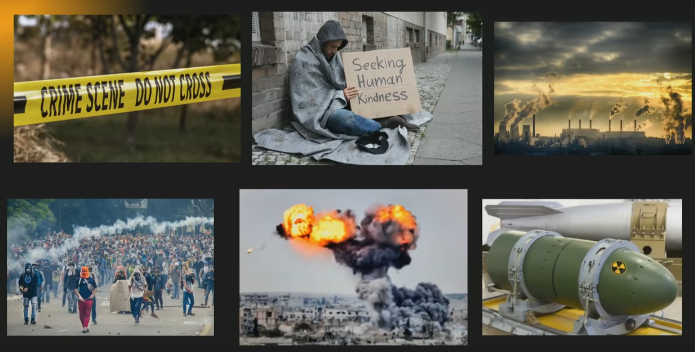]

.center[Source: [Steven Pinker (2018)](https://www.youtube.com/watch?v=yCm9Ng0bbEQ)]
---

# Wars among great powers

.center[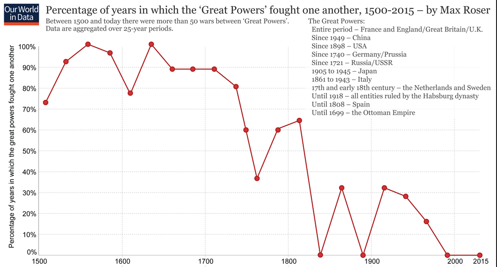]

.center[Source: [Our World in Data: War and Peace](https://ourworldindata.org/war-and-peace)]
---

# Wars are less violent 

.center[]

.center[Source: [Our World in Data: War and Peace](https://ourworldindata.org/war-and-peace)]
---

# Wars are less violent

.center[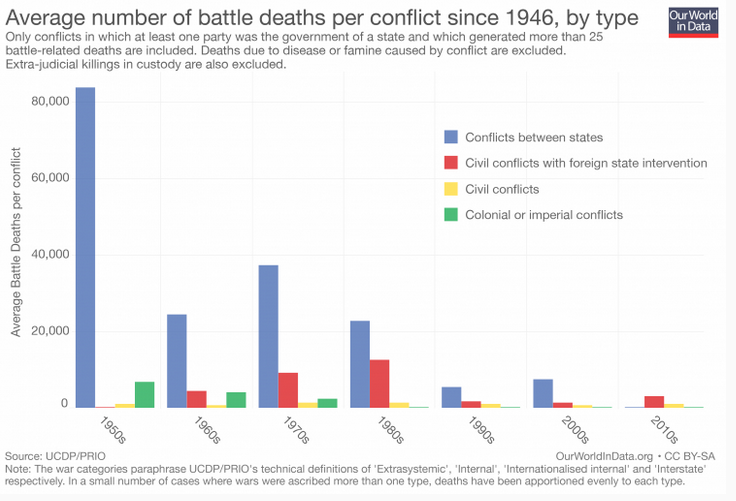]

.center[Source: [Our World in Data: War and Peace](https://ourworldindata.org/war-and-peace)]
---

# Nuclear war is less likely today 

.center[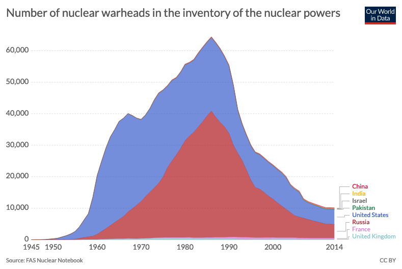]

.center[Source: [Our World in Data: Nuclear Weapons](https://ourworldindata.org/nuclear-weapons)]
---

# Nuclear war is less likely today

.font120[Non-nuclear states that started and stopped exploring nuclear weapons, 1945-2010]

.center[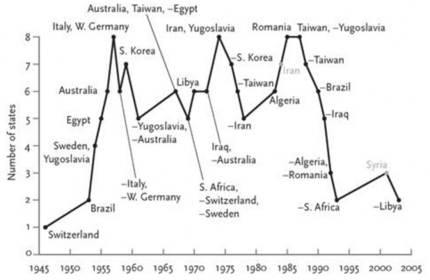]

.center[Source: [Steven Pinker (2011)](https://ourworldindata.org/nuclear-weapons)]
---

# Genocides are far less common 

.center[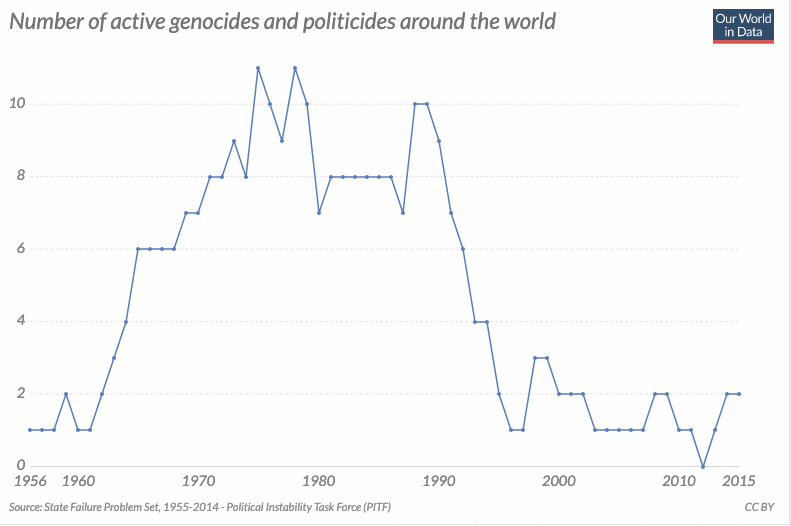]

.center[Source: [Our World in Data: Genocides](https://ourworldindata.org/genocides)]
---

# Hijackings disappeared 

.center[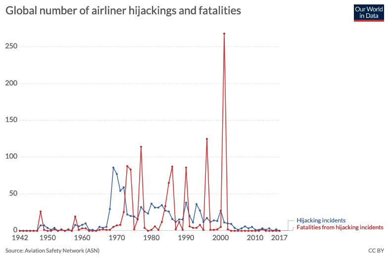]

.center[Source: [Our World in Data: Terrorism](https://ourworldindata.org/terrorism)]
---

# Terrorism is not common in the West 

.center[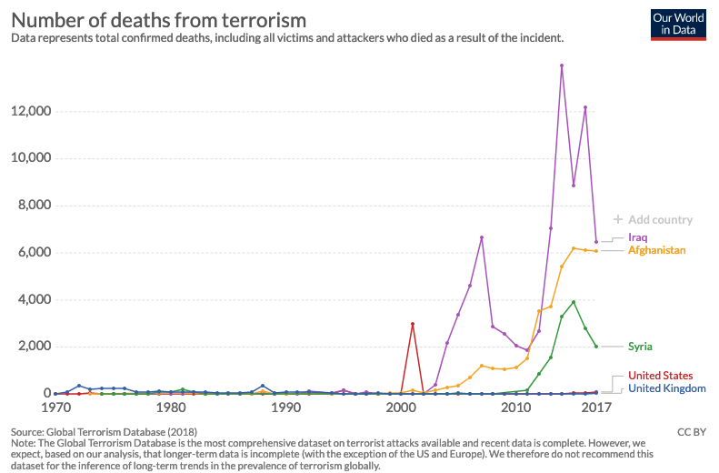]

.center[Source: [Our World in Data: Terrorism](https://ourworldindata.org/terrorism)]
---

# Even mass shootings aren't increasing 

.center[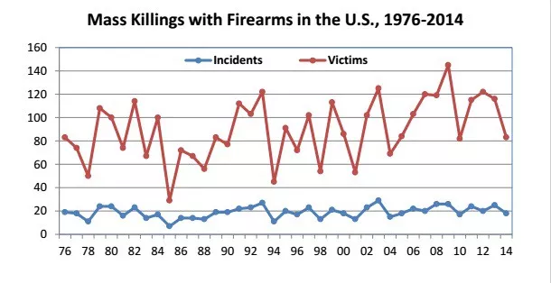]

.center[Source: [James Allan Fox (2019)](https://www.vox.com/2015/10/1/18000524/mass-shootings-rare)]
---

class: inverse, center, middle

# We're more peaceful, but why?

<html><div style='float:left'></div><hr color='#EB811B' size=1px width=720px></html> 
---

# Pinker (2013) 

.font150[
* If human nature hasn't changed, what has?
]
--
.font150[
* Violence is not homeostatic, but opportunistic 
]
--
.font150[
* Increased costs of violence:
	- Stronger governments
	- Democracy
	- Trade
	- International community and organisations
	- Humanistic ideologies, such as natural rights
]
---

# Sceptical view of the long peace 

.font150[
* What if we haven't had a major war...
* ... just because they don't happen often?
]
--
.font150[
* **Fat-tailed events**: some events happen so unfrequently that we underestimate them
* E.g.: massive financial crises, large disease outbreaks

* Pareto principle: 80-20 rule 
]
--
.font150[
* **Absense of evidence is not the same as evidence of absense** 
]
---

# Black swan

.center[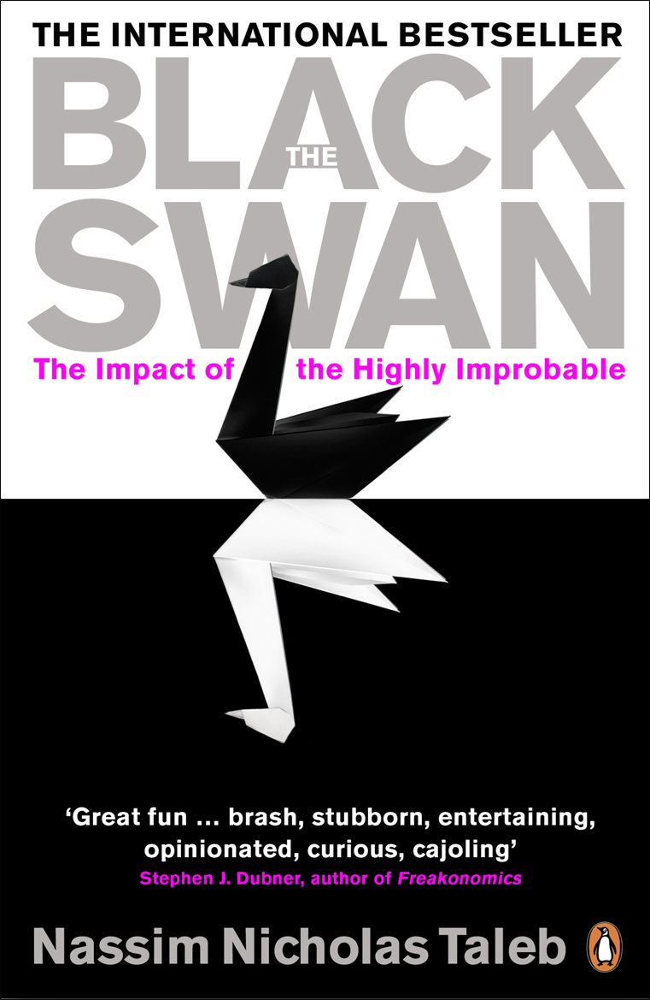]
---

# Large wars as black swans

.font150[
* Cirilo and Taleb (2015) make two important comments:

	- 1) The Law of Large Numbers converges much more slowly in fat-tailed distributions
	- "We require more data to assert that there are no black swans than to assert that there are black swans"
	- 2) The means are misleading with dealing with extreme events
	- "for fat-tailed variables, the mean is almost entirely determined by extremes. If you are uncertain about the tails, then you are uncertain about the mean"
]
---

# Number of conflicts

.center[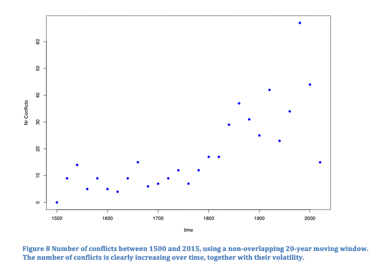]
---

# Number of battle-related deaths 

.center[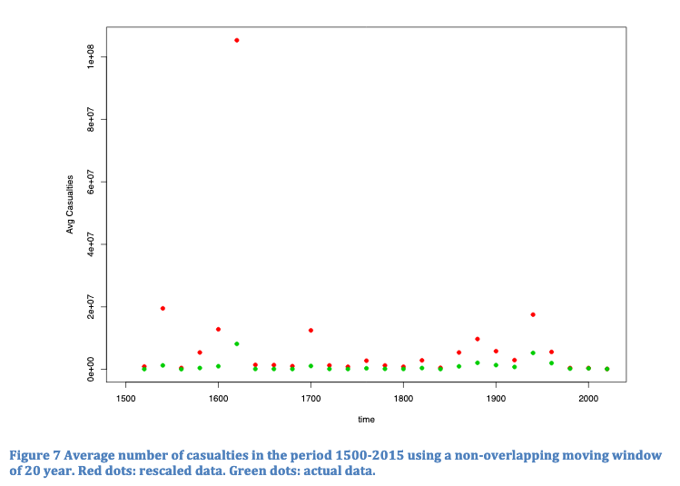]
---

# Is there a trend?

.center[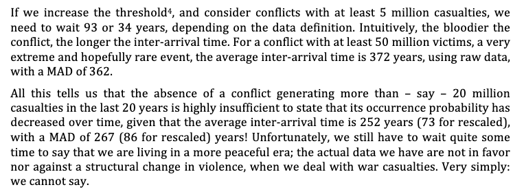]
---

class: inverse, center, middle

# Are battle deaths decreasing?

<html><div style='float:left'></div><hr color='#EB811B' size=1px width=720px></html> 
---

# Gohdes and Price (2012) 

.font150[
* What if our data are wrong?

* PRIO is the most important think-tank for peace studies 

* The PRIO Battle Deaths Dataset is widely used in academia

* G&P argue that the dataset has a lot of *missing data* and the data is prone to *measurement error*
]
---

# Gohdes and Price (2012)

.font150[
* Issues of data quality:
	- No reliable estimates for many conflicts, specially before 1980
	- E.g.: "for the Persian Gulf War in Iraq in 1991, the PRIO Battle Deaths Dataset gives a disaggregated best estimate of 28,245, a low estimate of 1,545, and a high estimate of 43,245 killed in combat situations" (p. 1095)
	- Which one should we believe in? The best, high or low? 
]
---

# Gohdes and Price (2012)

.font150[
* Issues of data availability:
	- No yearly data available for most conflicts before 1980
	- Interpolate mean yearly estimates according to qualitative knowledge of the case, when available
	- E.g.: "60.2 percent of the units before 1975 do not even include information on conflict-internal trends." (p. 1096)
]
---

# Differences in battle deaths 

.center[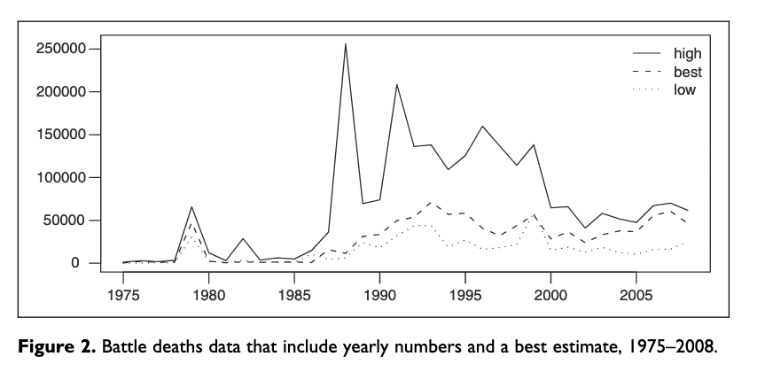]
---

# Differences in battle deaths 

.center[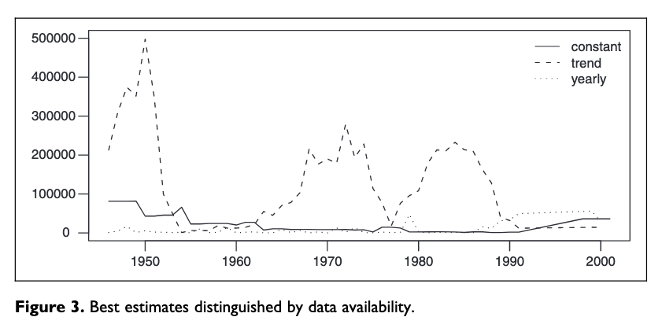]
---

# Convenience samples

.font150[
* Why are convenience samples bad for statistical inference? 
]
--
.font150[
* _Selection bias_ 
]
--
.font150[
* Can we correct for selection bias in data? 
]
--
.font150[
* _Very rarely_: only if we have an idea of how the true population looks like. 

* _We often don't_

* Some statistical procedures can approximate it, but only with a lot of uncertainty
]
---

# Gohdes and Price (2012)

.font150[
* They replicate the analysis using heteroskedasticity-robust clustered standard errors and polynomial trends

* Result: Inverted U - battle deaths decline in the 1980s and are rising again 
]

.center[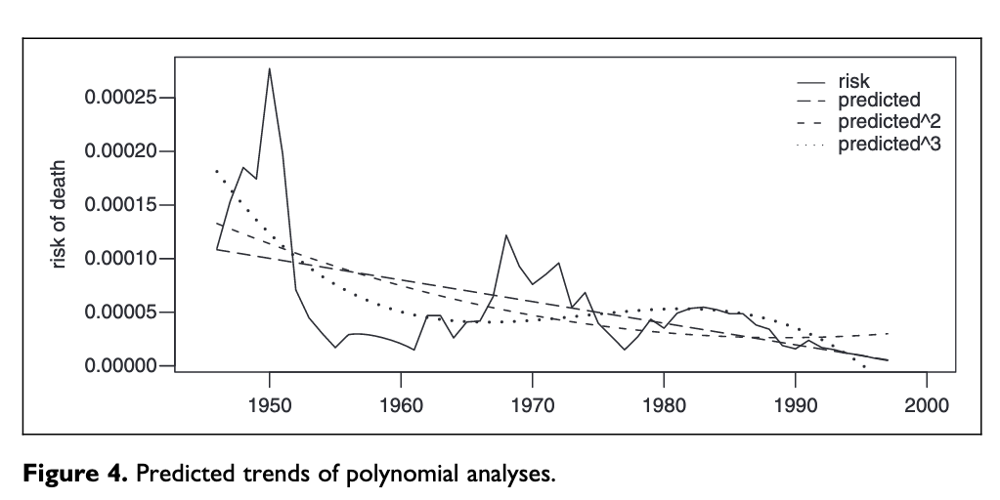]
---

# Lacina and Gleditsch (2012)

.font150[
* Issues of data quality:
	- Best estimate is missing for some years, and in others there are two or more estimates available
	- Conflicts tend to be short: interpolation isn't a great problem
	- Armies are good record-keepers
	- Applying smoothing functions work better than arbitrary model assumptions 
]
---

# Lacina and Gleditsch (2012)

.center[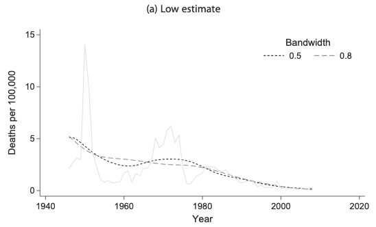]
---

# Lacina and Gleditsch (2012)

.center[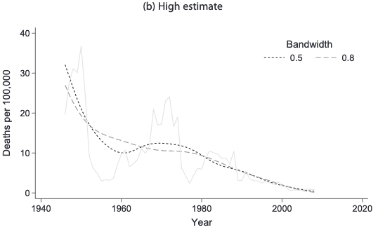]
---

# Underestimates or overestimates?

.font150[
* The authors argue that:
	- Media reports tend to underestimate battle deaths
	- Academic scrutiny corrects eventual errors in data
	- Experts and NGOs tend to overestimate conflict size
	- Thus, the biases can go in both directions

* _What do you think?_
]
---

# Violence in the Pinochet regime

.center[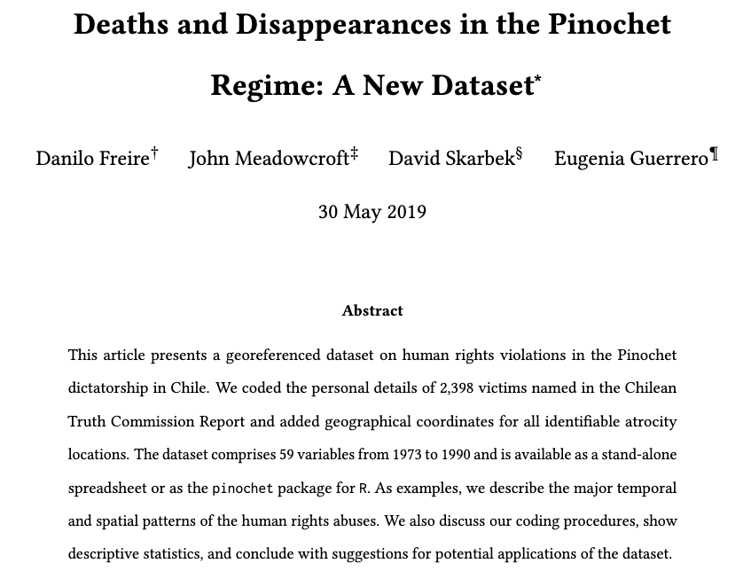]
---

# Violence in the Pinochet regime

```{r, warnings=F, errors=F, messages=F}
library(pinochet)
names(pinochet)
```
---

# Violence in the Pinochet regime

.center[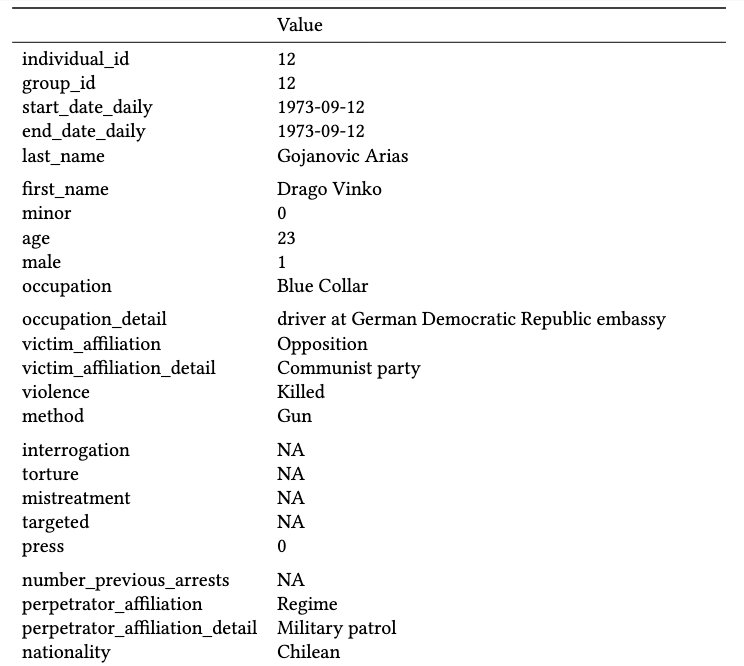]
---

# Violence in the Pinochet regime

.center[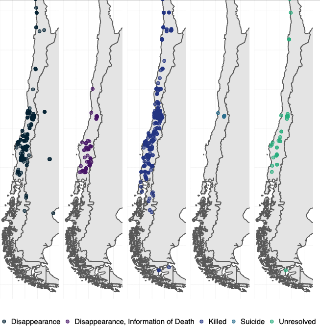]
---

class: inverse, center, middle

# Wrap-up

<html><div style='float:left'></div><hr color='#EB811B' size=1px width=720px></html> 
---

# To sum up...

.font150[
* Short-term and negativity biases are always present in media reports

* Long-run trend for the economy is very robust (and it's going up)

* Long-run trend for war and peace.... is a bit less robust

* International and civil wars are indeed much more rare

* And so are many other types of violence

* ... but for how long? 
]
---

# To sum up...

.font150[
* The best way to improve those estimates is to understand _cause and effect_

* Knowing whether A causes B allows us to make better predictions about the future

* And this is what we will do in this course:
	- Discuss recent theories about civil wars, genocides, and terrorism
	- See their limitations and think about how to improve them
	- Hopefully, have fun along the way! 
]

---
class: inverse, center, middle

# Thanks for coming! See you next week!

<html><div style='float:left'></div><hr color='#EB811B' size=1px width=720px></html> 


