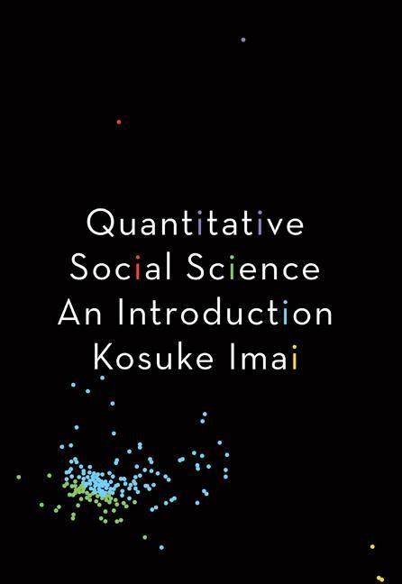
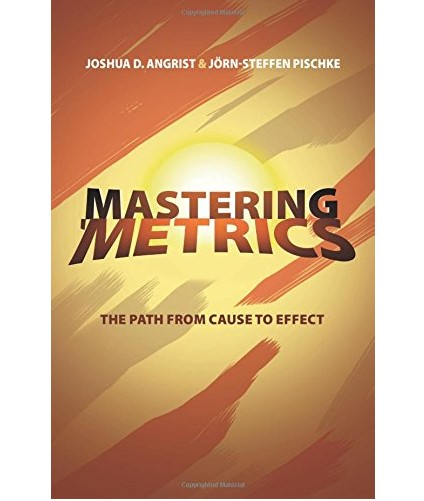
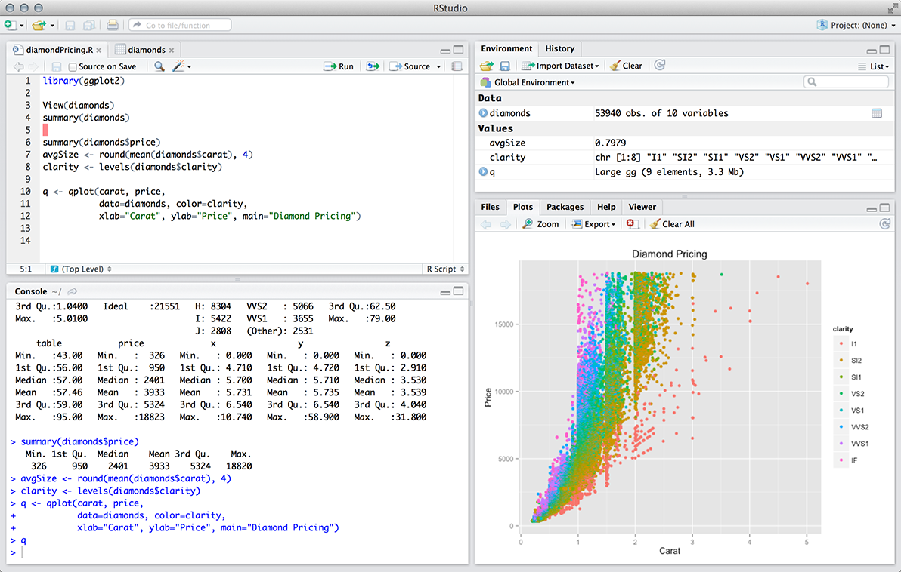
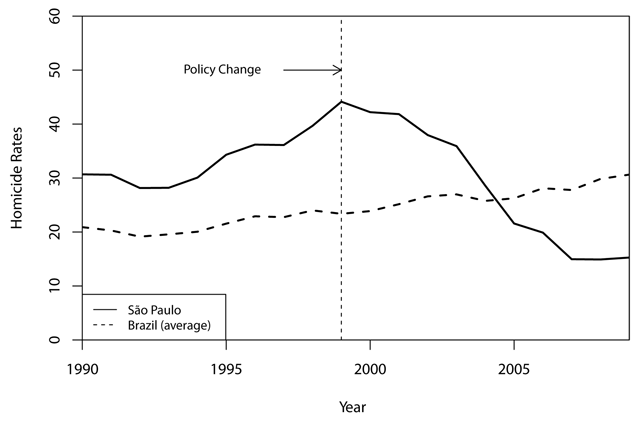
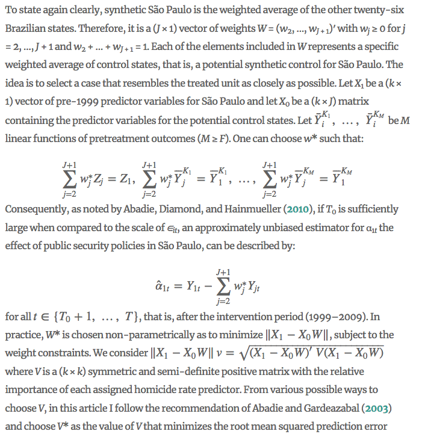
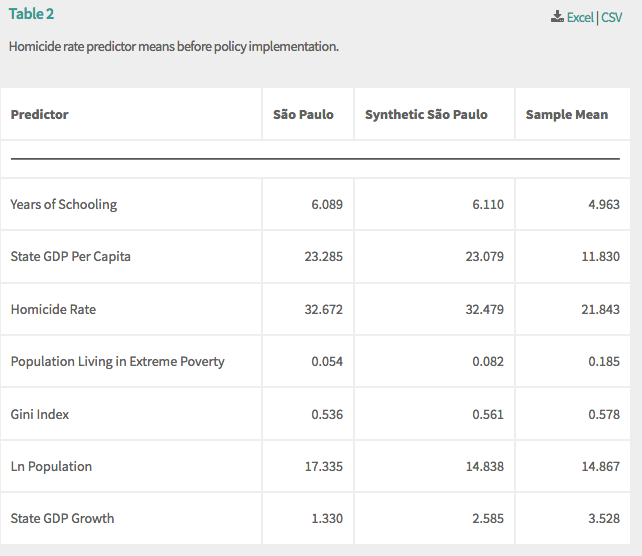
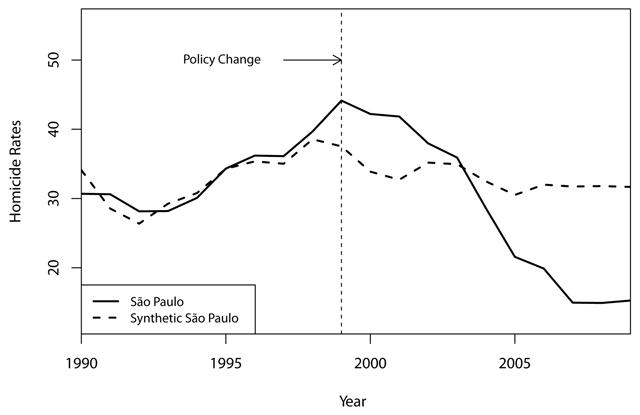
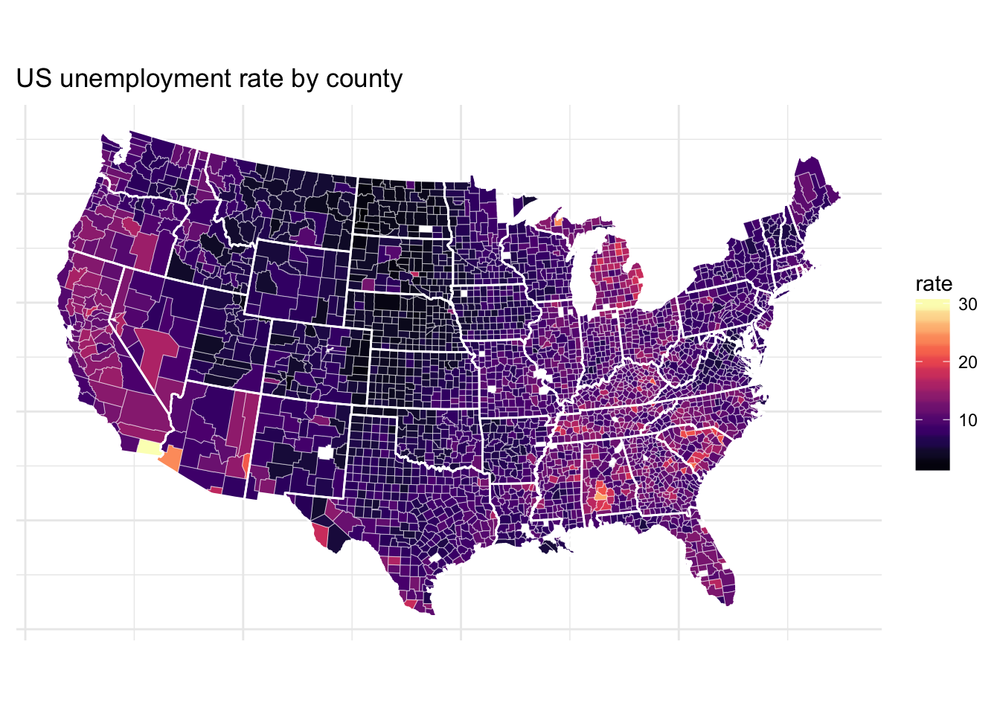
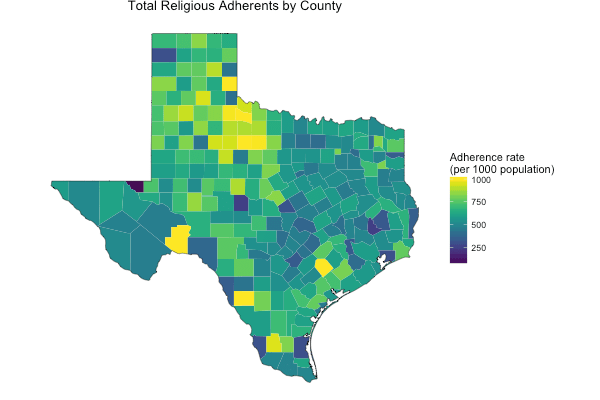

```{r setup, include=FALSE}
options(htmltools.dir.version = FALSE)
```

<style>

.remark-slide-number {
  position: inherit;
}

.remark-slide-number .progress-bar-container {
  position: absolute;
  bottom: 0;
  height: 6px;
  display: block;
  left: 0;
  right: 0;
}

.remark-slide-number .progress-bar {
  height: 100%;
  background-color: #EB811B;
}

.orange {
  color: #EB811B;
}
</style>

# Introduction

.font180[**Danilo Freire**]

.font120[
* Eu sou brasileiro

* Masters from the Graduate Institute Geneva

* PhD in Political Economy at King's College London

* Post-doctoral research fellow in the Political Theory Project

* Political violence, collective action, experimental methods, machine learning

* [http://danilofreire.github.io](http://danilofreire.github.io)
* [danilo_freire@brown.edu](mailto:danilo_freire@brown.edu)
]
---

background-image: url(neymar.jpg)

class: clear
---

background-image: url(carnaval.jpg)

class: clear
---

background-image: url(rio.jpg)

class: clear
---

class: inverse, center, middle

# What about you?

<html><div style='float:left'></div><hr color='#EB811B' size=1px width=720px></html> 
---

# Introduce yourself

.font150[
* What is your name?

* Where do you come from?

* Tell me something I don't know about your city or country

* Why are you taking this course?
]
---

class: inverse, center, middle

# POLS 1600

<html><div style='float:left'></div><hr color='#EB811B' size=1px width=720px></html> 
---

# Logistics

.font150[
* We meet every Monday, Wednesday and Friday at 13:00 in the [CIT Centre (Thomas Watson CTI) 227](http://brown.edu/Facilities/Facilities_Management/maps/index.php#building/WATSONCIT)

* All course information will be available at [http://danilofreire.github.io/pols1600](http://danilofreire.github.io/pols1600)

* Syllabus will probably be updated throughout the course (but not much)

* Office hours: at your convenience (just e-mail me first)

* Office address: [8 Fones Alley, first floor, office 114](https://goo.gl/maps/MRQNS9EC9Qv)
]
---

# Textbooks

.center[]
---
# Textbooks

.center[]
---

# Learning Objectives

.font120[
* Be a critical consumer of statistical information
]
--
.font120[
* Be a critical _producer_ of statistical information
]
--
.font120[
* Learn how to code
]
--
.font120[
* Learn how to use R for quantitative analysis
]
--
.font120[
* Learn the basics of data visualisation
]
--
.font120[
* Estimate the relationship among many variables of interest using statistical models (OLS)
]
--
.font120[
* .orange[Have a good time with your colleagues]
]
---

# Grading

.font150[
* **Participation**: 10%

* **Problem Sets**: 40%

* **Final Project**: 50%
]
--
.font150[
* _No exams_
]
--
.font150[
* Read the materials and do the exercises _before_ class
]
---

# Resources

.font150[
* This course is relatively light in mathematics...
]
--
.font150[
* ... but it is quite heavy in programming
]
--
.font150[
* .orange[Programming can be hard and frustrating...]
]
--
.font150[
* ... but it doesn't have to
] 
--
.font150[
* R has a steep learning curve, so practice is fundamental 
]
---

class: clear

.center[]
---
class: inverse, center, middle

# Why programming?

<html><div style='float:left'></div><hr color='#EB811B' size=1px width=720px></html> 

---

# Why programming?

.center[]
---

# Why programming?

.font150[
* Nowadays, political science is mostly quantitative

* Newspapers often use R to plot graphs and convey statistical information...and you can do it too
]
---

background-image: url(sp.jpg)

class: clear
---

background-image: url(violencia.jpg)

class: clear
---

background-image: url(economist.png)

class: clear
---

background-image: url(policia.jpg)

class: clear
---

background-image: url(pcc.jpg)

class: clear
---

# Freire (2018)

.center[]
---

# Freire (2018)

.center[]
---

 # Freire (2018)

.center[]
---

# Freire (2018)

```{r, eval=FALSE}
dataprep.out <-
        dataprep(df,
                 predictors = c("state.gdp.capita",
                                "state.gdp.growth.percent",
                                "population.projection.ln",
                                "years.schooling.imp"
                                ),
                 special.predictors = list(
                         list("homicide.rates", 1990:1998, "mean"),
                         list("proportion.extreme.poverty", 1990:1998, "mean"),
                         list("gini.imp", 1990:1998, "mean")
                         ),
                 predictors.op = "mean",
                 dependent     = "homicide.rates",
                 unit.variable = "code",
                 time.variable = "year",
                 unit.names.variable   = "state",
                 treatment.identifier  = 35,
                 controls.identifier   = c(11:17, 21:27, 31:33, 41:43, 50:53),
                 time.predictors.prior = c(1990:1998),
                 time.optimize.ssr     = c(1990:1998),
                 time.plot             = c(1990:2009)
)
```
---
# Freire (2018)

.center[]
---

# Freire (2018)

.center[]
---

# Data visualisation in R

.center[]
---

# Data visualisation in R

.center[]
---

class: inverse, center, middle

# Questions?

<html><div style='float:left'></div><hr color='#EB811B' size=1px width=720px></html> 

---
# Homework

.font150[
* Read chapter 1 of QSS 

* Download and install R and RStudio: 

* <https://cloud.r-project.org/>

* <https://www.rstudio.com/> (RStudio Desktop, free version)
]

---
class: inverse, center, middle

# See you on Friday!

<html><div style='float:left'></div><hr color='#EB811B' size=1px width=720px></html> 


