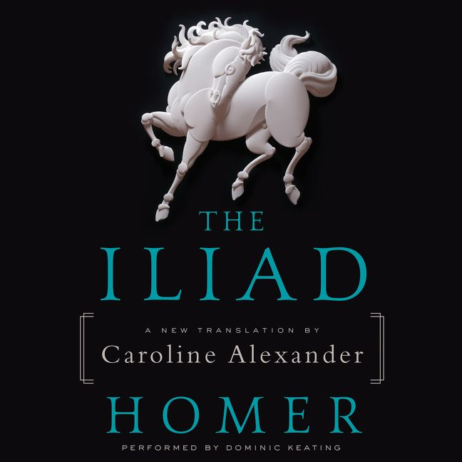
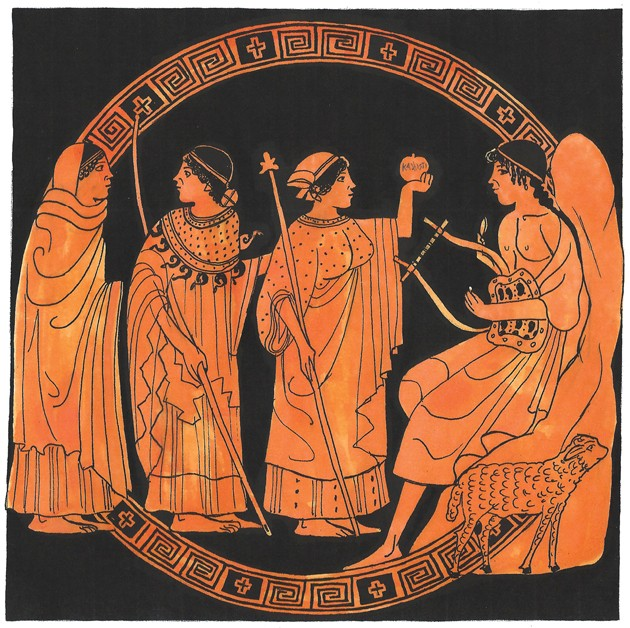
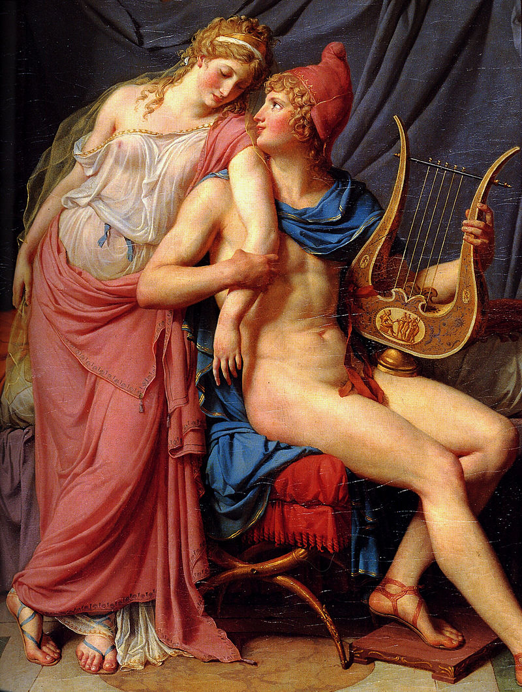
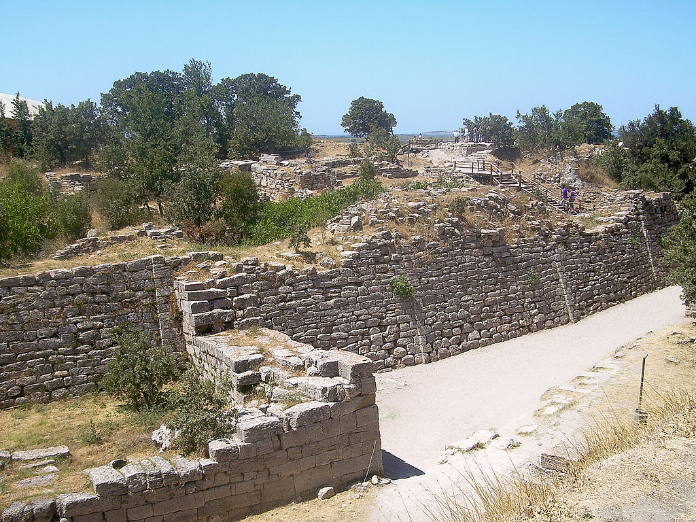
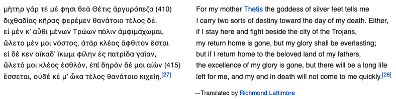
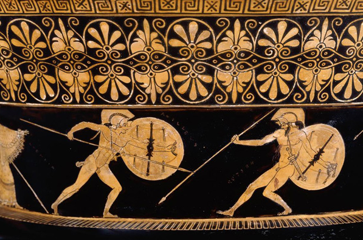

```{r setup, include=FALSE}
options(htmltools.dir.version = FALSE)
```

<style>

.remark-slide-number {
  position: inherit;
}

.remark-slide-number .progress-bar-container {
  position: absolute;
  bottom: 0;
  height: 6px;
  display: block;
  left: 0;
  right: 0;
}

.remark-slide-number .progress-bar {
  height: 100%;
  background-color: #EB811B;
}

.orange {
  color: #EB811B;
}
</style>

# Some info about the course

.font150[
* Website: <http://danilofreire.github.io/pols1824w>

* Email: [danilofreire@brown.edu](mailto:danilofreire@brown.edu) 

* Office address: [8 Fones Alley, first floor, office 114](https://goo.gl/maps/MRQNS9EC9Qv) 

* Office hours: every afternoon, but please email me first 
]
---

# Last week we saw that... 

.font150[
* We do a pretty bad job at long-term thinking

* We are prone to negavitity bias too

* The economy has done incredibly well in the long run...

* It seems that other things are going fine too...
	
* ... yet conflicts still occur 
	
* Let's see why: we start with **civil wars**
]
---


class: inverse, center, middle

# What is civil war?

<html><div style='float:left'></div><hr color='#EB811B' size=1px width=720px></html> 
---

# What is civil war?

.font150[
* Civil wars are probably as old as humankind itself

* They have been discussed, debated, and praised through history

* Pointed out as the cause of demise of many civilisations 

* Hobbesian state of nature: "*homine homini lupus est*"
]
---

# The Iliad

.center[]
---

# Apple of discord

.center[]
---

# Helen

.center[]
---

# Troy

.center[]
---

# κλέος

.center[]

.center[]
---


