```{r setup, include=FALSE}
options(htmltools.dir.version = FALSE)
```

<style>

.remark-slide-number {
  position: inherit;
}

.remark-slide-number .progress-bar-container {
  position: absolute;
  bottom: 0;
  height: 6px;
  display: block;
  left: 0;
  right: 0;
}

.remark-slide-number .progress-bar {
  height: 100%;
  background-color: #EB811B;
}

.orange {
  color: #EB811B;
}
</style>

# Some info about the course

.font150[
* Website: <http://danilofreire.github.io/pols1824w>

* Email: [danilofreire@brown.edu](mailto:danilofreire@brown.edu) 

* Office address: [8 Fones Alley, first floor, office 114](https://goo.gl/maps/MRQNS9EC9Qv) 

* Office hours: every afternoon, but please email me first 
]
---

# Final project

.font150[
* About 20 pages

* ~~Up to 3 people per group~~ Individual work

* **1st of October**: one-page summary of your paper idea

* Each student will review 2 summaries (one-page comment too)

* **8th of October**: please send me your comments

* **19th of November**: discussion of your projects

* **17th of December**: deadline for the capstone project
]
---

# Last week we saw that... 

.font150[
* We do a pretty bad job at long-term thinking

* We are prone to negavitity bias too

* The economy has done incredibly well in the long run (about 250 years)

* It seems the world is becoming more peaceful too (we're not sure)
	
* Nevertheless, serious conflicts still occur 
	
* Let's see why: we start with **civil wars**
]
---

class: inverse, center, middle

# What is civil war? 

<html><div style='float:left'></div><hr color='#EB811B' size=1px width=720px></html> 
---

# What is civil war?

.font150[
* Civil wars are as old as humankind itself

* They have been discussed, debated, and often praised through history

* Pointed out as the cause of demise of many civilisations 

* Hobbesian state of nature: "*homine homini lupus est*"
]
---

# The Iliad

.center[]
---

# Apple of discord

.center[]
---

# Helen

.center[]
---

# Troy

.center[]
---

# Fame (κλέος)

.center[]

.center[]
---

# Athens versus Sparta

.center[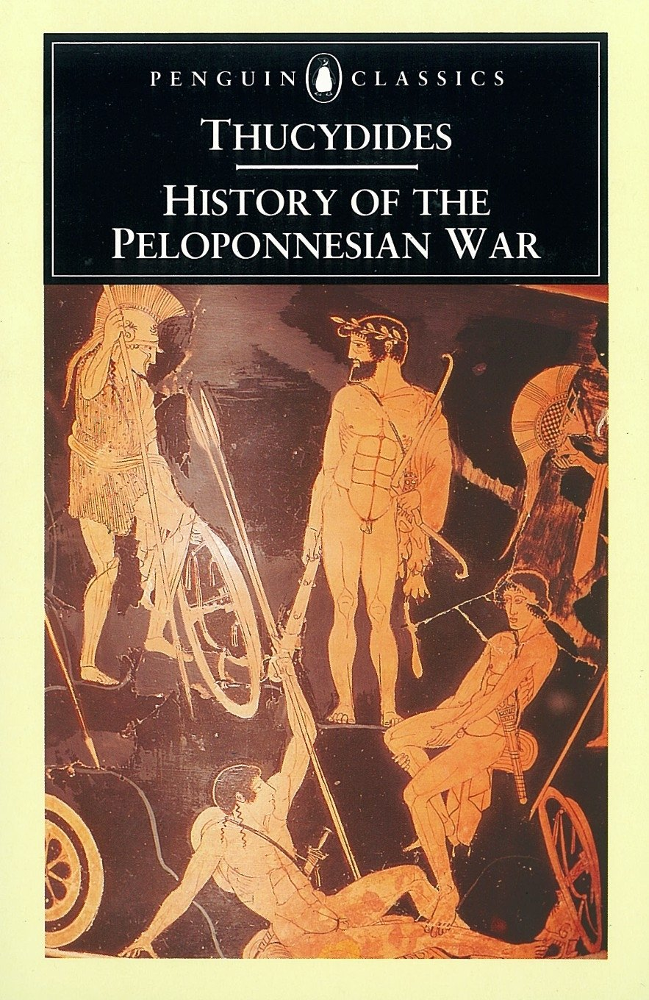]
---

# Stasis (στάσις)

.center[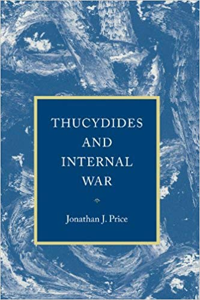]
---

# Civil war in Corcyra

.font150[
Thucydides, III.82.3-5: 
]

.font120[
*"Revolution thus ran its course from city to city, and the places which it arrived at last, from having heard what had been done before, carried to a still greater excess the refinement of their inventions, as manifested in the cunning of their enterprises and the atrocity of their reprisals. Words had to change their ordinary meaning and to take that which was now given them. Reckless audacity came to be considered the courage of a loyal ally; prudent hesitation, specious cowardice; moderation was held to be a cloak for unmanliness; ability to see all sides of a question, inaptness to act on any. Frantic violence became the attribute of manliness; cautious plotting, a justifiable means of self-defence. The advocate of extreme measures was always trustworthy; his opponent a man to be suspected."*]
---

# Roman Empire

.center[]
---

# Roman Empire

.font150[
Created by civil war... 
]

.center[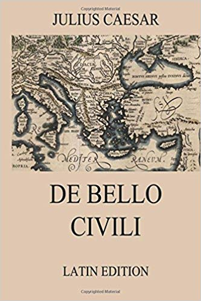]
---

# Roman Empire

.font150[
... and destroyed by civil war 
]

.center[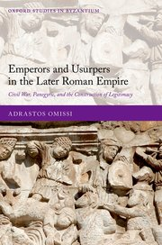]
---

# Thomas Hobbes

.center[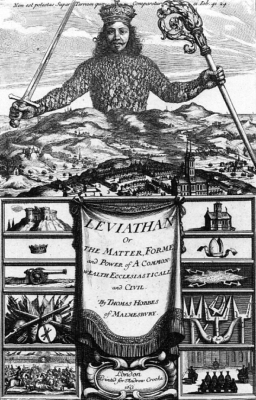]
---

class: clear

background-image: url(leviathan02.jpg)
---

# English Civil War

.center[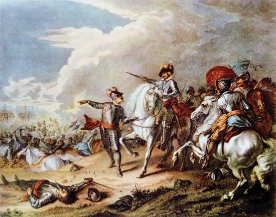]
---

# American Civil War

.center[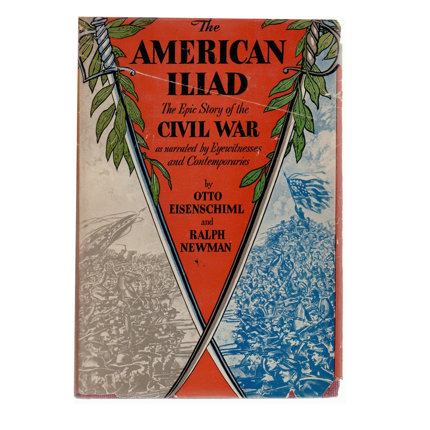]
---

# French Revolution

.center[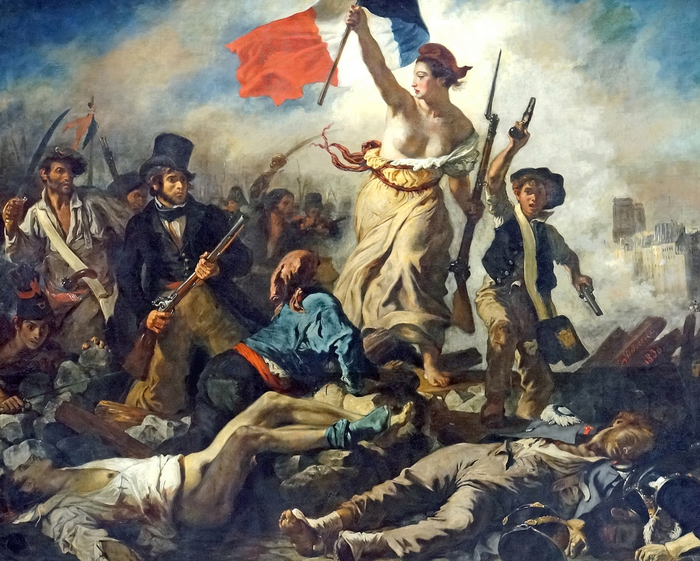]
--

.font150[
.center[**Question**: Why don't we call it the French Civil War?]
]
---

class: inverse, center, middle

# So what is civil war, then?

<html><div style='float:left'></div><hr color='#EB811B' size=1px width=720px></html> 
---

# Kalyvas (2006)

.font140[
*  Literature on civil war has grown exponentially over the last decades:
	- Onset
	- Resolution
	- Duration
	- Social bases
	- Political and social outcomes
	- Postwar justice and reconciliation

* Civil wars remain ill-defined

* Comparative studies require a common, broad definition of internal war
]
---

# Terminology

.font140[
* Strongly politicised term: confers/removes legitimacy
	- Our side: heroes, warriors, freedom fights
	- Their side: bandits, criminals, terrorists

* A neutral definition: 
	- *[...] armed combat within the boundaries of a recognised sovereign entity between parties subject to a common authority at the outset of the hostilities* (p. 17) 
	- Sceptical about motivations, parties, and outcomes
	- Key part: *de facto* territorial division
]
---

# Questions

.font150[
* How to differentiate between terrorism and civil war?

* Are criminal groups different from insurgents?

* What about conflicts *among* insurgent groups? Are they also civil wars?
]
---

# What is violence?

.font150[
* **Violence**:
	- Take many, many forms: physical, verbal, sexual, lethal, etc
	- Focus on _lethal violence_:
	- Most severe (?)
	- Easier to measure

* Although very related, _civil war_ and _violence in civil war_ are distinct concepts

* Violence is _both an outcome and a means_ of civil war

* Again: _it is also a tool_
]
---

# Victims and perpetrators

.font130[
* Kalyvas makes a strong statement here (p. 21, edited): 

*"[...] little or no information is provided about the victims' histories and lives before the advent of violence. Such a view assumes (and further propagates) a dichotomous world populated only by victims and perpetrators, [... so] victims cannot be guilty. Yvon Grenier (1999:2) portrays the literature on Latin American insurgencies as suggesting "a world inhabited by women, children, and the elderly." Typically overlooked is a large "gray zone" populated by those who partake in the process of violence in a variety of ways [...] as either perpetrators or victims [...]. Yesterday's victims may turn into tomorrow's victimizers and vice versa. Women and children, usually portrayed as victims, are often active and willing participants in all kinds of activities, including combat."*
]
---

# Aims of violence

.font150[
* What is violence used for?
	- Senseless: killing for the sake of killing
	- Kalyvas sees "expressive violence" as a probematic category. Why?
]

.font150[
* Conflates several reasons
* Subject to _post hoc_ rationalisation
* Endogenous to the conflict itself
* Most often, perpetrators do not have severe psychological issues 
]
---

# Aims of violence

.font150[
* Strategic/instrumental violence: 
	- Even extremely barbaric uses of violence might have a purpose
	- E.g.: cannibalism is (obviously) used to frighten others
	- Individual motivations cannot sustain a long war

* Mix between the two:
	- Leaders might have strategic goals
	- Followers might operate according to expressive logics
]
---

# Strategic violence

.font150[
* Instil fear and send a message

* "Communicative violence" in other settings:
	- Cutting hands of thieves (Sierra Lione)
	- Raping child molesters (prison gangs)
	- Forced self-amputation of fingers (Yakuza)

* **Question**:
	- Can those methods be used rationally?
]
--
.font150[
* _Yes_ 
]
---

# Classification

.center[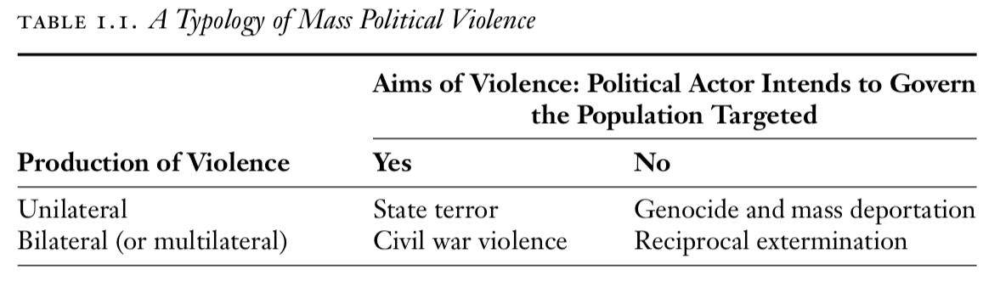]
---

class: inverse, center, middle

# Questions?

<html><div style='float:left'></div><hr color='#EB811B' size=1px width=720px></html> 
---

# Pathologies: Partisan bias

.font150[
* Sympathy for victims implies barbarism of others   

* Normatively fair; theoretically problematic

* Civil war causes barbarism; barbarism might not cause civil war

* "Glory is monopolized by one’s own camp, crime by the other's"

* "Revolutionary romanticism"
]
---

# Political bias

.font150[
* **War is not politics**]
--

.font150[
* "fundamental distinction between peaceful political competition and armed combat"
]
--

.font150[
* War creates its own dynamics:
	- More constains, more repression
	- Higher stakes

* **Question**: how do these constrains impact leaders?
]
---

# Urban bias

.font150[
* Civil war is often a rural phenomenon

* Politicians, the press, and academics are located in cities

* Prejudice and costly information

* Little understanding of local dynamics:
	- Ascribing broad ideological motives for rebel groups
	- Fighters tend to rationalise their actions _a posteriori_
	- Offer narratives that fit what they believe others want to hear
]
---

# Preference falsification

.center[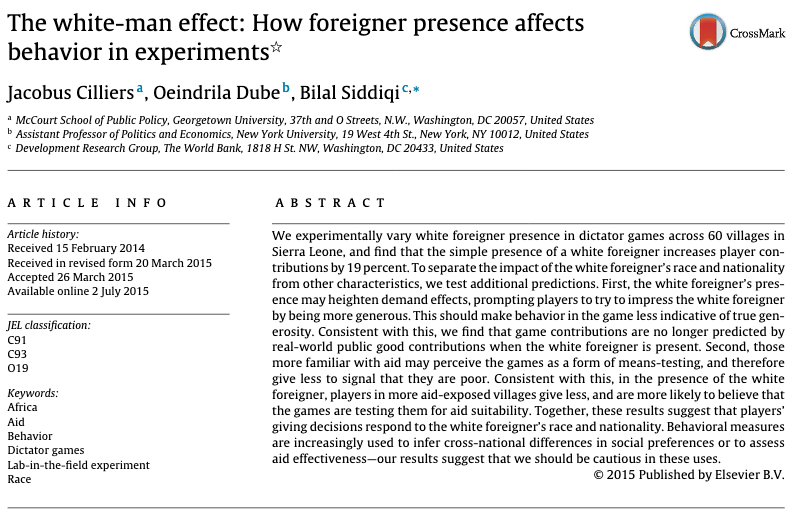]

.center[Source: [Cillier et al (2015)](https://www.sciencedirect.com/science/article/pii/S0167268115000906)]
---

# Preference falsification 

.center[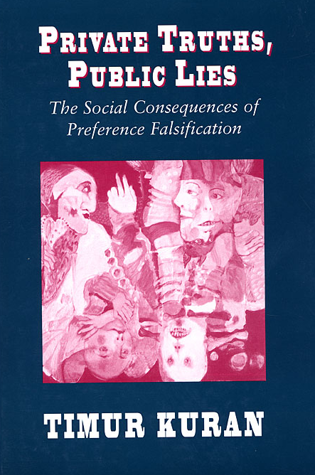]
---

# Urban bias

.font150[
* Existing societies vs narratives about such societies

* Bias toward written sources

* Emphasis on "top-down" motives, broad narratives

* Fixed identities: catholics vs protestants, peasants vs elites, etc
	- Endogeneity of social clivages: they change _because_ of the war

* Researchers should focus more on the local 
]
---

# Selection bias

.font150[
* We study places _where wars occur_

* Variables can cause both war and violence in war

* Data are problematic: we have more information about some places than others

* Overaggregation and acontextual

* Fake news
]
---

class: inverse, center, middle

# Questions?

<html><div style='float:left'></div><hr color='#EB811B' size=1px width=720px></html> 
---

# Sambanis (2004)      

.font150[
* Significant variation in civil war coding in datasets

* _Ad hoc_ criteria to distinguish civil wars from other conflicts

* First quantitative definition:

	- *"any armed conflict that involves (a) military action internal to the metropole, (b) the active participation of the national government, and (c) effective resistance by both sides."* (Small and Singer 1982, 210)
	- 1,000 battle-related deaths per calendar year
]
---

# Problems

.font150[
* Extranational or internal? (colonial wars)

* Organised opposition or genocide?

* Why not 999 deaths?

* Temporal dependence: one or many conflicts? 

* Many small conflicts are a civil war?

* How can we know whether the person was indeed killed because of the war?
]
---

# Extrasystemic wars

.font150[
* How do we classify colonial wars?
	- International or civil wars?

* Should the Algerian Revolution (1954-1962) count as a French civil war?

* If so, all other variables (democracy, GDP, population) has to be adjusted for the whole empire

* Lose context: France was democractic but Algeria was not
]
---

# Comparison between different datasets

.font150[
* Correlation is sometimes modest (0.42-0.46) 

* Parsimonious solution: run models with all of them
]
---

# Results

.center[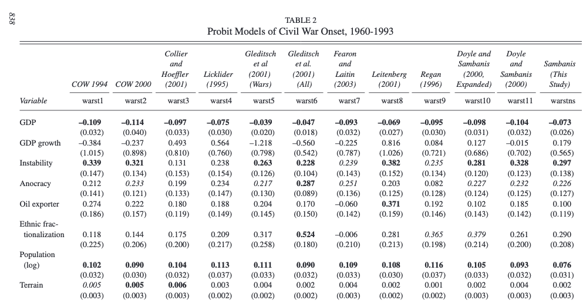]

.center[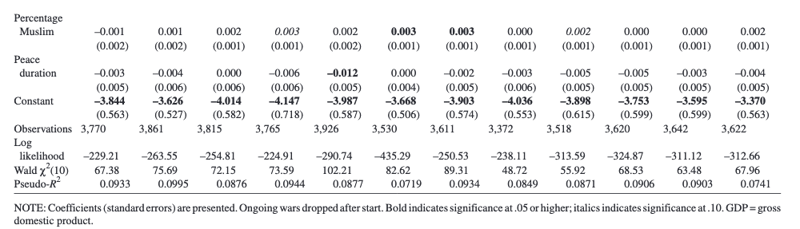]
---

# What datasets do we use today?

.center[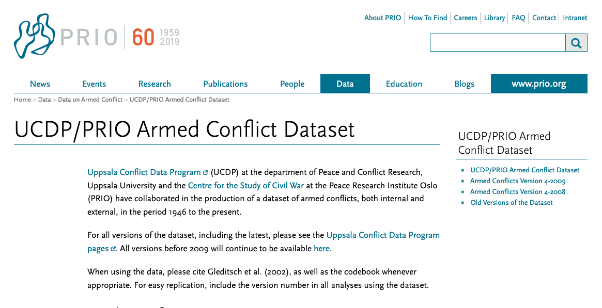]

.center[Source: [PRIO (2019)](https://www.prio.org/Data/Armed-Conflict/UCDP-PRIO/)]
---

# PRIO/UCDP

.font150[
* Two thresholds: 25 and 1000 annual battle-deaths 

* Covers from 1945 to 2018 (?)

* *"An armed conflict is defined by the Uppsala Conflict Data Project as a contested incompatibility that concerns government or territory or both where the use of armed force between two parties results in at least 25 battle-related deaths. Of these two parties, at least one is the government of a state."*

* Recommended reading: [Gleditsch et al (2002)](http://sci-hub.tw/https://journals.sagepub.com/doi/10.1177/0022343302039005007) 
]
---

# PRIO/UCDP

.center[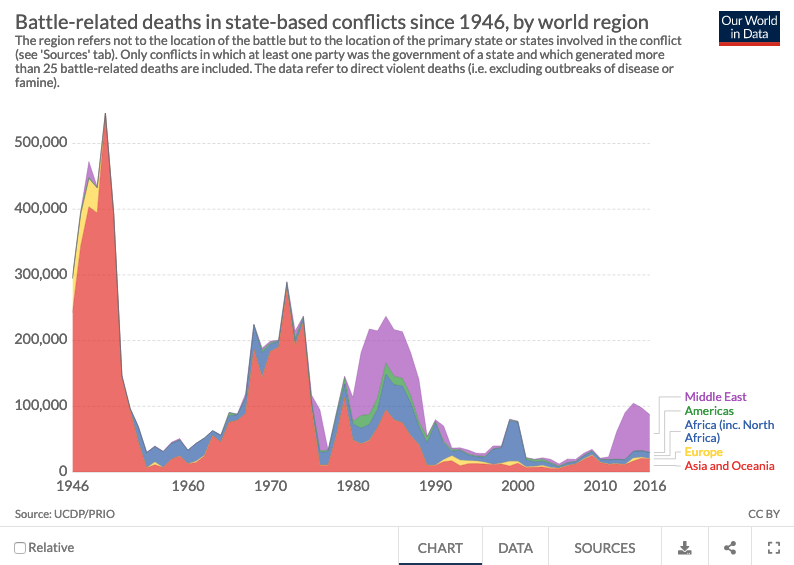]
---

# ACLED

.font150[
* Armed Conflict Location & Event Data Project (ACLED)

* Records the dates, actors, types of violence, locations, and fatalities of all reported political violence and protest events across Africa, South Asia, Southeast Asia, the Middle East, Europe, and Latin America

* Political violence and protest activity includes events that occur within civil wars and periods of instability, public demonstrations, and regime breakdown 
]
---

# ACLED

.center[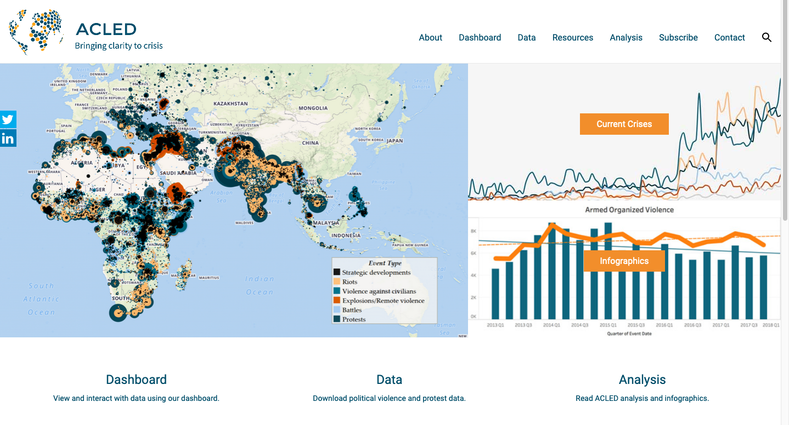]

.center[Source: [ACLED (2019)](https://www.acleddata.com)]
---

class: inverse, center, middle

# Questions?

<html><div style='float:left'></div><hr color='#EB811B' size=1px width=720px></html> 
---

class: inverse, center, middle

# Recent trends in civil wars

<html><div style='float:left'></div><hr color='#EB811B' size=1px width=720px></html> 
---

# Walter (2017)

.font150[
* Civil wars declined until 1990...

* ... they seem to be on the rise again

* Post-2003 conflicts are different:
	- Muslim countries
	- Fought by radical Islamists
	- Transnational goals
	- Very long
	- Encompass the whole region
	- Rarely end via negotiated agreements
	- Dangers of contagion
]
---

# Three waves

.font150[
* One that began around 1951 and ended with the close of the Cold War
	- Peasant rebellions, class based
	- Colonial wars (Angola, Algeria, etc)
	- Proxy wars (Vietnam, Afghanistan, Iran-Iraq)

* A second that began around 1992 and ended soon after 2001
	- Ethnic conflicts
	- Larger role of peacekeeping forces
]
---

# Three waves

.font150[
* A third wave began with the fall of Saddam Hussein in 2003 and continues today

	- Religious conflicts
	- Muslim countries (63%)
	- Radical islamists: Syria, Afghanistan, etc
	- Transnational: Rebel forces and armies from around the world
]
---

# Muslim countries and civil wars

.font150[
* Is the religion to blame for wars?

* We don't know for sure, maybe/probably not

* Muslim countries also have many factors that influence civil war onset:
	- Poor
	- Very populated
	- Authoritarian government
	- Natural resources
	- Foreign interference
	- Rise of extremist groups
]
---

# Muslim countries and civil wars

.center[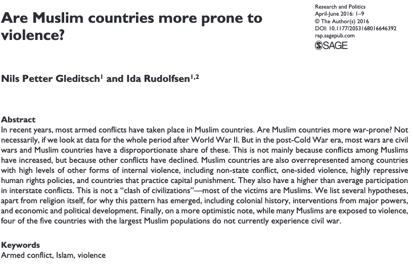]

.center[[Gleditsch and Rudolfsen (2016)](https://journals.sagepub.com/doi/full/10.1177/2053168016646392)]
---

# Muslim countries and civil wars

.font150[
* Civil wars in Muslim countries increasingly involve extremists 
]

.center[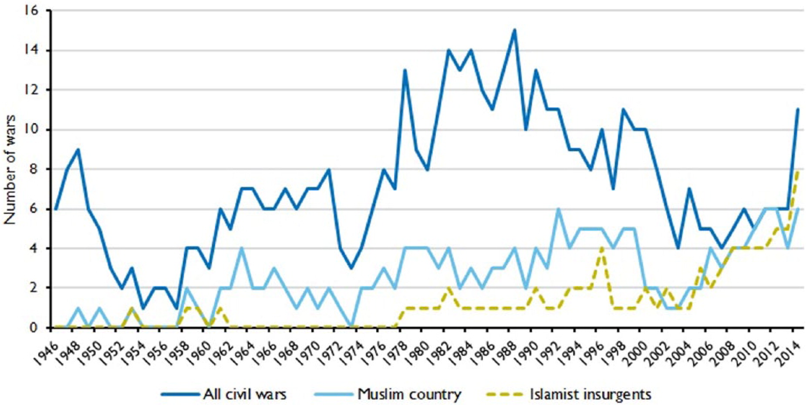]
---

# Muslim countries and civil wars

.center[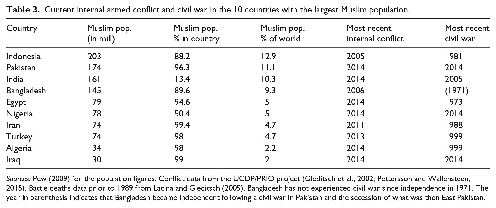]

.font130[
* Six had low-level internal conflict, but only three experienced civil war. 

* Four of the five largest have been free from conflict for more than 10 years
]
---

class: inverse, center, middle

# Questions?

<html><div style='float:left'></div><hr color='#EB811B' size=1px width=720px></html> 
---

class: inverse, center, middle

# See you next week! 

<html><div style='float:left'></div><hr color='#EB811B' size=1px width=720px></html> 

