```{r setup, include=FALSE}
options(htmltools.dir.version = FALSE)
```

<style>

.remark-slide-number {
  position: inherit;
}

.remark-slide-number .progress-bar-container {
  position: absolute;
  bottom: 0;
  height: 6px;
  display: block;
  left: 0;
  right: 0;
}

.remark-slide-number .progress-bar {
  height: 100%;
  background-color: #EB811B;
}

.orange {
  color: #EB811B;
}
</style>

# Last week we saw that... 

.font150[
* Civil wars are crucial events in world history

* They are hard to define
	- Partisan bias (favour victims)
	- Political bias (war is not politics)
	- Urban bias (costly information, big narrative)
	- Selection bias (overaggregation, acontextual)
]
---

# Last week we saw that... 

.font150[
* Violence is both an outcome and a process 

* Even barbaric acts can be *rational* 

* PRIO/UCDP and ACLED
	- 25/100 annual battle deaths
	- "contested incompatibility over territory or government where one of the parties is the state"
]
---

# Last week we saw that... 

.font150[
* Three waves of civil war

	- Cold War: class-based conflicts, peasant rebellions
	- 1991-2003: ethnic conflicts 
	- 2003-present: radical Islamism, but religion might not be the main cause
]
---

class: inverse, center, middle

# Causes of civil war

<html><div style='float:left'></div><hr color='#EB811B' size=1px width=720px></html> 
---

# Collier and Hoeffler (2004)

.font150[
* C&H affirm that political scientists puts too much emphasis on motivations (grievances)

* People have grievances all the time, why do civil wars break only at a particular time, then?

* *Window of opportunity*: people rebel when they can

* Greed: atypical circumstances that can generate large returns

* Yet they agree they cannot differentiate between *opportunity* and *viability* to express grievances
]
---

# Proxies for opportunity

.font150[
* **Mineral resources**

* Ratio of primary exports to GDP

* Relationship is not linear

* Countries with very low and very high ratios do not have civil wars

* **Question**: why?
]
--

.font150[
* Countries with few natural resources have nothing to loot
* Oil-rich countries can hold the country together by force
* Those who are above average are the best to loot
]
---

# Proxies for opportunity

.font150[
* **Money from diasporas**

* E.g.: Tamil Tigers funded by American-resident Tamils

* Proxied by % of emigrants living in the US
]
---

# Proxies for opportunity

.font150[
* **Funding from hostile governments**

* Examples: 
	- Algerian civil war (rebels supported by USSR/ France by the US)
	- Soviet-Afghan war (Sunni Mujahideen supported by US/PAK/CH, etc; Shia Mujahideen supported by Iran)
	- Syrian civil war (a mess!)
]
---

# Proxies for opportunity

.font120[
* **Low cost of fighting**:  

* 1) Income is low: GDP per capita

* 2) Weapons are cheap: previous wars

* 3) Government is weak: montainous terrain

* 4) Social cohesion: ethnic diversity
]
---

# Proxies for grievances

.font150[
* Ethnic and religious hatred: ethnic fractionalisation

* Political repression: non-democracies

* Political exclusion: ethnic dominance (majority group comprises 45-90% pop) 

* Economic inequality: Gini index, ratio top-to-bottom income 
]
---

# Opportunity model

.center[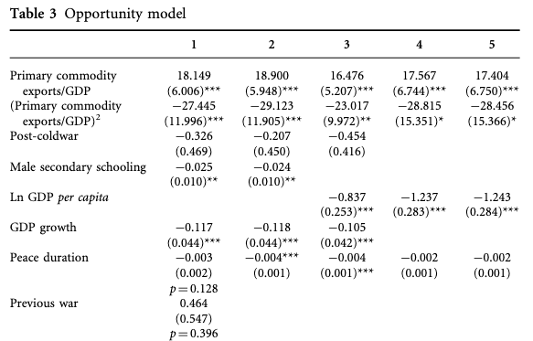]
---

# Opportunity model

.center[]
---

# Grievance model

.font120[Drops economic variables from the model]

.center[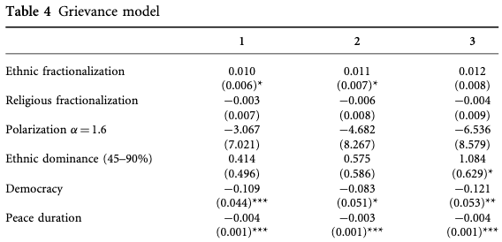]
---

# Grievance model

.center[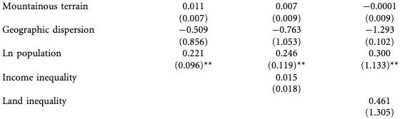]
---

# Combined model 

```{r comb01, out.width="1100px", out.height="400px", echo=FALSE}
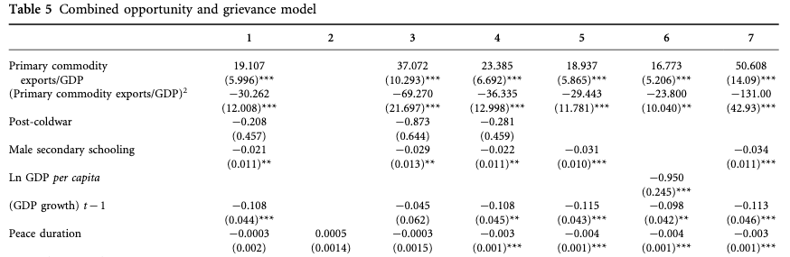
```
---

# Combined model 

```{r comb02, out.width="1100px", out.height="400px", echo=FALSE}
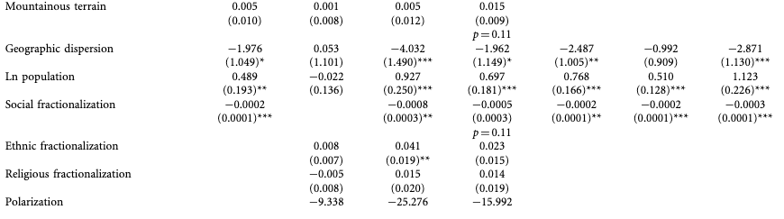
```
---

# Combined model 

```{r comb03, out.width="1100px", out.height="400px", echo=FALSE}
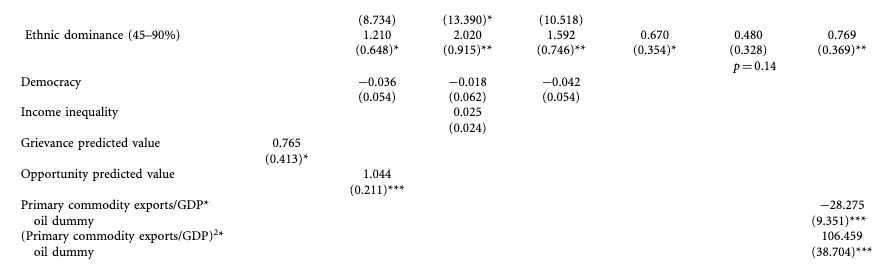
```
---

# Interpretation

.font150[
* Factors that influence the opportunity for rebellion:
	- Money from commodities
	- Diaspora
	- Low GDP
	- Dispersed population

* *Find no evidence for grievance-based theories*

* Only ethnic dominance has a positive effect

* **Question**: what do you think? Is their explanation convincing?
]
---

# Comments

.font150[
* No difference between rebels and criminals

* GDP, democracy, primary exports change very slowly over time... what explains the conflict onset?

* Urban bias: no mention of rural dynamics
	
* Passive role of the state in the conflict

* Crude proxies for greed and grievances
]
---

# Fearon and Laitin (2003)

.font150[
* Most cited paper in political science in the last 15 years

* Remarkable data collection effort

* Four main points:

	- The end of the Cold War *did not* cause civil wars
	- Controlling for income, ethnicity or religion doesn't matter
	- Also find little support for grievance-based theories
	- Factors that explain *insurgency* are the most relevant

* Different from C&H, F&L argue that low GDP proxies for *state capacity* 
]
---

# Data

.font150[
* Conflicts that kill at least 1,000 people, at least 100 per year, rebels or government forces

* Include colonial wars

* F&L are cautious about their data on empires

* They analyse the data both including and excluding colonial wars
]
---

# Conflicts over time

.center[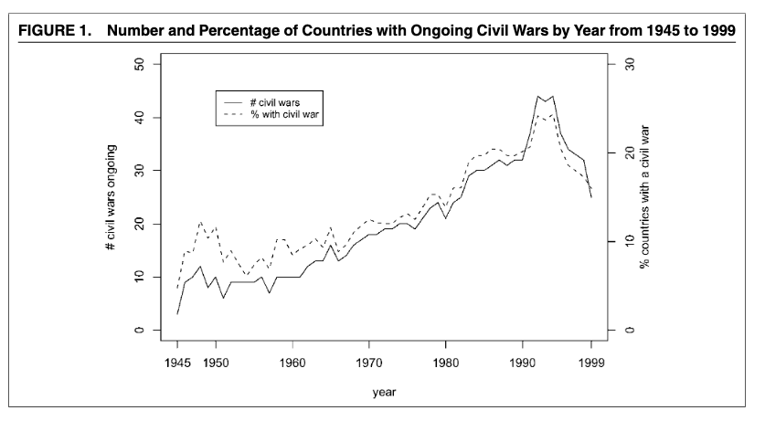]
---

# Ethnicity and conflict

.font150[
* They critique the idea of "clash of civilisations"

* Deep-rooted ethnic grievances are not enough to explain civil war onset

* Sceptical of "modernisation theory": limits to upward mobility cause people to revolt

* Question that discrimination (ethnic of economic favoritism to other groups) leads to inequality
]
---

# Insurgencies

.font150[
* Focus on small guerrilla wars 

* Guerrilla groups are weak compared to the government

* Factors that facilitate rebel group survival are very important
	- Montainous terrain (hideouts)
	- Local knowledge
	- Rural base
	- Weak state governance
]
---

# Pred. probabilities: income and ethnicity

.center[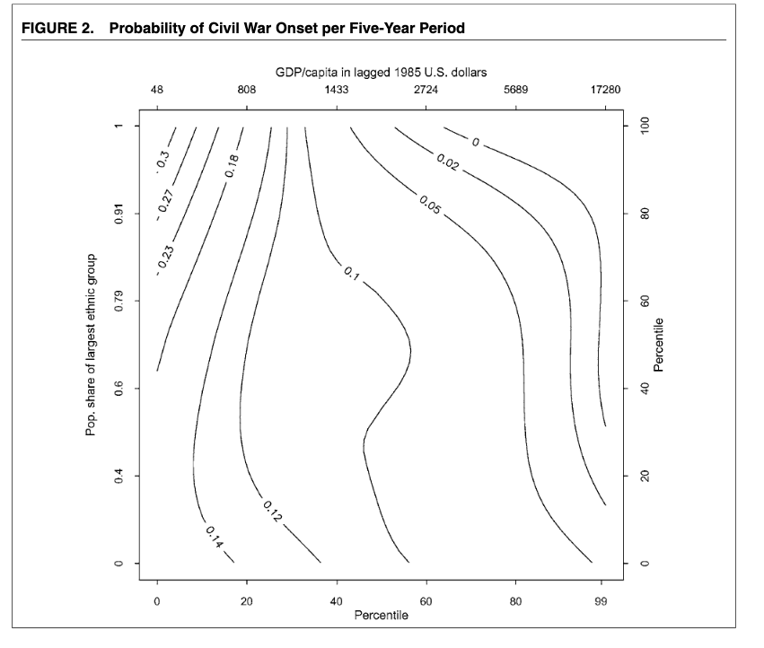]
---

# Main results

.center[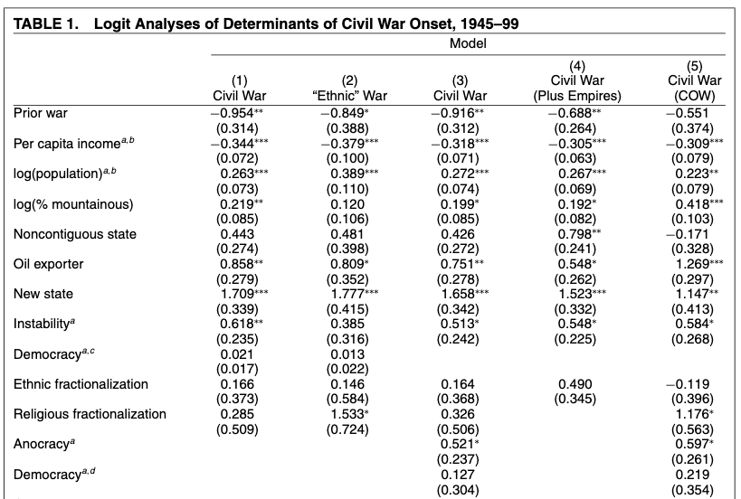]
---

# Discussion 

.font140[
* The high number of civil wars in the 1990s is the result of accumulation of previous conflicts, not the end of the Cold War

* Ethnicities and grievances do not explain why internal wars occur 
	
* Factors that favour *insurgency* do: state weakness, low GDP, instability, and large population

* Practical implications:
	- Promoting democracy abroad doesn't work
	- Cultural dialogue doesn't work either
	- Little foreign states can do: GDP, state capacity take time
]
---

# Comments on C&H and F&L

.font150[
* C&H: *homo oeconomicus* goes to war

* Rebels are essentially criminals: profits from looting

* **Question**: natural/lootable resources can fuel grievances too, can't they?
]
--

.font150[
* Resource-rich countries might have higher inequality, forced migrations, trade shocks, etc

* Diasporas can also provide welfare to local communities and therefore *reduce* the likelihood of conflict
]
---

# Comments on C&H and F&L

.font150[
* F&L: unclear which aspect of state capacity decreases civil war risk: Inclusive institutions, shared power, armed forces, economic redistribution?

* Impossible to adjudicate between their theory (state capacity, proxied by GDP per capita) and C&H's (lootable resources, proxied by.... GDP per capita!) 

* As with C&H, national-level data obscures important within-country dynamics
]
---

class: inverse, center, middle

# Questions?

<html><div style='float:left'></div><hr color='#EB811B' size=1px width=720px></html> 
---

# Wimmer et al (2009)

.font150[
* Ethnicity *does* play a role in civil war outbreaks

* Qualify previous literature 

* Offer better data on ethnic groups

* Establish new mechanisms that link group grievances to conflicts

* Focus on political dynamics of ethnic exclusion and competition
]
---

# Institutionalist, configurational theory

.font150[
* **Institutionalist**: political structures create incentives for players to act strategically

* **Configurational**: the same institution provides different incentives according to the distribution of power

* Ethnicity matters _because the nation state uses it for legitimacy_

* Politicians have incentives to favour their co-ethnics 

* Ethnic favouritism is more likely in poor, young states (who need more legitimacy)
]
---

# Institutionalist, configurational theory

.center[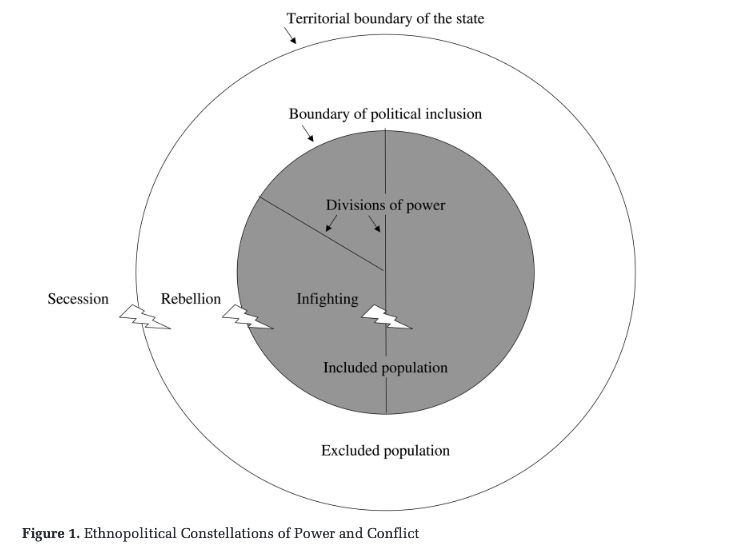]
---

# Three types of ethnic conflict

.font150[
* **Secession**: changing the territorial boundaries of a polity and can be pursued by both excluded and included groups

* **Rebellion**: excluded segments of a population fight to shift the boundaries of inclusion

* **Infighting**: elite disputes for the spoils of government

* Predictions:
	- ethnic exclusion breeds conflict
	- more power-sharing increase conflict (coalitions)
	- large states and those under indirect rule rebel more 
]
---

# Results

.center[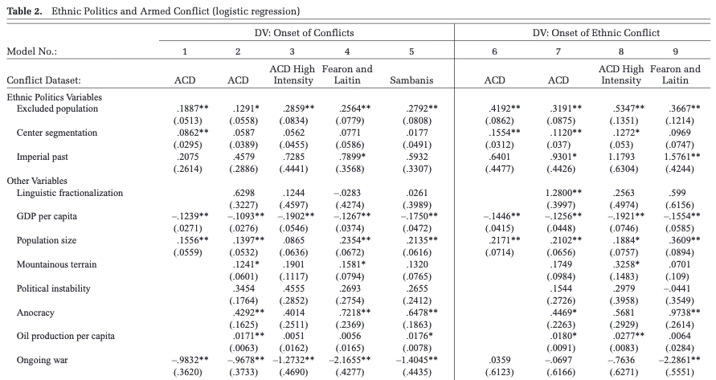]
---

# Results

.center[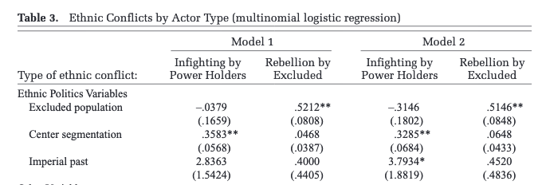]
---

# Results

.center[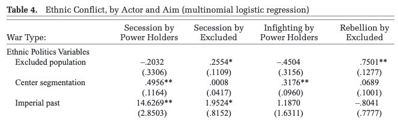]
---

# Conclusion

.font150[
* "The likelihood of armed confrontation increases as the center of power becomes more ethnically segmented and as greater proportions of a states population are excluded from power because of their ethnic background"

* "These conflicts are even more likely in incoherent states where the population is not accustomed to direct rule by the political center"

* "Ethnicity is not an aim in itself, but the organizational means through which individuals struggle to gain access to state power"
]
---

# Comments on Wimmer et al

.font150[
* Good idea to focus on ethnicity and power dynamics

* However, still treats ethnicity as a fixed category

* Ethnicity and conflict can be endogenous

* Urban bias, maybe?
] 
---

class: inverse, center, middle

# Questions?

<html><div style='float:left'></div><hr color='#EB811B' size=1px width=720px></html> 
---

# Kalyvas and Balcells (2010)

.font150[
* Does systemic factors play a role in civil war dynamics?

* More specifically, what is the role of the international system in civil wars?

* "Technologies of rebellion": ways that civil conflicts are fought

* Disaggregating the types of conflict

* The end of the Cold War caused a decline in irregular wars
]
---

# Technologies of rebellion

.font150[
* **Irregular warfare**: guerrillas

* **Conventional warfare**: army and rebels have similar power

* **Symmetric non-conventional (SNC) warfare**: states unable/unwilling to fight ("primitive" wars)
]
---

# The puzzle of the Cold War

.font150[
* Civil wars were understood as proxy wars 

* End of the Cold War brought changes to the int'l system:
	- End of multiethnic states
	- Emergence of new states
	- Cheap weapons from the former USSR
	- Weakening of client states
	- No legitimising principle to the state (link with Wimmer et al.)

* Contest F&L's results that the Cold War has no effect
]
---

# Technologies of rebellion

.center[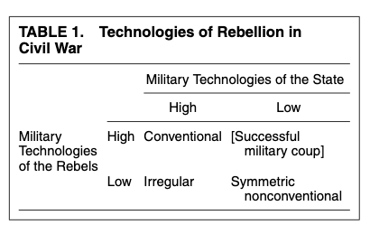]
---

# Summary statistics

.center[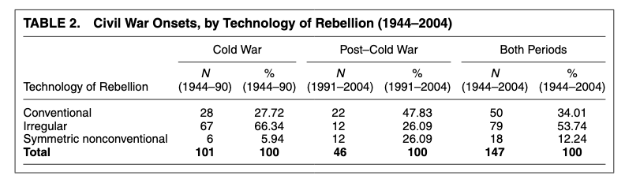]
---

# Main results

.font150[
* 1 for conventional wars, 2 for irregular wars, and 3 for SNC wars. 
]

.center[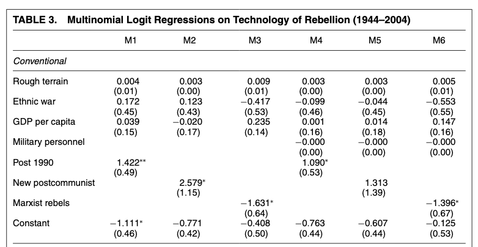]
---

# Main results

.center[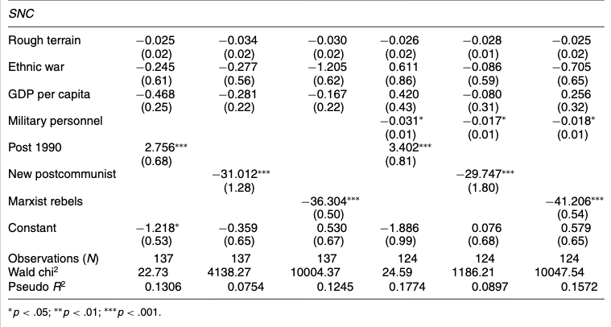]
---

# Discussion

.font150[
* Indeed the "technologies of rebellion" had been overlooked

* However, the model doesn't seem very convincing

* Almost nothing is significant; bad control variables

* No testing of any mechanism:
	- Material support
	- Ideological cohesion
	- Access to weapons

* SNC is a poorly-defined category
]
---

# Ward et al (2010)

.font150[
* Statistical models explain what has already happened...

* How useful are they to predict *what might happen in the future*?

* In-sample vs out-of-sample testing

* Limitations of statistical models

* Possible means for testing the validity of a theory: see how it performs with new data
]
---

# Problems of statistical significance

.font140[
* False positives and false negatives
	- Every probability above 0.5 is considered positive in the model
	- There is *nothing* special about that number

* **Question**:
	- You are the leader of your country and you see that country X has 50% chance of going to war next year. If you are right, a civil war can be averted. *But if you are wrong*, you will invade another country, your citizens will die, and conflict might spread. What probability would make *you* go to war?
]
---

# Statistical vs predictive power

.center[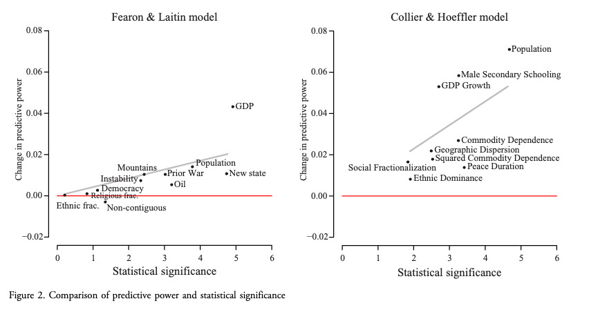]
---

# Discussion

.font150[
* Variables that are statistically significant have little predictive power

* How can we use these models to prepare for new conflicts?

* Factors that explain previous civil wars may not explain future ones

* Prediction can help us build more robust (although not necessarily more efficient) models for civil war prevention
]
---

class: inverse, center, middle

# Questions?

<html><div style='float:left'></div><hr color='#EB811B' size=1px width=720px></html> 
---

# Brief summary

.font150[
* Civil wars happen in poor, weak states

* Windows of opportunity are more important than old grievances

* Ethnic rivalries can lead to civil war outbreak, but under certain conditions

* The Cold War has changed the way civil wars are fought

* Many of the variables we know explain *past* wars, but can they explain future ones?
]
---

# Similar analysis

.center[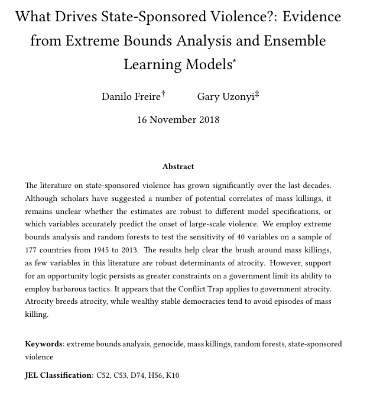]
---

# To conclude

.center[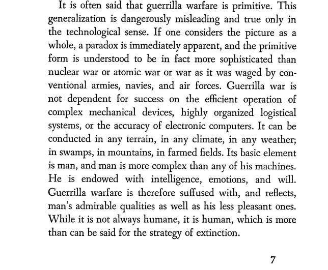]

.center[Source: [Griffith, S. B. - Introduction to Mao Zedong's *On Guerrilla Warfare* (1961)](https://books.google.com/books?id=jKoqAwAAQBAJ&lpg=PA7&dq=griffith%20%22its%20basic%20element%20is%22&pg=PA7#v=onepage&q&f=false)]
---

class: inverse, center, middle

# See you next week!

<html><div style='float:left'></div><hr color='#EB811B' size=1px width=720px></html> 
