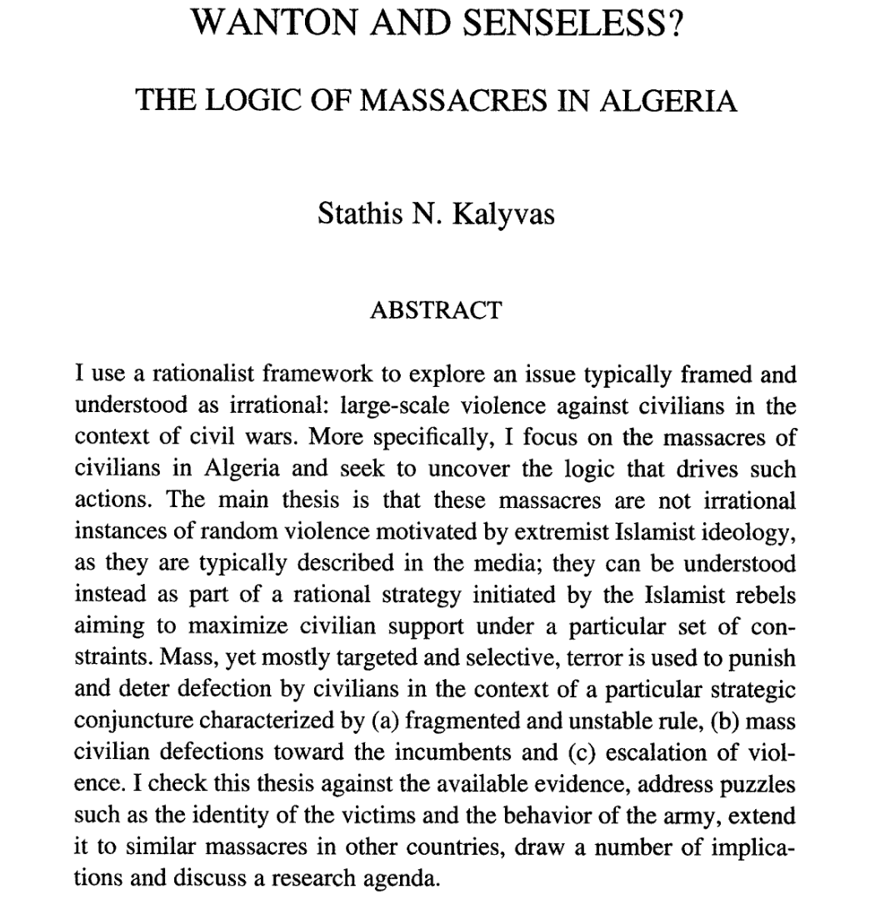
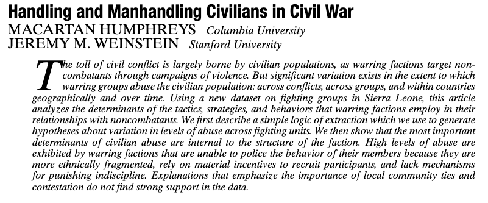
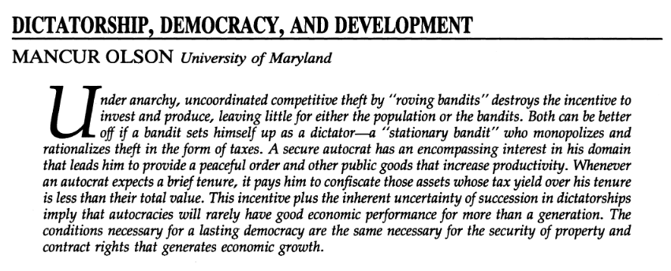

```{r setup, include=FALSE}
options(htmltools.dir.version = FALSE)
```

<style>

.remark-slide-number {
  position: inherit;
}

.remark-slide-number .progress-bar-container {
  position: absolute;
  bottom: 0;
  height: 6px;
  display: block;
  left: 0;
  right: 0;
}

.remark-slide-number .progress-bar {
  height: 100%;
  background-color: #EB811B;
}

.orange {
  color: #EB811B;
}
</style>

# Last week we saw that... 

.font150[
* C&H propose a greed-based theory of civil wars

* Grievance are constant, so civil wars need another triggering factor

* Opportunity: rebel groups revolt when they're able to

* Lootable resources, money from diasporas and hostile governments, and low costs of fighting (poverty) explain civil war onset 
]
---

# Last week we saw that... 

.font150[
* F&L argue that state capability is the most important civil war predictor

* Also proxied by GDP, like C&H's opportunity variable

* Ethnic and religious heterogeneity don't matter once you control for income

* Factors that favour insurgency (mountainous terrain, oil, unstable regimes) increase the risk of civil wars
]

---

# Last week we saw that... 

.font150[
* Wimmer et al (2009) write ethnicity does play a role in civil wars

* Ethnicity is useful because politicians mobilise it

* Secession, rebellion, or group infighting

* Excluded population fight for the first two, included groups for the latter (sometimes for secession too)
]

---

# Last week we saw that... 

.font150[
* Most variables don't have strong predictive power

* GDP per capita and population are the best predictors of civil conflicts

* Statistical significance is not the same as practical or predictive significance
]

---

class: inverse, center, middle

# Violence against Civilians

<html><div style='float:left'></div><hr color='#EB811B' size=1px width=720px></html> 
---

# Kalyvas (1999)

.center[]
---

# Some context

.font150[
* The Algerian Civil War lasted from 1991 to 2002

* Islamist groups vs the government 

* Onset: government cancelled 1991 elections after they thought the Islamic Salvation Front (FIS) would win

* FIS was banned and members arrested, Islamist guerrillas rebelled against the government

* Two main rebel groups: Islamic Armed Movement (MIA) and Armed Islamic Group (GIA)
]
---

# Some context

.font150[
* In 1994, talks between FIS and the government took place

* GIA declared war against FIS

* Pro-Army party won the next election (1997)

* MIA surrended and GIA were hunted down

* 1996-1999 peak violence; civil war ends in 2002 (government victory)
]
---

# Some context

.font150[
* *La sale guerre*  

* 44,000 to 100,000 deaths

* Salafist Group for Preaching and Combat (GSPC), a GIA dissident group, later affiliated with Al-Qaeda and continue fighting in the Maghreb
]
---

# Kalyvas (1999)

.font150[
* Rational choice approach to mass violence

* Massacres are not acts of barbarism, but a war strategy

* Violence maximises civilian support under constrains

* Illustrates his case using the Algerian Civil War as an example
]
--

---

# Kalyvas (1999)

.font150[
* **Questions**:
	- Should political organisations kill civilians randomly?
	- Specifically, why would *insurgents*, who tend to be weaker, kill civilians?
]
--
.font150[
* *No*]
--
.font150[
* *To find infiltrated enemies and prevent civilian defection*

* Repression is effective:
	- Cheaper than selective benefits
	- Useful in areas and periods of contested rebel control
]
---

# Targets

.font150[
* Local opponents, mainly those associated with the government

* Civilians associated with other insurgents

* Defectors
]
--
.font150[
* **Question**: how to identify the enemies?
]
--
.font150[
* Access to reliable local information
]
---

# A theory of selective violence

.font150[
* Rebels and the government have fragmented sovereignty  

* But rebels and gov't forces often don't have full control oves the territory

* They use coercion to elicit information from citizens and punish the enemies

* Constraints faced by denouncers provide a good way to model the process

* Key constraint is *the likelihood of retaliation*
]
---

# A theory of selective violence

.font150[
* In areas over which the rebels/gov't have full control, they can easily retaliate citizens

* In contested areas, citizens can switch sides and it's hard for parties to use selective violence

* Denunciation leading to selective violence is most likely where one actor exercises *dominant but incomplete control*

* **Question**: in which type of conflict actors *might not* need to solicit information to citizens?
]
--
.font150[
* Ethnic civil wars: private information is often available 
]
---

# Territorial control and violence

.center[]
---

# Territorial control and violence

.font150[
* Violence is more likely in zones 2 and 4 
	- Dominant but incomplete control by the rebels
	- The same for incumbents

* As they lose control over the population, actors compensate by increasing the level of brutality

* *This process can happen elsewhere*, not only in Algeria

* The level of violence probably does *not* come from ideology, but from territorial control
]
---

class: inverse, center, middle

# Questions?

<html><div style='float:left'></div><hr color='#EB811B' size=1px width=720px></html> 
---

# Humphreys & Weinstein (2006)

.center[]
---

# Humphreys & Weinstein (2006)

.font130[
* "...the extent of civilian suffering varies across conflicts, over time within a conflict, and across geographic regions in countries that experience violence" 

* Three factors:
	- Incentives for groups to be violent
	- Territorial control
	- *Poor internal cohesion*

* "Units composed of members with private goals, which organize into ethnically heterogeneous groupings and lack internal mechanisms to discipline behavior, exhibit relationships with noncombatants characterized by coercion and abuse"
]
---

# Humphreys & Weinstein (2006)

.font150[
* Model:

* Too much violence is counterproductive: "kills the goose that lays the golden egg"

* Too *little* violence is also counterproductive: rebels will lose without information and conquest

* There exist an optimal point where violence is effective: restrained violence + public goods production 
]
---
.font150[
* **Pause!**
]
---

# Roving and stationary bandits

.center[]
---

class: inverse, center, middle

# See you next week!

<html><div style='float:left'></div><hr color='#EB811B' size=1px width=720px></html> 
