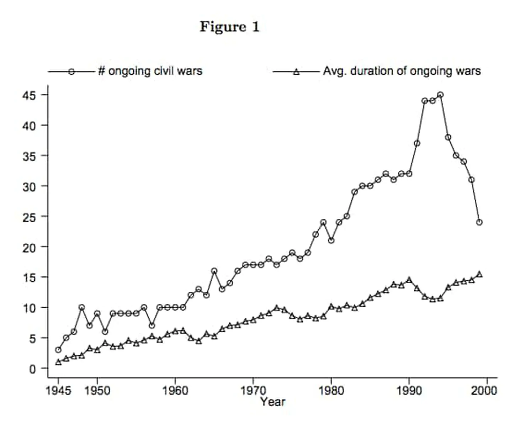
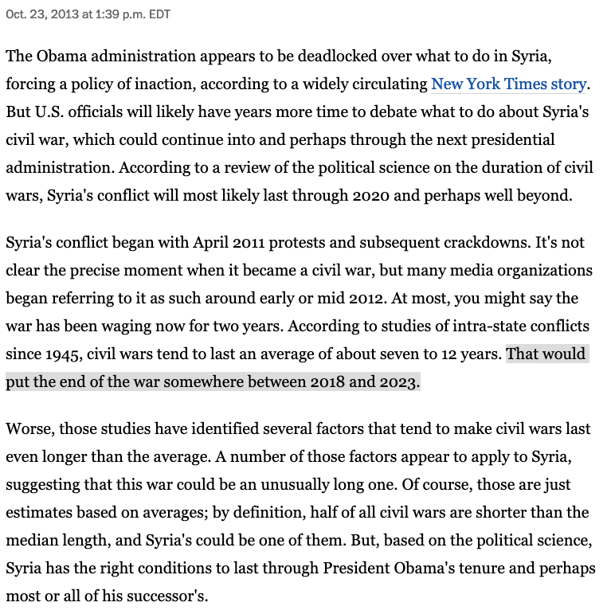
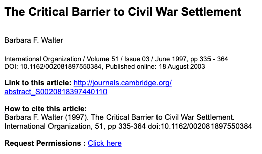
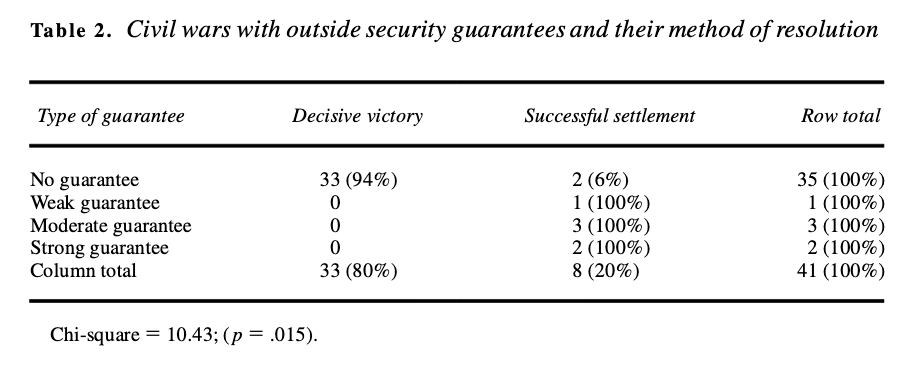
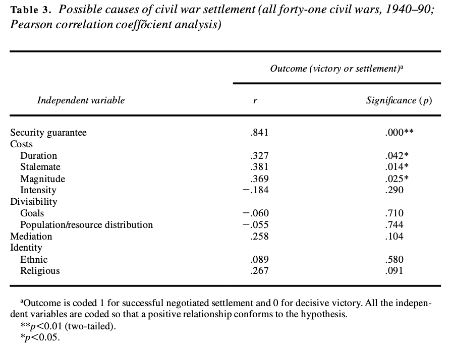
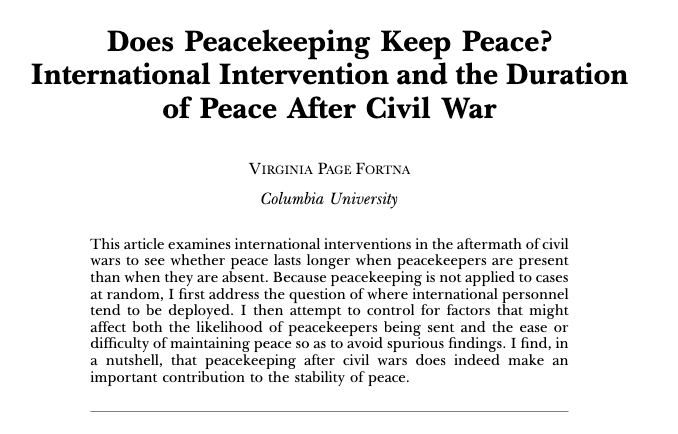
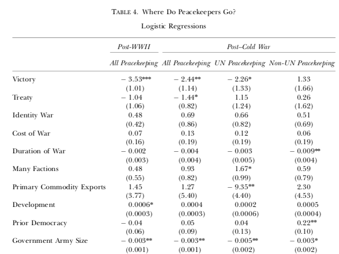
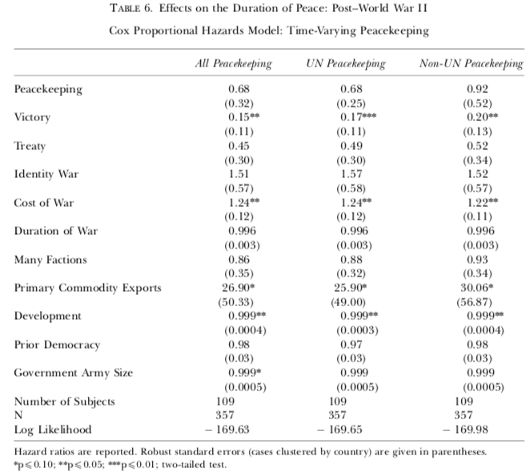
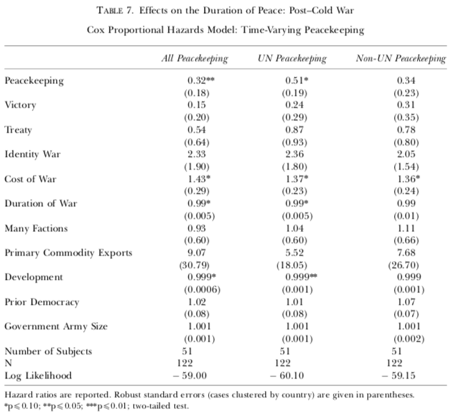
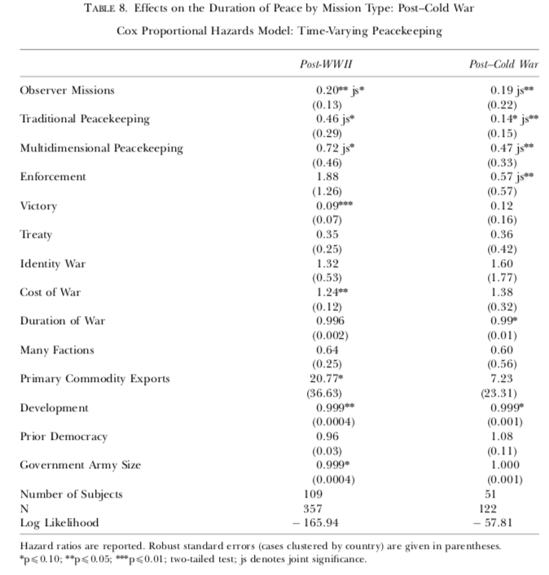

```{r setup, include=FALSE}
options(htmltools.dir.version = FALSE)
```

<style>

.remark-slide-number {
  position: inherit;
}

.remark-slide-number .progress-bar-container {
  position: absolute;
  bottom: 0;
  height: 6px;
  display: block;
  left: 0;
  right: 0;
}

.remark-slide-number .progress-bar {
  height: 100%;
  background-color: #EB811B;
}

.orange {
  color: #EB811B;
}
</style>

# Last week we saw that... 

.font150[
* Civil war violence is not necessarily irrational

* Violence prevents civilian defector and elicits information about enemies

* Violence is unlikely in areas fully controled by the rebels/gov't forces

* In contested areas, it's hard for groups to gather information about the enemies and defection is easy

* Thus, _selective violence against civilians are more prevalent in areas over which the groups have dominant but incomplete control_
]
---

# Last week we saw that... 

.font150[
* Humphreys and Weinstein highlight another factor that explains violence against civilians in internal wars: _rebel group structure_

* Groups that are less cohesive tend to commit more violence: less control over rogue soldiers

* They also find that material incentives also increase violence in civil wars

* Note: no distinction between selective and indiscriminate violence here
]

---

# Last week we saw that... 

.font130[
* Balcells focuses her attention on *conventional civil wars*, where insurgents and the government have similar resources

* She affirms that Kalyvas and H&W focused too much on *irregular wars*, or guerrillas

* While guerrillas fight for territorial control, in conventional civil wars rebel groups control well-delineated areas

* Violence occurs due to rivalry and revenge:
	- Rivalry: When parties have parity, small victories can be decisive, so groups are more likely to fight 
	- Revenge: Higher levels of violence by an armed group at $t_1$ leads to retaliation by the rival group in $t_2$
]

---

# Last week we saw that... 

.font150[
* Wartime rape has its own logic

* Ethnic rivalries, greed, and gender norms are conventional explanations

* Rape is a socialisation tool: increases rebel group cohesion and boosts rebels' self-esteem

* Cohen finds that rape is associated with state collapse and rebel group characteristics 
]
---

class: inverse, center, middle

# How do civil wars end?

<html><div style='float:left'></div><hr color='#EB811B' size=1px width=720px></html> 
---

# Why do some civil wars last so long?

.font150[
* Civil wars vary greatly in duration—some end within months; others last for decades

* Military victory does happen in civil war, but it is rare
]
--
.font150[
* **Question**: why do you think that's the case?]
--
.font150[
* Wars last longer when parties perceive the war as less costly relative to peace

* And when combatants are overly optimistic about winning the war
]
---

# Why do some civil wars last so long?

.font150[
* Some parties cannot accept a division of the issues at stake

* Government or rebels are unable to trust the commitments

* More combatants increase coordination costs]
---

# Fearon (2002)

.center[]
---

# Washington Post, 2013

.center[]
---

# Washington Post, 2013

.center[]
---

# Walter (1997) 

.center[]
---

# Negotiated settlements are rare 

.font130[
* While most international wars end in agreements, negotiations are unfrequent in civil wars

* "Most internal wars ended with the extermination, expulsion, or capitulation of the losing side"

* Groups almost always choose to fight instead of pursuing an agreements

* Puzzle: if civil wars are costly for both parties, why do conflicts often last so long? ]
--
.font130[
* Negotiations fail because civil war opponents are asked to do what they consider unthinkable: *lay down their weapons and integrate into the national army*
]
---

# Why don't negotiations work?

.font150[
* Many rebel groups/governments _do_ try to reach agreements during civil wars

* But peace talks often fail

* Problem: lack of neutral police force and government enforcement
]
---

# Cooperation under anarchy

.font150[
* Countries can use international organisations, military alliances, or trade agreements as incentives

* Domestic factions don't have the same options

* Settlements make parties vulnerable and compliance is risky

* No credible democratic institutions
]
---

# Third-Party Guarantees

.font150[
* A mediator can increase the costs of punishment for non-compliers

* Three conditions:
	- Guarantor must have an interest in peace: colonial ties, economic interests, etc
	- Must be willing to use force if needed
	- Must be able to signal resolve: promises have to be credible
]
---

# Five hypotheses

.font140[
* H1: Credible guarantees on the terms of the settlement are almost impossible to arrange by the combatants themselves
	- Need for a third party

* H2: Successful settlements should be more likely as the expected costs of winning a war increases
  - Losers have an incentive to start peace talks

* H3: Adversaries are more likely to settle when stakes are easier to divide
	- Financial arragements, political participation
]
---

# Five hypotheses

.font150[
* H4: The greater the skill of the mediation, the greater the likelihood of a peace deal
	- Credible commitments

* H5: Ethnic/cultural conflicts are harder to solve
	- Groups cannot find common ground 

* **Question**: how is H5 different from H3?
]
---

# Results

.center[]
---

# Results

.center[]
---

# Discussion

.font150[
* Strong relationship between security guarantees and settlement 

* Longer, larger civil wars are more likely to be mediated 

* Military stalemates increase the chance of successful negotiations

* Issue divisibility and ethnic motivations are unrelated with the outcomes (decisive victory or negotiated settlements)
]
---

# Conclusion

.font150[
* The findings offer support for the credible-commitment theory of conflict resolution

* A third party is necessary because groups are unable to compromise 

* The findings hold even for ethnic civil wars 

* Implications:
	- Peacekeeping operations should be willing to use force
	- Mediators might even be biased, as long as they show resolve
	- Guarantors should stay during the whole process
]
---

# Conclusion

.font150[
* Remember: Walter stresses that security guarantees are a necessary, *but not sufficient*, condition for peace

* **Question**: Does her theory sound somewhat familiar to you? 
]
---

# Leviathan

.center[]
---

class: inverse, center, middle

# Questions?

<html><div style='float:left'></div><hr color='#EB811B' size=1px width=720px></html> 
---

# Fortna (2004)

.center[]
---

# Do peacekeeping operations work?

.font150[
* Walter mentions the importance of security guarantors 

* Peacekeeping operations provide third-party law and police enforcement

* In a sense, Fortna puts Walter's theory to test (at least partially)
]
---

# Do peacekeeping operations work?

.font150[
* Opponents of peacekeeping point out many failed operations:
	- Sierra Leone, Darfur, etc

* Fortna accuses them of two biases:
	- Pessimism bias
	- Selection bias

* **Question**: what does selection bias mean in this case?
]
---

# Do peacekeeping operations work?

.font150[
* Peacekeeping decisions *are not random*
	- Forces are deployed only to the very worst conflicts
	- E.g.: conflicts with more than two parties or when victory is unlikely

* To have an accurate assessment of the effect of peacekeeping operations, we should compare similar cases only 
]
---

# Where do peacekeepers go? 

.center[]
---

# What is the effect of peacekeeping?

.center[]
---

# What is the effect of peacekeeping?

.center[]
---

# Types of peacekeeping missions

.center[]
---

# Discussion

.font150[
* While peacekeeping has little effect on the whole Post-WWII period...

* ... it has a negative effect on civil war duration after 1991

* Evidence that peacekeeping operations are getting more effective

* All types of peacekeeping operations seem to reduce civil war duration 
]
--
.font150[
* *Yes, peacekeeping does keep peace*
]
---

class: inverse, center, middle

# Questions?

<html><div style='float:left'></div><hr color='#EB811B' size=1px width=720px></html> 
---

# Howard and Stark (2018)  

.font150[
* While in the 1990s civil wars were more likely to end in negotiated agreements...

* The trend seems to have reversed

* Post-9/11: stabilisation over democratisation and non-negotiation with terrorist groups

* Neorealist explanation: the nature of the international system explains civil war duration 
]
---

# 

---

class: inverse, center, middle

# See you next week!

<html><div style='float:left'></div><hr color='#EB811B' size=1px width=720px></html> 
