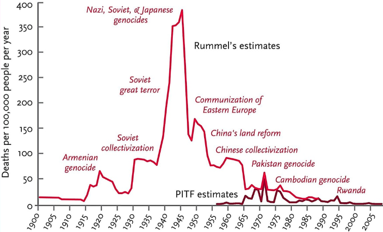
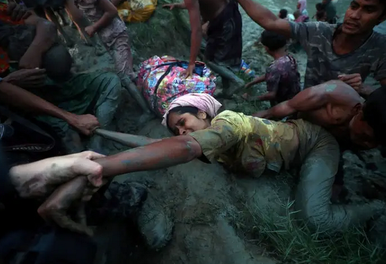
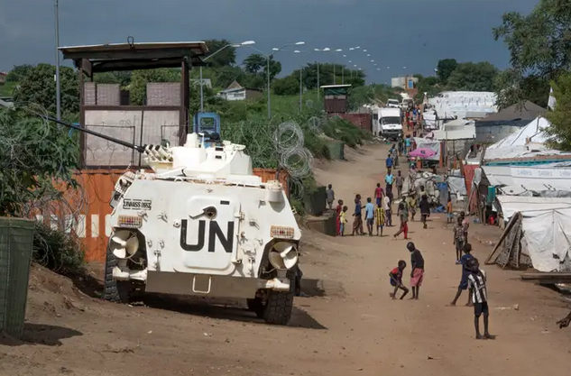
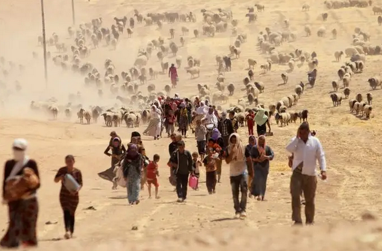
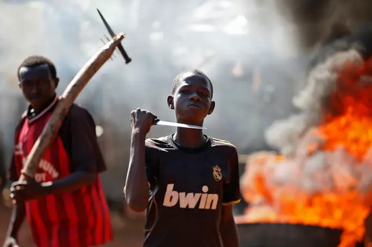
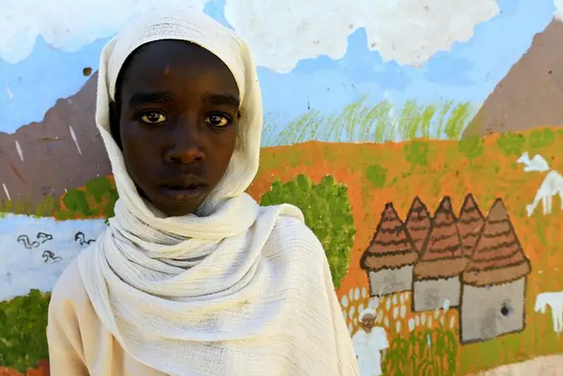
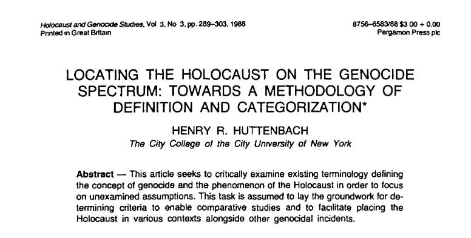
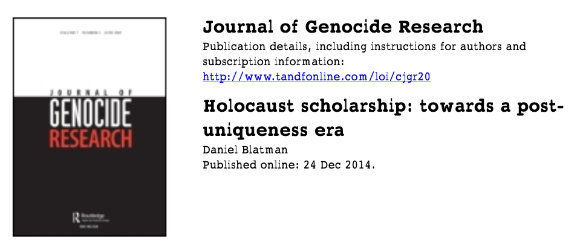
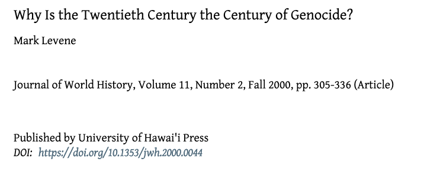
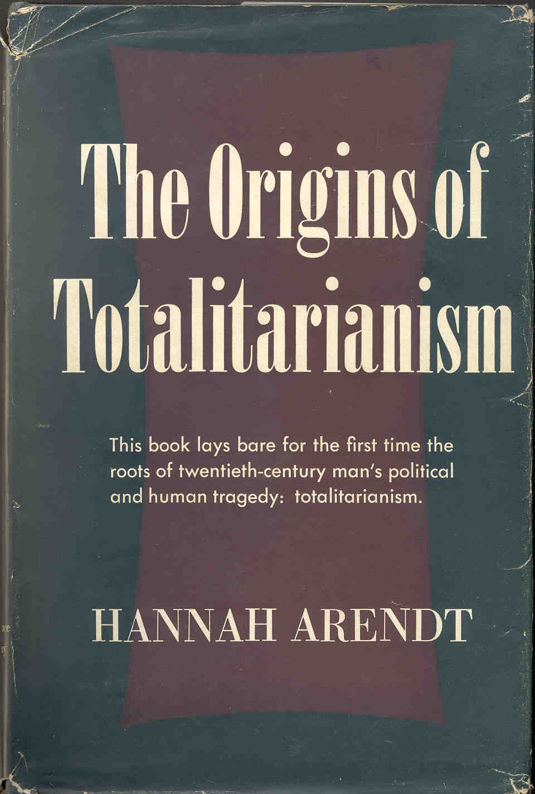

```{r setup, include=FALSE}
options(htmltools.dir.version = FALSE)
```

<style>

.remark-slide-number {
  position: inherit;
}

.remark-slide-number .progress-bar-container {
  position: absolute;
  bottom: 0;
  height: 6px;
  display: block;
  left: 0;
  right: 0;
}

.remark-slide-number .progress-bar {
  height: 100%;
  background-color: #EB811B;
}

.orange {
  color: #EB811B;
}
</style>

# Last week we saw that... 

.font150[
* Civil wars generally last longer than international conflicts 

* It is difficult to reach a negotiated settlement between insurgents and government forces

* High stakes: if groups demobilise and lay down their guns, they have a high risk of being imprisioned or killed

* Possible solution: committed guarantors

* Walter argues that the effect of third-party mediation works even for ethnic conflicts
]
---

# Last week we saw that... 

.font150[
* Peacekeeping operations (PKOs) are not sent at random: selection bias

* PKOs do not decrease the duration of civil wars if we consider the whole post-WWII period 

* Yet they do seem effective in the post-Cold War period

* All types of PKOs (observer missions/traditional/multidimensional) are associated with less civil war recurrence
]

---

# Last week we saw that... 

.font150[
* While in the 1990s civil wars were more likely to end in negotiated agreements...

* The trend seems to have reversed

* Post-9/11: stabilisation over democratisation and non-negotiation with terrorist groups

* Failed democratisation attempts also discouraged further comprehensive PKOs
]

---

# Last week we saw that... 

.font150[
* Terrorists may spoil civil war aggrements to:
	- Push for an agreement
	- Increase their bargaining power 
	- Terminate an agreement

* There is a case for rebel victory, too:
	- Rebels might promote governance

* There's no case for *government* victory, though
]
---

class: inverse, center, middle

# Genocides and politicides: definitions

<html><div style='float:left'></div><hr color='#EB811B' size=1px width=720px></html> 
---

# History

.font150[
* Word coined by Polish lawyer Raphäel Lemkin
	- *genos*, race or tribe
	- *cide*, killing

* First recognised as a crime under international law in 1946

* 1948 Convention on the Prevention and Punishment of the Crime of Genocides
	- Customary law: binding to all states

* *Ius cogens*: no derogation is permitted
]
---

# UN definition

.font130[
Article II

In the present Convention, genocide means any of the following acts committed with intent to destroy, in whole or in part, a national, ethnical, racial or religious group, as such:

 - Killing members of the group;
 - Causing serious bodily or mental harm to members of the group;
 - Deliberately inflicting on the group conditions of life calculated to bring about its physical destruction in whole or in part;
 - Imposing measures intended to prevent births within the group;
 - Forcibly transferring children of the group to another group.
]

.center[Source: [Convention on the Prevention and Punishment of the Crime of Genocide](https://www.un.org/en/genocideprevention/documents/atrocity-crimes/Doc.1_Convention%20on%20the%20Prevention%20and%20Punishment%20of%20the%20Crime%20of%20Genocide.pdf)]
---

# Elements of the crime

.font130[
* Article II

* A mental element: the "intent to destroy, in whole or in part, a national, ethnical, racial or religious group, as such"; and

* A physical element, which includes the following five acts, enumerated exhaustively:
  - Killing members of the group
  - Causing serious bodily or mental harm to members of the group
  - Deliberately inflicting on the group conditions of life calculated to bring about its physical destruction in whole or in part
  - Imposing measures intended to prevent births within the group
  - Forcibly transferring children of the group to another group
]
---

# Politicides

.font140[
* A politicide is a particular type of genocide

* Barbara Harff and Ted R. Gurr argued that the concept of politicide should supplement genocide

* Killing of groups targeted not because of shared ethnic or communal traits, but because of "their hierarchical position or political opposition to the regime and dominant groups"

* Similarly, Rudolph Rummel suggests the term *democide* for the intentional killing of unarmed civilians by governments

* Both terms are rather technical and uncommon
]
---

# Political Instability Task Force 

.font130[
*In genocides the victimized groups are defined primarily in terms of their communal (ethnolinguistic, religious) characteristics. In politicides, by contrast, groups are defined primarily in terms of their political opposition to the regime and dominant groups.*

*Genocide and politicide are distinguished from state repression and terror. In cases of state terror authorities arrest, persecute or execute a few members of a group in ways designed to terrorize the majority of the group into passivity or acquiescence. In the case of genocide and politicide authorities physically exterminate enough (not necessarily all) members of a target group so that it can no longer pose any conceivable threat to their rule or interests*
]

.center[Source: [Centre for Systemic Peace](http://www.systemicpeace.org/inscrdata.html)]
---

# Genocide over time

.center[]

---

# Genocide over time

<iframe src="https://ourworldindata.org/grapher/number-of-active-genocides-and-politicides-around-the-world?time=1956..2015" style="width: 100%; height: 550px; border: 0px none;"></iframe>

---

# Genocide around the world

<iframe src="https://ourworldindata.org/grapher/map-of-genocides-and-politicides-around-the-world" style="width: 100%; height: 550px; border: 0px none;"></iframe>

---

# Genocide deaths in 2015

<iframe src="https://ourworldindata.org/grapher/map-of-genocide-and-politicide-deaths-around-the-world" style="width: 100%; height: 550px; border: 0px none;"></iframe>

---

class: inverse, center, middle

# Five genocides going on today

<html><div style='float:left'></div><hr color='#EB811B' size=1px width=720px></html> 
---

# The Rohingya in Myanmar

.center[]

---

# The Nuer in Sudan

.center[]

---

# Christians and Yazidis in Iraq and Syria

.center[]

---

# Christians and Muslims in CAR

.center[]

---

# Darfuris in Sudan

.center[]

---

class: inverse, center, middle

# Genocide and the Holocaust

<html><div style='float:left'></div><hr color='#EB811B' size=1px width=720px></html> 
---

# Huttenbach (1988)

.center[]

---

# The inexplicability of the Holocaust

.font140[
* Survivors, politicians, scholars could not give a convincing explanation for the Holocaust 

* Main puzzle: rationality 
  - Modern bureaucratic state devoted to killing

* Social Darwinism + totalitarianism + rational administration 

* Split between "singularists" and "comparativists"

* Split between academics and lawyers:
  - Historical phenomenon or a type of crime?
]
---

# The problem of intention

.font140[
* As we've just seen, the UN declares that "genocide means any of the following acts committed *with intent to destroy* [...] a group"

* Huttenbach (1988, 294) affirms that "Simply  put, genocide---the destruction of a group, the *physical* destruction  of an entire segment of the population---is just that"

* He mentions that the methods of killings are not important to define genocide
]
--

.font140[
* **Question**: should genocide be defined by the intention of the perpetrator? Why or why not?
]
---

# Interesting questions from Huttenbach

.font150[
* What about homosexuals? Why don't we could their deaths as genocide?

* Gender: "while feminists justifiably seek to add their issues to the agenda of historic debates [...] there have been no incidents of genocide against women *per se*" Why? 
  - Note that this is different from female *experiences* of genocide

* Are only minorities targeted in genocides? 
]
---

# Interesting questions from Huttenbach

.font150[
* Was the killing of capitalists and aristocrats in Soviet Russia a genocide?

* Can civilian groups commit genocide too? 

* Given all that, how does the Holocaust rate?
]
---

# Conclusion

.font150[
"*One can see, therefore, that the application of the definition and its results will not be free from controversy Differences of interpretation, additional research will provide a dynamic flow prompting continued revision of the list  of candidates for acts of genocide. [...] Too much remains to be examined, many assumptions tested,and more information gathered. Given the sensitivity of the subject, considerable patience will have to be practiced, more perhaps than this post-Holocaust generation can muster*."
]
---

class: inverse, center, middle

# Questions?

<html><div style='float:left'></div><hr color='#EB811B' size=1px width=720px></html> 
---

# Blatman (2014)

.center[]
---

# The uniqueness of the Holocaust 

.font150[
* What does the uniqueness of the Holocaust actually mean in historiography?

* Every historical event, to a certain extent, is unique

* But how and why have scholars singled out the Holocaust from other types of genocide?
]
---

# The uniqueness of the Holocaust 

.font150[
* Predominant in North America

* Changed the focus of Jewish history from religion to national identity

* Idea that the Nazi *Weltanschauung* (worldview) was centred around the elimination of the Jews

* German antisemitism as a separate social phenomenon
]
---

# The uniqueness of the Holocaust 

.font140[
* Blatman argues that this focus on antisemitism, while correct, downplays other ideologies based on racial-anthropological and social Darwinist traits, such as colonialism 

* European antisemitism and racial colonialism share many characteristics

* "Singularist" authors are often not open to the idea that a similar event might happen in the future with groups other than Germans and Jews

* Integrating studies of the Holocaust with the broader literature on genocides seems to be a promising methodological move
]
---

# Integrated History of the Holocaust

.font140[
* Two approaches: liberal and post-liberal

* Liberal: 
	- Based on Raphael Lemkin, focused on the intentions of the perpetrator and the role of the state

* Post-liberal:
	- Takes non-state actors into account, such as the externation of native populations in America or Australia
  - Emphasises biological determinism more broadly

* The second view is more prevalent today
]
---

# Historicising Nazi Germany

.font150[
* Several authors argue that the Nazi state should be put into historical context

* Rise of authoritarianism in Europe, racism as national ideology, growing power of the state apparatus

* Parallels with Fascist Italy and Stalinist Russia

* Nazi Germany is a particularly extreme case of a larger historical trend
]
---

# Levene (2000)

.center[]

---

# Genocides during history

.font150[
* Is modern genocide a legacy of our barbaric past or an invention of post-Enlightenment rationality?

* Both: 
  - While technological advances increase the scope of mass killings...
	- They still require people to use their weapons and kill 

* Greeks and Romans also saw themselves as the most advanced societies of the time]
--

.font150[
* Change the focus from *modernity* to *civilisation*
]
---

# The international system

.font150[
* "Genocide is thus not only a by-product of particular national trajectories as they attempt state building in order to operate within, circumvent, or possibly confront that system, but a guide to and indeed cipher for its own dysfunctional nature" 

* Competition among states forced them to strengthen their control over the population via assimilation or extermination

* Max Weber: monopoly of force over a delimited territory 
]
---

# State building

.font150[
* State building was largely seem as an ambiguous process:
  - While often condemned and criticised by countries...
	- Sometimes seen as necessary by others

* Examples: British colonialism in the 19th century, Spanish/Portuguese conquest of America

* Societies that were prosperous and homegenous in the early 20th century had started this process earlier

* Modern genocide happens in countries that are latecomers to the international system
]
---

# Fast modernisation

.font150[
* Genocidal processes are closely linked with the goal of rapid modernisation

* Links cases as different as China, Germany, Russia, Japan, Cambodia, and Turkey

* Blame happens after periods of acute crisis, such as losing a war (Germany, Turkey) or failed economic plans (Russia)

* Sense of alienation fosters people to support leaders willing to quickly restore the country

* "Evil" or "bad" leaders are not enough to carry a genocide
]
---

# Nationalism and modern capitalism 

.font140[
* The liberal order won over socialism, but not over nationalism

* As capitalist competition intensifies, nationalism provides an ideology that unites citizens negatively affected by the globalisation

* He predicts (in 2000) that "genocide will in fact be *more* prevalent in the near future than it was fifty or a hundred years ago" (p. 333)

* Nation states will be in a difficult position given the increasing power of multinational organisations, thus they will resort to violence to "catch-up" with more powerful states
]
---

# Nationalism and modern capitalism 

.font150[
* **Inevitable question**: what do you think of that?
]
---

class: clear

background-image: url(arendt.jpg)
---

# Hannah Arendt

.center[]
---

# Antisemitism

.font150[
* Antisemitism in Europe has multiple causes:
  - The declining importance of Jewish bankers in the 19th century
	- The rise of the nation-state
	- The emergence of a new type of nationalism in which the Jews were perceived as an alien element in the nation
	- Jews had historically aligned themselves with the nobility, which was seen as the major impediment to the formation of unified nation-states
]
---

# Imperialism

.font150[
* Scientific racism as the driving ideology of European expansionism

* "Tribalism" in Central and Eastern Europe, replication of such policies on the European continent

* Emergence of political parties as movements of nationalism: "Pan-Germanism" and "Pan-Slavism"

* Goal: eliminate all restraints upon the power of the movement
]
---

# Totalitarianism

.font140[
* Transformation of social classes into masses

* Aggressive nationalist propaganda

* Use of terror as a political means

* Totalitarian governments are different from previous absolutism regime:
 - The goal is not to consolidate power, but to expand it to the private sphere and then to other countries

* Popular organisations, conspiracy theories, mystic doctrines are evoked to normalise the radicalism of the movement
]
---

# Propaganda

.font120[
* "Men have been found to resist the most powerful monarchs and to refuse to bow down before them, but few indeed have been found to resist the crowd, to stand up alone before misguided masses, to face their implacable frenzy without weapons and with folded arms to dare a no when a yes is demanded."

* "Mass propaganda discovered that its audience was ready at all times to believe the worst, no matter how absurd, and did not particularly object to being deceived because it held every statement to be a lie anyhow."

* "The ideal subject of totalitarian rule is not the convinced Nazi or the convinced Communist, but people for whom the distinction between fact and fiction (i.e., the reality of experience) and the distinction between true and false (i.e., the standards of thought) no longer exist."
]

---

# Refugees

.font120[
* "For the nation-state cannot exist once its principle of equality before the law has broken down. … Laws that are not equal for all revert to rights and privileges, something contradictory to the very nature of nation-states."

* "The point is that a condition of complete rightlessness was created before the right to live was challenged." 

* "Before they set the gas chambers into motion they had carefully tested the ground and found out to their satisfaction that no country would claim these people."

* "Antisemitism (not merely the hatred of Jews), imperialism (not merely conquest), totalitarianism (not merely dictatorship)-one after the other, one more brutally than the other, have demonstrated that human dignity needs a new guarantee [...] whose validity this time must comprehend the whole of humanity"
]
---


class: inverse, center, middle

# See you next week!

<html><div style='float:left'></div><hr color='#EB811B' size=1px width=720px></html> 

