```{r setup, include=FALSE}
options(htmltools.dir.version = FALSE)
```

<style>

.remark-slide-number {
  position: inherit;
}

.remark-slide-number .progress-bar-container {
  position: absolute;
  bottom: 0;
  height: 6px;
  display: block;
  left: 0;
  right: 0;
}

.remark-slide-number .progress-bar {
  height: 100%;
  background-color: #EB811B;
}

.orange {
  color: #EB811B;
}
</style>

# Two weeks ago, we saw that... 

.font150[
* Genocide studies are closely linked with Holocaust scholarship

* Holocaust recognised as a crime in 1946 and received legal treatment in the 1948 Convention on the Prevention and Punishment of the Crime of Genocides

* Genocides defined by the UN as the "intent to destroy, in whole or in part, a national, ethnical, racial or religious group, as such"

* Some scholars add _politicides_ to the list

* The question of intention
]
---

# Two weeks ago, we saw that... 

.font150[
* Split between "singularists" and "comparativists"

* First generation of post-WWII scholars emphasised the uniqueness of the Holocaust

* Contemporary scholars argue that the genocides must be analysed comparetively 

* Nazi Germany is an extreme case of Social Darwinism + modern technology + state totalitarianism  

* Hannah Arendt: ethnic hatred + expansionist ideologies + political mobilisation + no civil rights guarantees 
]
---

# Two weeks ago, we saw that... 

.font150[
* Levene: Competition among states forced them to strengthen their control over the population via assimilation or extermination

* State building often involved genocidal practices

* Societies that were prosperous and homegenous in the early 20th century had started this process earlier

* The competitiveness of the international system puts pressure on underdeveloped states

* Genocide is seen as a "shortcut" to state modernisation
]
---

class: inverse, center, middle

# Determinants of genocide 

<html><div style='float:left'></div><hr color='#EB811B' size=1px width=720px></html> 
---

# Barbara Harff (2003)

.center[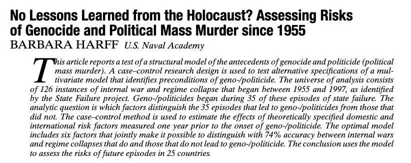]
---

# Historical overview

.font150[
* Genocides are recurrent phenomena

* Since the 1980s, scholars took a comparative approach to analyse genocides

* Genocides share some characteristics with ethnic wars and revolutions:
	- Almost all genocides ocurr during or after wars 

* Few large-_n_ analyses of correlates of genocides
]
---

# Definitions

.font140[
* Article II, UN Convention on Genocide: "acts committed with intent to destroy, in whole or part, a national, ethnical, racial, or religious group." 

* "Causing serious bodily or mental harm to members of the group"
	- Does not include groups defined by their political actions

* "Deliberately inflicting on the group conditions of life calculated to bring about its physical destruction in whole or in part"
	- Might be a result of economic or social change
]
---

# Definitions

.font150[
* "Intent to destroy"
	- Questions about how to observe true intentions 

* Role of non-state actors

* "Genocides and politicides are the  promotion,  execution,  and/or  implied  consent  of sustained policies by governing elites or their agents—or,  in  the  case  of  civil  war,  either  of  the  contending authorities—that  are  intended  to  destroy,  in  whole  or part, a communal, political, or politicized ethnic group." (p. 58)
]
---

# Guidelines

.font150[
* Since intentions are hard to observe, Harff uses _complicity by the state_ as an indicator of genocide

* **Question**: does that solve the problem? 
]
--
.font150[
* Probably not, because complicity also needs to be inferred in some cases 

* Identity of victims: individuals who are not members of a given group might be targeted (ie, relatives of political prisoners, etc)

* Threat to group survival: no threshold of victims 
]
---

# Preconditions for genocide 

.font150[
* **Political upheaval**: abrupt change in the political community

* **Prior genocides**: atrocity begets atrocity 

* **Exclusionary ideologies**: Marxists, Islamists, anticommunists, ethnonationalists 

* **Ethnic/religious cleavages**: discrimination, rebel minorities 

* **Low economic development**: state failure, low capacity

* **Political interdependence**: alliances 
]
---

# Main results

.center[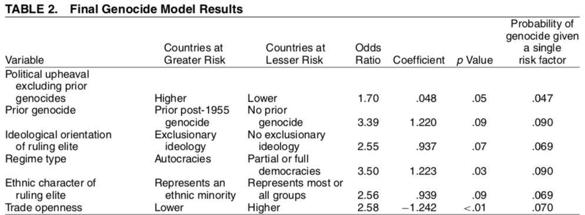]
---

# Main results

.center[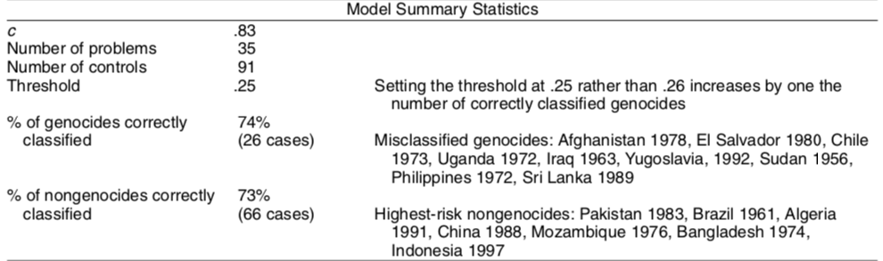]
---

# Ethnicity

.center[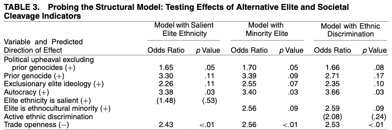]
---

# Interdependence 

.center[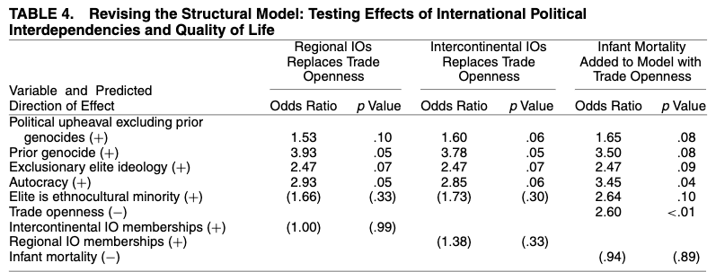]
---

# Discussion

.font150[
* 74% of the cases correctly predicted

* Political upheaval, prior genocides, autocracies, exclusionary elites, ethnic minorities increase the risk of genocides and politicides

* Ethnic and religious cleavages have mixed results 

* Theoretical implications: more research on elite behaviour 

* Political implications: genocide/politicide watchlist 
]
---

# Genocide watch

.center[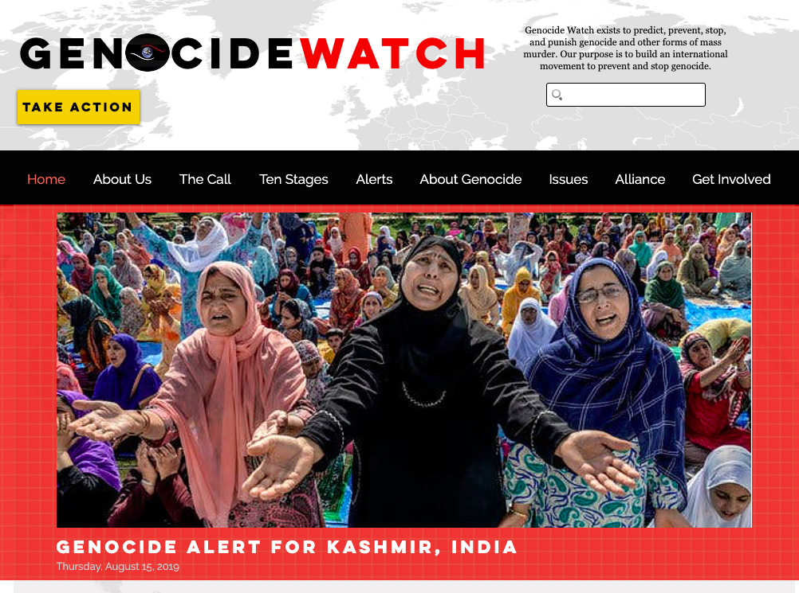]

.center[]
---

class: inverse, center, middle

# Questions?

<html><div style='float:left'></div><hr color='#EB811B' size=1px width=720px></html> 
---

# Gary Uzonyi (2014)

.center[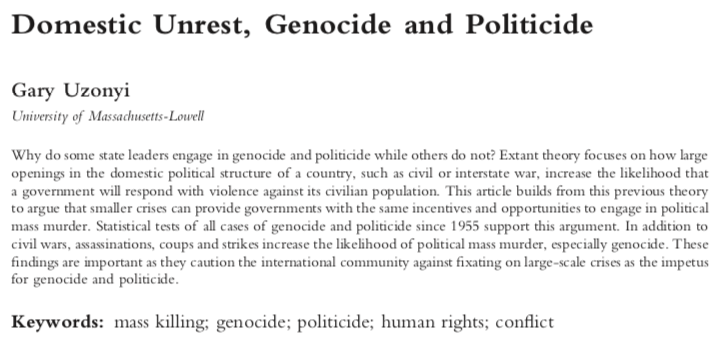]

---

# Civilian unrest and mass killings

.font150[
* Harff states that civil wars are important drivers of mass killings

* Uzonyi argues that _non-militarised unrest can also provide incentives for genocide_

* Assassinations, coups, and general strikes also increase the risk of mass killings

* Genocide and politicides follow different logics
]
---

# Challenges to elite control

.font150[
* Genocides are tools that political elites use to achieve certain goals

* As they are costly, elites avoid using mass violence extensively

* Decision of whether to appease the opposition or to engage in violence is determined by the costs associated with each strategy 

* Ongoing wars can alter the costs of violence, but other types of domestic unrest can provide an opportunity to carry violent tactics too
]
---

# Actual versus perceived risk 

.font140[
* Former research argues that leaders commit genocide when there is _actual_ risk to their position (i.e., civil wars)

* But they can also do so only if they _perceive_ the risks to be substantial

* Hypotheses:
	- H1: Militarised threats to the regime increase the likelihood of the onset of genocide and politicide
	- H2: Leader-specific threats increase the likelihood of the onset of genocide and politicides
	- H3: Non-militarised domestic unrest increases the likelihood of the onset of genocide and politicide
]
---

# Genocide and politicide

.font150[
* While genocides intend to destroy a specific group...

* Politicides are used to maintain the government’s stability

* During politicide, the government perceives several groups as potentially threatening

* Domestic unrest should increase the risk of politicide, but not that of genocide

* H4: The onset of genocide is less likely to occur during non-militarized unrest than is politicide 
]
---

# Results

.center[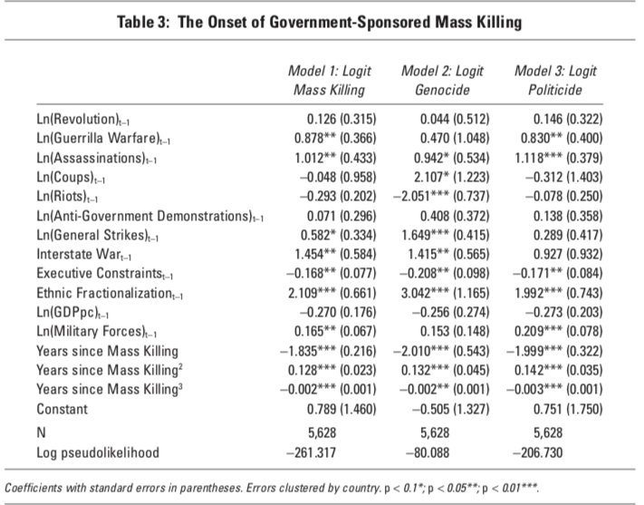]
---

# Results

.center[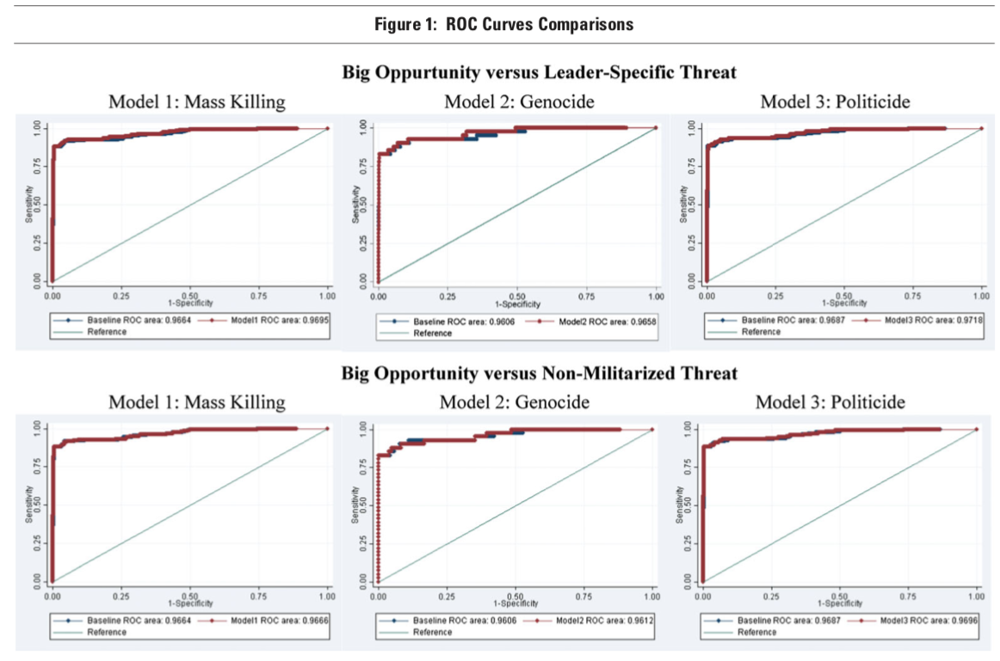]
---

# Discussion

.font150[
* Guerrila warfare is more likely to cause politicides, not genocides

* But in contrast with Uzonyi's hypotheses, assassinations and coups are more likely to cause genocides instead

* Riots _reduce_ the change of mass killings

* Strikes, international wars and ethnic cleavages also positively associated with genocide

* Mixed support for his claims 
]
---

class: inverse, center, middle

# Questions?

<html><div style='float:left'></div><hr color='#EB811B' size=1px width=720px></html> 
---

# Valentino et al (2004)

.center[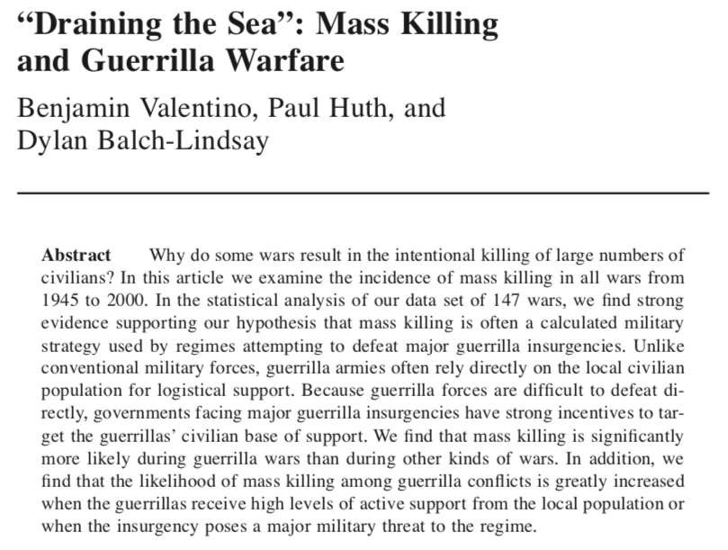]
---

# Valentino et al (2004)

.font150[
* The literature on genocide forecasting generated two predictions:
	- Mass killing during war may be driven by ethnic hatred and discrimination
	- Mass killing during war may be associated with nondemocratic regimes

* Valentino et al argue that killing civilians is a calculated strategy to combat guerrillas 

* As it is difficult to fight guerrillas directly, states target _their base of support_
]
---

# Valentino et al (2004)

.font150[
* Most guerrilla wars never escalate to genocide

* But they who do seem to be unrelated with ethnic rivalries and autocracies

* Remember: their theory explains _a subset_ of all genocides

* Other genocides, such as those perpetrated during peacetime, are not explained by the theory 
]
---

# Mass killings

.font150[
* Definition: “the intentional killing of a massive number of noncombatants” (p.378)

* Recently (1945-2000), mostly promoted by states

* “Massive number”: 50,000 intentional deaths in the course of five years or less

* “Noncombatant”: “any unarmed person who is not a member of a professional or guerrilla military group and who does not actively participate in hostilities by intending to cause physical harm to enemy personnel or property” (p.378-9).
 ]
---

# Mass killings

.font150[
*  Mass killing is not genocide/politicides

* Harff’s definition of genocide rejects the essential death toll criteria

* Genocide definitions will exclude the intentional killing of a great number of civilians if it has happened during war when the intent was not to destroy a political or ethnic group
]
---

# Mass killings

.font150[
* Yet there is overlap between the phenomena 

* Hypotheses:

* H1: Mass killing will be more likely during ethnic or ‘identity conflicts’ than during political or ideological conflicts

* H2: Highly autocratic regimes are more likely to engage in mass killing during armed conflicts than highly democratic regimes
]
---

# Further hypotheses

.font150[
* H3: The probability that a state will engage in mass killing during large-scale armed conflicts will be greater when the armed opposition relies primarily on guerrilla tactics than when the opposition uses other military tactics 
	- guerrillas need popular support; the military does not
	- violence promoted by the government may drive civilians into the arms of guerrilla forces, but it is easier to deter cooperation (by killing) than win it
	- the easiest way to catch fish (guerrilla) is by draining the sea (noncombatants)
]
---

# Further hypotheses

.font150[
* H4: The probability that a state will engage in mass killing during a guerrilla conflict will increase the greater the military threat posed by the guerrillas to the regime and its political survival 
	- violent strategies are costly and compensate only when the risk of loss increases

* H5: The probability that a state will engage in mass killing during a guerrilla conflict will increase the greater the number of civilians who provide support to the guerrillas
]
---

# Further hypotheses

.font150[
* H6: The probability of mass killing during large-scale armed conflict will increase the greater the size of the population from which the opposition is drawn 

* H7: The probability of mass killing during large-scale armed conflict will increase the longer the duration of the conflict
]
---

# Results

.center[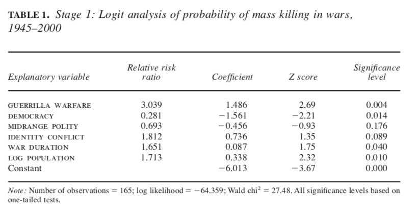]

---

# Results

.center[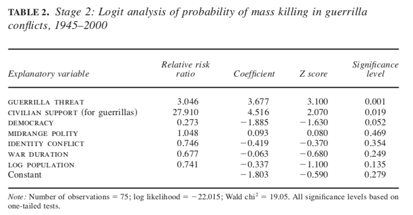]

---

# Results

.center[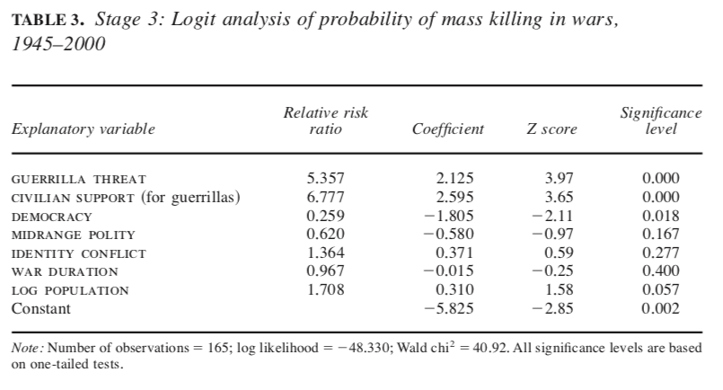]

---

# Discussion

.font150[
* Hypotheses derived from the literature on genocide do not account for most of the variation in mass killing during wars 

* High guerrilla threats and civilian support to guerrillas increase the probability of mass killings

* The other statistically significant variable was regime type, where more democratic states were less likely to see mass killings

* Larger states seem more likely to promote mass killing than smaller ones (in population size)
]
---

class: inverse, center, middle

# Questions?

<html><div style='float:left'></div><hr color='#EB811B' size=1px width=720px></html> 

---

# Ulfelder (2013)

.center[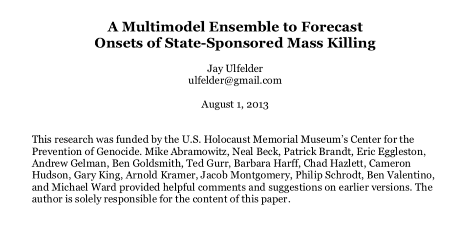]
---

# Ulfelder (2013)

.font150[
* How accurate are genocide predictions?  

* Previous models (e.g. Harff) used a single model for forecasting

* However, combining multiple models provides a much better way of forecasting future events

* Given that genocides have far-reaching consequences, it is crucial to have reliable early-warning systems

* It is also important that models are transparent, so that they can be improved in the future  
]
---

# Predicting mass killings

.font150[
* Mass killings are very rare events, which makes prediction difficult

* Predictions were conditioned to other types of violence, i.e., civil war onset

* Often made with a single model

* Problem is, we don't know how the world will be like in the future 

* So we use _ensemble forecasting_, put many models together to account for uncertainty
]
---

# Predicting mass killings

.font150[
* Ulfelder starts by combining four well-known models 

* Tests model validity by leaving some data out and measuring how well the model performs with unseen data

* If a model scores 0.5, it is as good as a coin flip: 50% chance for genocide or peace in that country-year 
	- This model is useless in practice 

* He achieves about 0.75 accuracy in his predictions 
]
---

# Predictions for 2013 

.center[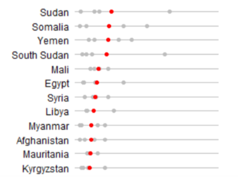]
---

# How did the model fare?

.font150[
* "In 2013, we saw onsets of state-led mass killing in at least two countries: Egypt, and Nigeria. Both of those countries were in our top 30 at the time—Egypt at 6th and Nigeria at 21"

* "We also saw new mass-killing episodes begin last year in Central African Republic. In any case, CAR was also in our top 30 at the time, at 27th"

* "The civil war that started in South Sudan in December 2013 has also produced twin streams of mass killing. South Sudan was near the very top of our risk list in 2013."
]
---

# Early Warning Project

.center[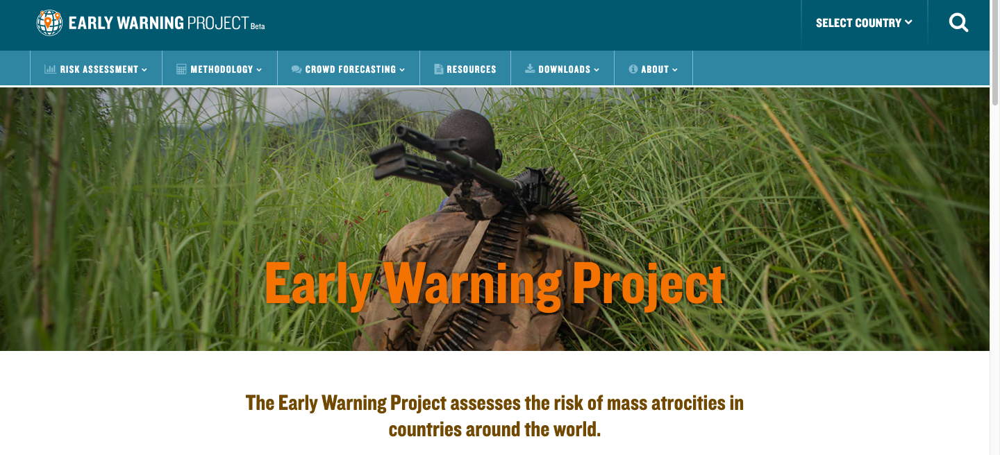]
.center[Source: <https://earlywarningproject.ushmm.org/>]
---

# Latest forecasts 

.center[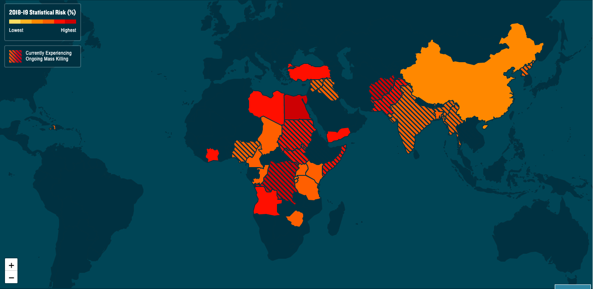]
---

# Latest forecasts 

.center[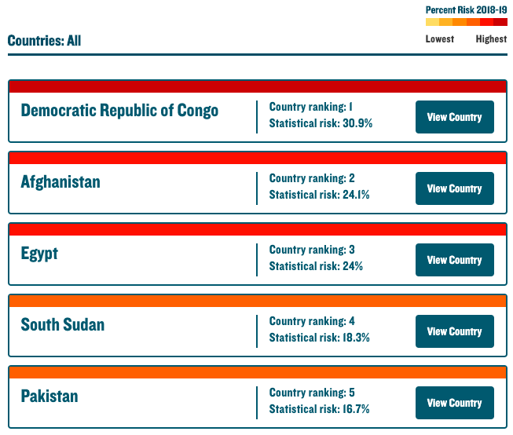]
---

# But what variables matter?

.center[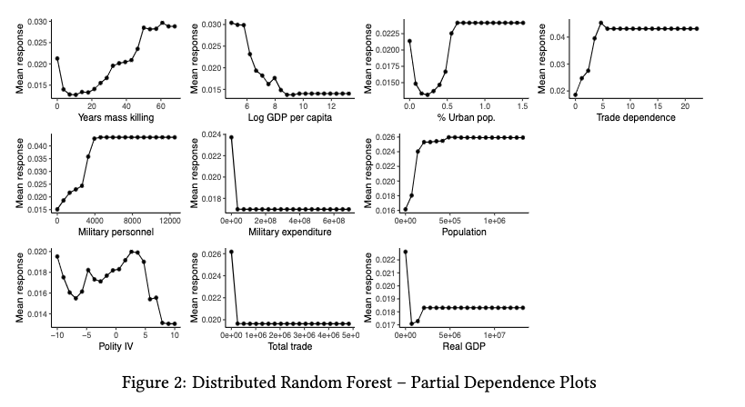]
--- 
---

class: inverse, center, middle

# See you next week!

<html><div style='float:left'></div><hr color='#EB811B' size=1px width=720px></html> 

