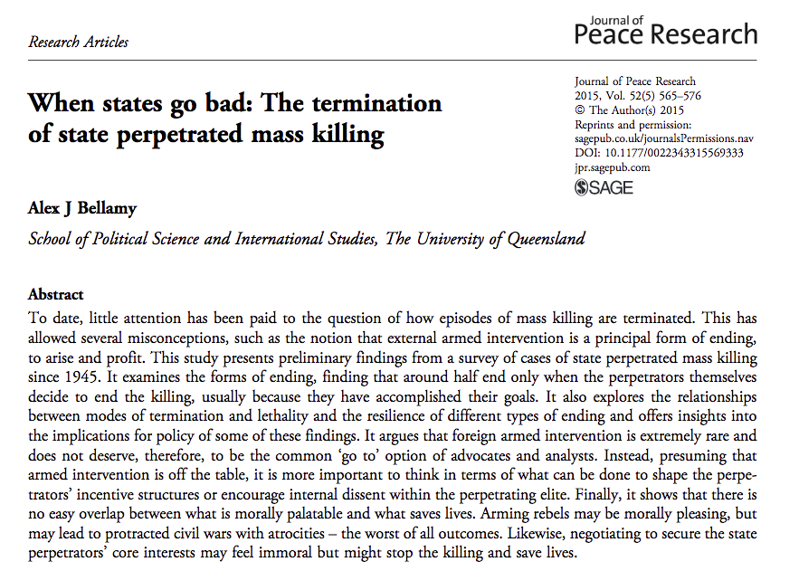

```{r setup, include=FALSE}
options(htmltools.dir.version = FALSE)
```

<style>

.remark-slide-number {
  position: inherit;
}

.remark-slide-number .progress-bar-container {
  position: absolute;
  bottom: 0;
  height: 6px;
  display: block;
  left: 0;
  right: 0;
}

.remark-slide-number .progress-bar {
  height: 100%;
  background-color: #EB811B;
}

.orange {
  color: #EB811B;
}
</style>

# Last week we saw that

.font140[
* A great number of genocides occur during or after civil/international wars

* Barbara Harff suggests that there are a few preconditions of genocide:
	- Political upheavals, prior genocides, exclusionary ideologies, ethnic/religious cleavages, low economic development

* Countries with any of these variables have higher risk of genocides

* Political and economic interdependence can mitigate genocide risk 
]
---

# Last week we saw that

.font130[
* Gary Uzonyi argues that not only actual threats, but _perceived_ threats to elites can cause genocide

* Politicides and genocides might have different logics: 
	- While genocides are motivated by the goal of exterminating a particular group
	- Politicides tend to be more affected by domestic unrest, as they are used to maintain a government's stability

* Domestic unrest should increase the risk of politicide, but not that of genocide

* However, he does not find robust evidence for his hypotheses 
]
---

# Last week we saw that

.font150[
* Valentino and his colleagues argue that killing civilians is a calculated strategy to combat guerrillas

* As it is difficult to fight guerrillas directly, states target their base of support

* Results show that countries with higher population, guerrillas, and civilian support are more likely to see mass killings

* Democracy seems to deter mass killings too 
]
---

# Last week we saw that

.font150[
* Jay Ulfelder affirms that the best way to predict genocide is by combining a large number of models

* Genocides and politicides are rare events, thus very difficult to predict 

* Ensemble models increase predictive accuracy and adds uncertainty to the estimations

* Tests model validity by leaving some data out and measuring how well the model performs with unseen data

* Early Warning Project and Genocide Watch 
]

---

class: inverse, center, middle

# Preventing genocide 

<html><div style='float:left'></div><hr color='#EB811B' size=1px width=720px></html> 
---

# Alex Bellamy (2015)

.center[]
---

# Overview 

.font140[
* UN's Responsibility to Protect (R2P) implies that the international community should prevent genocides, war crimes, ethnic cleansing, and crimes against humanity

* Global compact created in 2005 and it consists of three pillars:
	- Protection responsibility by the state; international assistance; timely and decisive response

* Evoked several times by the UNSC:
	- Kenya, Libya, Syria, CAR, etc

* But is that the best way to end genocides?
]

---

# Overview 

.font140[
* "Best of all worlds" trap: if we can't do what is best, we don't do anything at all

* If we look closely at the data, some unexpected patterns emerge

* Most cases of genocide de-escalated after the perpetrators achieved their goals

* External military interventions account for a small part of the de-escalations
]

---

# Mass killings termination

.font150[
* We have no good data about how genocides end

* The author has three suggestions:
  - Look at the determinants of civil war onset, civil war duration, and the causes of mass killings
  - Try an inductive approach by analysing how state-sponsored mass killings have ended in the past
  - The literature on external interventions
]
--

.font150[
* Let's start with the first one and take a look at the most recent UCDP/PRIO dataset
]

---

# Civil war termination

```{r, message=FALSE,warning=FALSE,error=FALSE,eval=FALSE}
library(tidyverse); library(readxl); library(lubridate); library(viridis)

df <- read_excel("~/Desktop/ucdp-term-conf-2015.xlsx")

df %>% 
  rename_all(tolower) %>%
  mutate_at(vars(outcome),
            funs(factor)) %>%
  mutate(outcome = recode(outcome, 
                          "1" = "Peace agreement",
                          "2" = "Ceasefire agreement",
                          "3" = "Government victory",
                          "4" = "Rebel victory",
                          "5" = "Low activity",
                          "6" = "Actor ceases to exist")) %>%
  mutate(year_end = year(ependdate)) %>%
  mutate(decade = floor(year_end/10) * 10) %>%
  drop_na(outcome) %>%
  group_by(outcome, decade) %>%
  mutate(count = n()) %>%
  ggplot(aes(fill = outcome, y = count, x = decade)) +
  geom_bar(position = "dodge", stat = "identity") +
  labs(x = "Decade", y = "Count") + 
  scale_fill_viridis(discrete = T, name = "Outcome")
```
---

# Civil war termination

```{r, message=FALSE,warning=FALSE,error=FALSE,echo=FALSE,fig.align='center',fig.height=9,fig.width=14}
library(tidyverse); library(readxl); library(lubridate); library(viridis)

df <- read_excel("~/Desktop/ucdp-term-conf-2015.xlsx")

df %>% 
  rename_all(tolower) %>%
  mutate_at(vars(outcome),
            funs(factor)) %>%
  mutate(outcome = recode(outcome, 
                          "1" = "Peace agreement",
                          "2" = "Ceasefire agreement",
                          "3" = "Government victory",
                          "4" = "Rebel victory",
                          "5" = "Low activity",
                          "6" = "Actor ceases to exist")) %>%
  mutate(year_end = year(ependdate)) %>%
  mutate(decade = floor(year_end/10) * 10) %>%
  drop_na(outcome) %>%
  group_by(outcome, decade) %>%
  mutate(count = n()) %>%
  ggplot(aes(fill = outcome, y = count, x = decade)) +
  geom_bar(position = "dodge", stat = "identity") +
  labs(x = "Decade", y = "Count") + 
  theme(text = element_text(size = 20)) + 
  scale_fill_viridis(discrete = T, name = "Outcome")
```

---

# Civil war termination

```{r, message=FALSE,warning=FALSE,error=FALSE,echo=FALSE,fig.align='center',fig.height=9,fig.width=14}
df %>% 
  rename_all(tolower) %>%
  mutate_at(vars(outcome),
            funs(factor)) %>%
  mutate(outcome = recode(outcome, 
                          "1" = "Peace agreement",
                          "2" = "Ceasefire agreement",
                          "3" = "Government victory",
                          "4" = "Rebel victory",
                          "5" = "Low activity",
                          "6" = "Actor ceases to exist")) %>%
  mutate(year_end = year(ependdate)) %>%
  mutate(decade = floor(year_end/10) * 10) %>%
  drop_na(outcome) %>%
  group_by(outcome, decade) %>%
  mutate(count = n()) %>%
  ggplot(aes(fill = outcome, y = count, x = decade)) +
  geom_bar(position = "fill", stat = "identity") +
  labs(x = "Decade", y = "Count") + 
  theme(text = element_text(size = 20)) + 
  scale_fill_viridis(discrete = T, name = "Outcome") 
```

---

# Civil war termination

.font140[
* Although these data provide some guidance...

* ... factors that end mass killing do not necessarily end civil war

* For instance, mass killings may happen before or during conflicts

* Genocides can also be unrelated to wars

* Studies focused only on the causes of mass killings offer little help
  - Killings might end without addressing the cause
  - Mass killings _causes_ are different from their _logics_ 

]

---

# Duration of civil wars

.font150[
* We only have good evidence that low GDP per capita and lootable resources increase the duration of civil wars

]

---

class: inverse, center, middle

# See you next week!

<html><div style='float:left'></div><hr color='#EB811B' size=1px width=720px></html> 

