```{r setup, include=FALSE}
options(htmltools.dir.version = FALSE)
```

<style>

.remark-slide-number {
  position: inherit;
}

.remark-slide-number .progress-bar-container {
  position: absolute;
  bottom: 0;
  height: 6px;
  display: block;
  left: 0;
  right: 0;
}

.remark-slide-number .progress-bar {
  height: 100%;
  background-color: #EB811B;
}

.orange {
  color: #EB811B;
}
</style>

# Last week we saw that

.font140[
* A great number of genocides occur during or after civil/international wars

* Barbara Harff suggests that there are a few preconditions of genocide:
	- Political upheavals, prior genocides, exclusionary ideologies, ethnic/religious cleavages, low economic development

* Countries with any of these variables have higher risk of genocides

* Political and economic interdependence can mitigate genocide risk 
]
---

# Last week we saw that

.font130[
* Gary Uzonyi argues that not only actual threats, but _perceived_ threats to elites can cause genocide

* Politicides and genocides might have different logics: 
	- While genocides are motivated by the goal of exterminating a particular group
	- Politicides tend to be more affected by domestic unrest, as they are used to maintain a government's stability

* Domestic unrest should increase the risk of politicide, but not that of genocide

* However, he does not find robust evidence for his hypotheses 
]
---

# Last week we saw that

.font150[
* Valentino and his colleagues argue that killing civilians is a calculated strategy to combat guerrillas

* As it is difficult to fight guerrillas directly, states target their base of support

* Results show that countries with higher population, guerrillas, and civilian support are more likely to see mass killings

* Democracy seems to deter mass killings too 
]
---

# Last week we saw that

.font150[
* Jay Ulfelder affirms that the best way to predict genocide is by combining a large number of models

* Genocides and politicides are rare events, thus very difficult to predict 

* Ensemble models increase predictive accuracy and adds uncertainty to the estimations

* Tests model validity by leaving some data out and measuring how well the model performs with unseen data

* Early Warning Project and Genocide Watch 
]

---

class: inverse, center, middle

# Preventing genocide 

<html><div style='float:left'></div><hr color='#EB811B' size=1px width=720px></html> 
---

# Alex Bellamy (2015)

.center[]
---

# Overview 

.font140[
* UN's Responsibility to Protect (R2P) implies that the international community should prevent genocides, war crimes, ethnic cleansing, and crimes against humanity

* Global compact created in 2005 and it consists of three pillars:
	- Protection responsibility by the state; international assistance; timely and decisive response

* Evoked several times by the UNSC:
	- Kenya, Libya, Syria, CAR, etc

* But is that the best way to end genocides?
]

---

# Overview 

.font140[
* "Best of all worlds" trap: if we can't do what is best, we don't do anything at all

* If we look closely at the data, some unexpected patterns emerge

* Most cases of genocide de-escalated after the perpetrators achieved their goals

* External military interventions account for a small part of the de-escalations
]

---

# Mass killings termination

.font150[
* We have no good data about how genocides end

* The author has some suggestions:
  - Look at the causes of mass killings, the determinants of civil war duration, and the effect of external interventions
  - Try an inductive approach and analyse how state-sponsored mass killings have ended in the past
]
--

.font150[
* Let's start with the first one 
]

---

# Causes of mass killings

.font150[
* Last week we saw some of the causes of mass killings
  - Civil wars, guerrillas, political threats to the elites, discrimination against ethnic or religious groups

* Although this literature provides some guidance...

* ... it might not help us very much here. 
]
--

.font140[
* **Why?**
 ]

--

.font150[
* Factors that _cause_ mass killing might not be the same that those which account for _mass killing duration_
]

---

# Causes of mass killings

.font150[
* Some mass killings do not achieve the perpetrators' purposes

* Elites might be divided during the conflict

* Not all genocides or politicides happen in times of war
]

--

.font150[
* No reason to think that the elimination of causes will end mass killing
]

---

# Duration of civil wars

.font140[
* Some civil wars last much longer than others

* Since early 2000s, researchers have investigated which factors explain civil war duration

* As with the literature on civil war onset, there are only a few robust indicators associated with longer wars:
  - Low GDP per capita
  - Lootable resources
  - External support for rebels
]
--

.font140[
* But these factors might play a different role in genocides. **Question**: How would the variables above affect mass killings? 
]

---

# Role of third parties

.font150[
* We've already discussed that peacekeeping operations can reduce the duration of civil wars

* The author says it might not be the case with genocides. **Why?** Can you think of two possible mechanisms?
]
--

.font150[
* Real or perceived threats to leaders
]
--

.font150[
* If the third parties do not show resolve, leaders can be even more motivated to carry on the attacks  
]
---

# How mass killings end: Findings

.font150[
* The author identified 65 cases of genocides between 1945 and 2009

* Perpetrators themselves ended a majority of cases
  - Either because their goals
  - Or because they changed their goals
  
* This is changing since the end of the Cold War

* Negotiating ends are rare

* Some episodes end in regime change by domestic groups (more common) or external interventions

]

---

# Mass killing termination

```{r, message=FALSE,warning=FALSE,error=FALSE,eval=FALSE}
library(tidyverse); library(viridis) # Required packages

# Load data
df <- read_csv("~/Documents/github/pols1824w/slides/week09/genocides.csv")

# Data manipulation and plot
df %>% 
  mutate_at(vars(type),
            funs(factor)) %>%
  mutate(outcome = recode(type, 
                          "0" = "Goal achieved",
                          "1" = "Regime change by opposition",
                          "2" = "Regime change by external forces",
                          "3" = "Goal shifted",
                          "4" = "Negotiated")) %>%
  mutate(decade = floor(year/10) * 10) %>%
  drop_na(outcome) %>%
  group_by(outcome, decade) %>%
  mutate(count = n()) %>%
  ggplot(aes(fill = outcome, y = count, x = decade)) +
  geom_bar(position = "fill", stat = "identity") +
  labs(x = "Decade", y = "Count") + 
  theme(text = element_text(size = 24)) + 
  scale_fill_viridis(discrete = T, name = "Outcome") 

```

---

# Mass killing termination

```{r, message=FALSE,warning=FALSE,error=FALSE,echo=FALSE,fig.align='center',fig.height=9,fig.width=14}
library(tidyverse); library(viridis) # Required packages

# Load data
df <- read_csv("~/Documents/github/pols1824w/slides/week09/genocides.csv")

# Data manipulation and plot
df %>% 
  mutate_at(vars(type),
            funs(factor)) %>%
  mutate(outcome = recode(type, 
                          "0" = "Goal achieved",
                          "1" = "Regime change by opposition",
                          "2" = "Regime change by external forces",
                          "3" = "Goal shifted",
                          "4" = "Negotiated")) %>%
  mutate(decade = floor(year/10) * 10) %>%
  drop_na(outcome) %>%
  group_by(outcome, decade) %>%
  mutate(count = n()) %>%
  ggplot(aes(fill = outcome, y = count, x = decade)) +
  geom_bar(position = "fill", stat = "identity") +
  labs(x = "Decade", y = "Count") + 
  theme(text = element_text(size = 24)) + 
  scale_fill_viridis(discrete = T, name = "Outcome") 

```

---

# Mass killing termination

```{r, message=FALSE,warning=FALSE,error=FALSE,eval=FALSE,fig.align='center',fig.height=9,fig.width=14}
df %>% 
  mutate_at(vars(type),
            funs(factor)) %>%
  mutate(outcome = recode(type, 
                          "0" = "Goal achieved",
                          "1" = "Change by opposition",
                          "2" = "Change by external forces",
                          "3" = "Goal shifted",
                          "4" = "Negotiated")) %>%
  drop_na(outcome) %>%
  group_by(outcome, year) %>%
  summarise(n = n()) %>%
  ungroup() %>%
  ggplot(aes(x = year, y = n)) +
  geom_point(aes(colour = outcome), size = 6) +
  geom_smooth(aes(colour = outcome), se = F, method = "lm") +
  facet_wrap(.~ outcome) + 
  scale_y_continuous(breaks = c(0, 1, 2, 3)) + 
  theme(legend.position = "none") + 
  theme(text = element_text(size = 32)) + 
  labs(x = "Year", y = "Count") + 
  scale_color_manual(values = c(viridis::viridis(6)))

```

---

# Mass killing termination

```{r, message=FALSE,warning=FALSE,error=FALSE,echo=FALSE,fig.align='center',fig.height=9,fig.width=14}
df %>% 
  mutate_at(vars(type),
            funs(factor)) %>%
  mutate(outcome = recode(type, 
                          "0" = "Goal achieved",
                          "1" = "Change by opposition",
                          "2" = "Change by external forces",
                          "3" = "Goal shifted",
                          "4" = "Negotiated")) %>%
  drop_na(outcome) %>%
  group_by(outcome, year) %>%
  summarise(n = n()) %>%
  ungroup() %>%
  ggplot(aes(x = year, y = n)) +
	geom_jitter(aes(colour = outcome), width = 0.005,
							height = 0.005, size = 6) +
  geom_smooth(aes(colour = outcome), se = F, method = "lm") +
  facet_wrap(.~ outcome) + 
  scale_y_continuous(breaks = c(0, 1, 2, 3)) + 
  theme(legend.position = "none") + 
  theme(text = element_text(size = 32)) + 
  labs(x = "Year", y = "Count") + 
  scale_color_manual(values = c(viridis::viridis(6)))

```

---

# Implications

.font150[
* Regime change is becoming more prevalent as a means to end genocides

* Domestic actors are more successful than international interventions in changing repressive regimes

* But both mitigate atrocities

* **Question**: if you were a policy-maker, what would you do to stop mass killings? What are the pros and cons of each strategy?

]

---

# Matthew Krain (2005)

.center[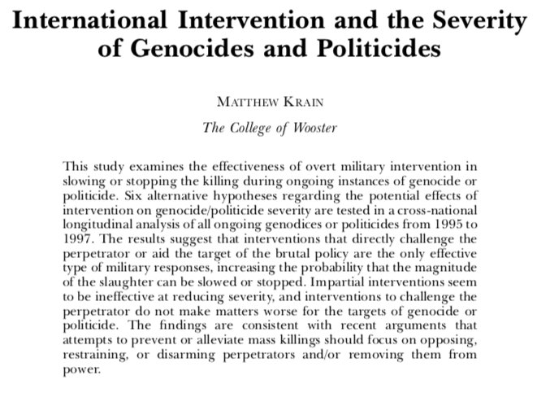]

---

# Matthew Krain (2005)

.font150[
* As we've seen before, the UN has increasingly discussed the used of international interventions 

* The international community frustrated expectations in Bosnia, Timor Leste, Darfur, etc

* Recent failures have raised questions about the effectiveness of interventions in foreign countries

* We have already discussed the role of peacekeeping operations (PKOs) in civil wars, but how do they affect the incidence of mass killings?
]

---

# PKOs, civil wars, and genocides

.font150[
* Most research has focused on the interaction between PKOs and civil war duration

* However, genocides pose a much harder problem for the UN

* "In a matter of 100 days, almost 800,000 people were slaughtered in Rwanda, a rate of approximately 8,000 per day"

* Genocide duration is not correlated with genocide severity
]
---

# PKOs, civil wars, and genocides

.font150[
* A major question is that PKOs can have heterogeneous effects on mass killings

* While it can force perpetrators to stop the violence...

* It can also increase the pressure over them and accelerate the rate of murders

* Also, even PKOs can't stop the killings, they might reduce the levels of violence
]
---

# PKOs, civil wars, and genocides

.font150[
* While in civil wars PKOs can choose a side to collaborate with, in genocides there is only _one_ group making the decisions

* This makes the situation harder as the target population by definition can't help

* Thus, the author says, _the motivations of the intervention don't matter_, as PKO's only chance of success lies in stopping the perpetrator by any means

* **Question**: do you agree?
]
---

# Intervention models

.font150[
* Three strategies don't seem to work:

* Do nothing

* Neutral interventions

* Aiding the perpetrator

* What seems to work: directly challenge the perpetrator

* **Why?**
]
---

# Other factors

.font150[
* Duration: the longer the genocide, the more the leaders learn how to kill more efficiently 

* Previous conflicts: leaders know that they can continue genocidal policies, or past grievances can increase the likelihood of future mass killings

* Contiguity: contiguous states can either increase or decrease the severity of violence
]

---

# Other factors

.font150[
* Regime type: democracies are more peaceful than dictatorships

* Ethnic fractionalisation 

* Economic marginalisation: increase the severity of mass killings. How do they affect *the perpetrator*?
]
---

# Results 

.center[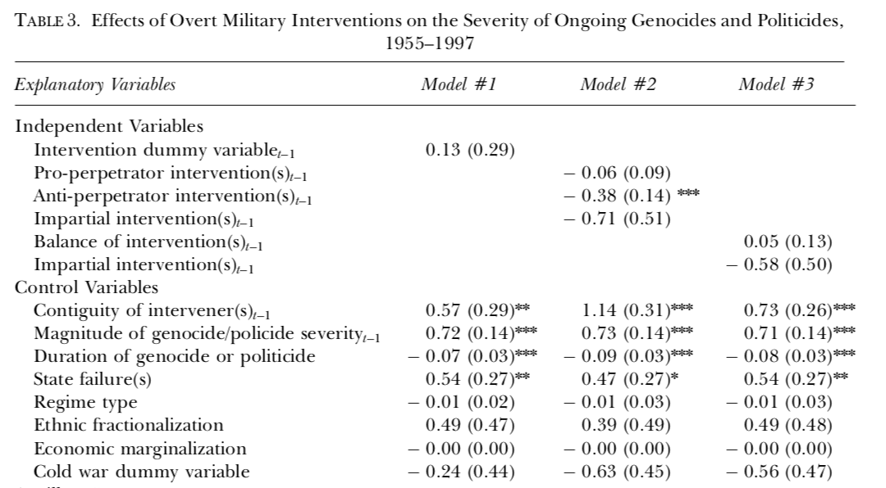]
---

# Results

.font140[
* The findings suggest that:

* International interventions that do not support the perpetrator (either against the perpetrator or as an impartial force) do not have an effect on the severity of genocide or politicide

* Impartial interventions have no statistically significant effect on the severity of state-sponsored mass murder

* Additional support for perpetrators does not make an already lethal policy more lethal

* The balance of interventions has no statistically significant effect on severity
]
---

# Results and implications

.font150[
* The only overt military interventions that appear to be effective in reducing the severity of genocides or politicides are those that explicitly challenge the perpetrator of the atrocities

* Implications:
    - The UN should use even more military force to stop governments from perpetrating genocide
    - The UN should explicitly _take sides_ in the conflict

* What do you think?
]
---

# Eric Melander

.center[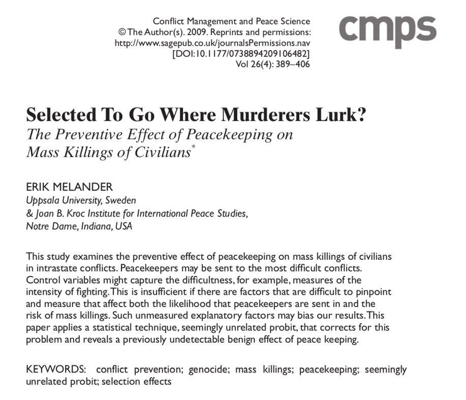]
---

# Introduction

.font150[
* Civil wars have declined since their peak in 1992

* "New new civil wars" are not as violent as previous conflicts

* Scepticism about the potential of IOs to reduce or eliminate genocides

* Selection bias: PKOs are deployed to the worst conflicts

* Account for the difference in "seriousness" of conflicts

* Proposed solution: estimate seriousness of conflicts and PKO deployment at the same time
]
---

# PKOs and mass murder

.font150[
* Cites Fortna's work on PKOs deployment

* Since PKOs are costly, organisations will only use them in extreme situations

* Previous history of mass killings is the most important outcome to predict future PKO deployment

* However, some third factor can influence both variables simultaneously
    - Question: which ones?
]
---

# PKOs and mass murder

.font150[
* Evidence shows that PKOs that confront the perpetrators are more likely to succeed

* Capability to prevent mass killings is not the same as the capability to stop ongoing massacres

* **Question**: what does that imply in terms of policy recommendations?
]

---

# Causes of both mass murder and PKOs

.font150[
* Previous major upheavals

* Level of democracy

* Additional controls:
    - Intensity of fighting; Cold War; population size; regional fixed effects
]
---

# Causes of both mass murder and PKOs

.center[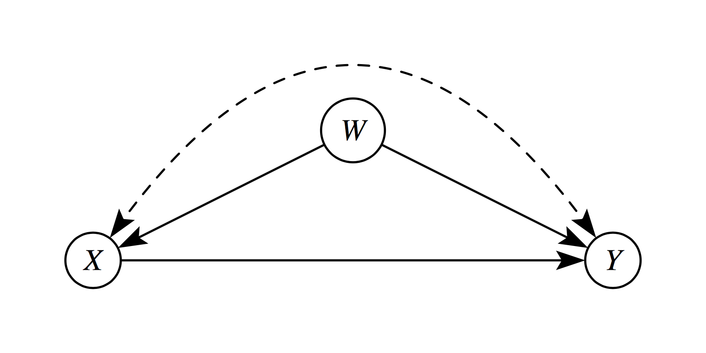]
---

# Results 

.center[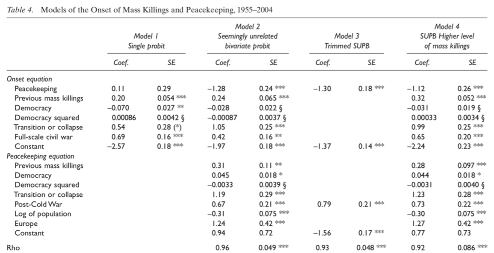]

--- 

# Results 

.font140[
* Jointly significant (Rho)
]

---

# Results

.font150[
* No association between PKO and onset of mass killings

* Previous episodes of mass killings increase the likelihood of future ones

* "Anocracies" have higher risk of mass killings

* State failure correlated with genocides, too

* _PKOs are negatively associated with onset of genocides in the main models_

]
---

# Conclusions

.font150[
* PKOs are deployed to the worst cases of human rights abuses

* Hidden factors account for both the worst mass killings and the deployment of PKOs

* PKOs might be effective to prevent future genocides

]
---

# Matthew Krain (2016)

.center[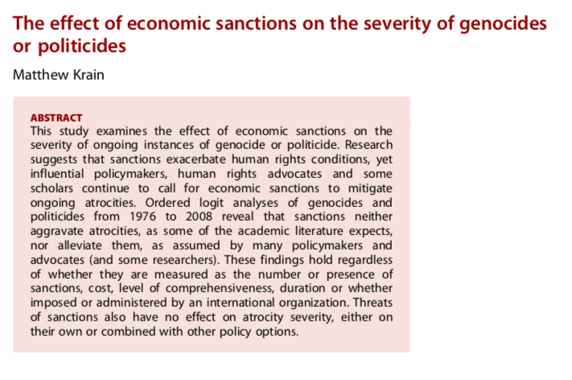]

---

# Economic sanctions and genocide

.font150[
* Genocide prevention is usually addressed by deployment of PKOs or international condemnation in the press

* Middle-ground alternative: _economic sanctions_

* Some evidence that they reduce the duration of civil wars

* But little evidence on their impact on mass killings

]
---

# Mechanisms

.font150[
* In favour of economic sanctions:

* Economic sanctions might change perpetrator perceptions of the
costs of continuing the slaughter

* Like naming and shaming, such action labels perpetrators as norm violators, which in turn will lead to costs imposed by others in the international community

* Framing perpetrators as international pariahs makes it harder for
others to support or do business with them without being similarly labelled
]
---

# Mechanisms

.font150[
* Why economic sanctions can be ineffective:

* Often cheap talk: monitoring problems

* Dependent on regime type: closed regimes with more centralised control are
better able to resist sanctions 

* Principals may be unable to control the agents actually doing the killing sufficiently to slow or stop ongoing atrocities

* Significant increase in the use of repression and political terror 
]
---

# Mechanisms

.font150[
* Why economic sanctions can _sometimes_ be effective:

* "Smart sanctions"
    - Travel bans, bank account suspensions, frozen government assets

* Efforts by international organisations have more legitimacy

* Threats might be more effective than sanctions themselves (?)
]
---

# Results

.center[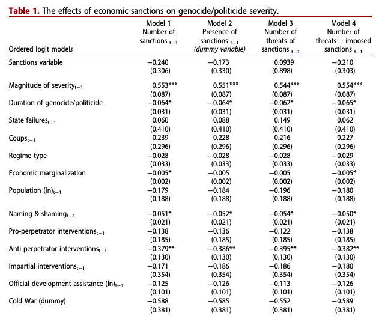]
---

# Results

.font150[
* _Economic sanctions do not work_

* **Question**: why is it important to publish negative results?
]
--
.font150[
* _File drawer problem_
]
---

# Publication bias

.center[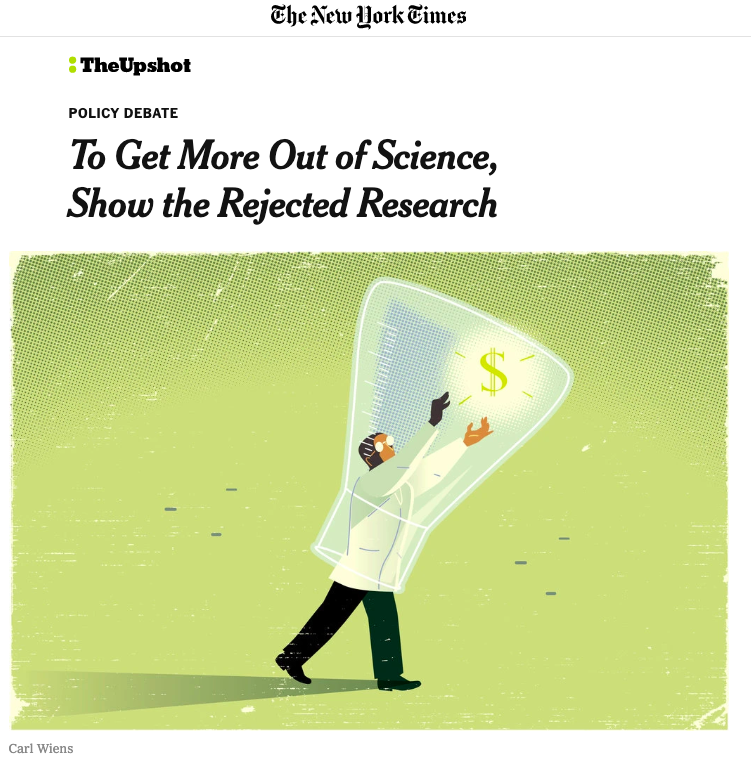]
---

# Publication bias

.center[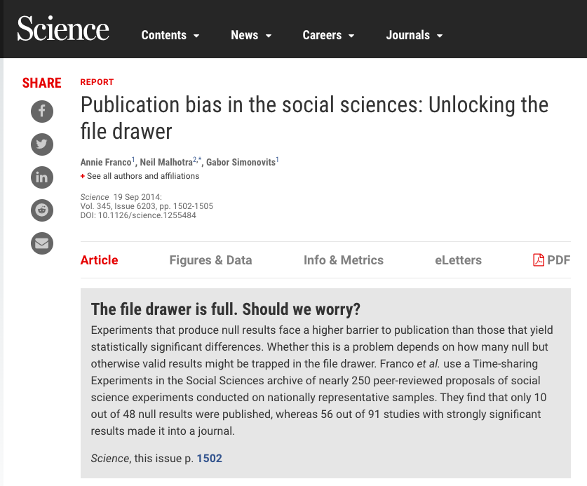]
---

# Publication bias

.center[]
---
# Publication bias

.center[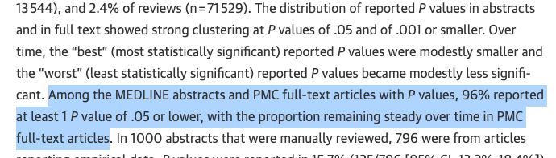]
---
# Publication bias

.center[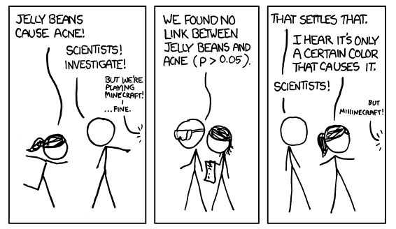]
---
# Publication bias

.center[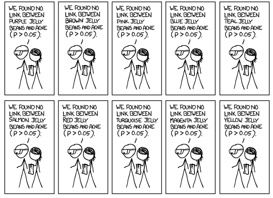]
---
# Publication bias

.center[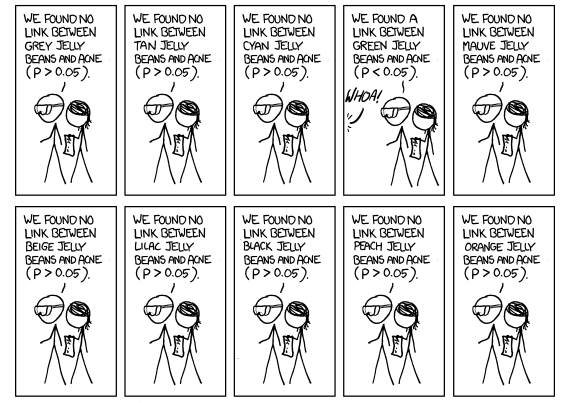]
---
# Publication bias

.center[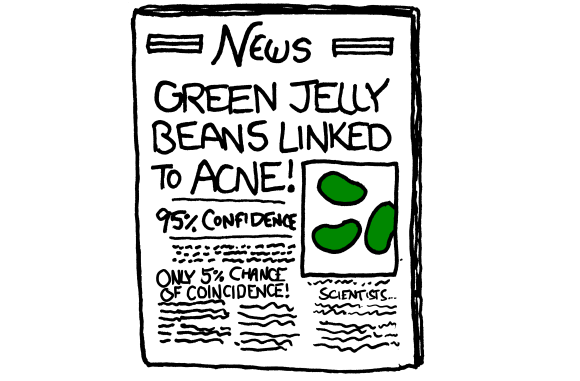]
---
# Publication bias

.center[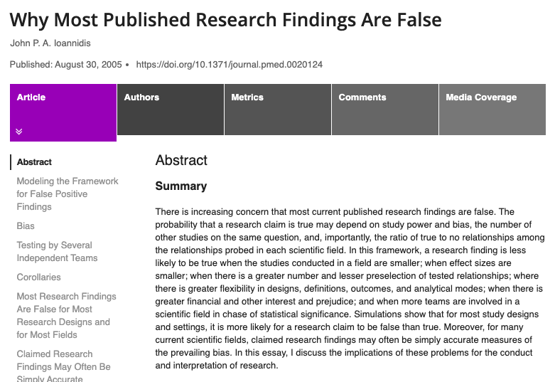]
---

# Conclusions

.font150[
* Until the end of the Cold War, the vast majority of mass killings ended after perpetrator victory

* External forces and domestic opposition are increasingly able to stop genocides

* PKOs seem to prevent mass killings

* But only when they are targeted against the perpetrators

* Economic sanctions have no effect
]
---
--- 

class: inverse, center, middle

# See you next week!

<html><div style='float:left'></div><hr color='#EB811B' size=1px width=720px></html> 

