```{r setup, include=FALSE}
options(htmltools.dir.version = FALSE)
```

<style>

.remark-slide-number {
  position: inherit;
}

.remark-slide-number .progress-bar-container {
  position: absolute;
  bottom: 0;
  height: 6px;
  display: block;
  left: 0;
  right: 0;
}

.remark-slide-number .progress-bar {
  height: 100%;
  background-color: #EB811B;
}

.orange {
  color: #EB811B;
}
</style>

# Two week ago, we saw that

.font150[
* There has been many waves of terrorist activities, from the French Revolution to Radical Islamism today

* Jacobins, Narodnaya Volnya, Irish nationalists, Young Bosnia, anti-colonial movements, left-wing terrorist groups, Al Qaeda, etc

* Terrorism has been used both by governments and by non-state actors alike

* Definition: _use of violence, or threats of violence, to intimidate others, directly or indirectly, to achieve political goals_
]
---

# Two week ago, we saw that

.font140[
* We also discussed some situations in which terrorism might be morally acceptable
  - Groups facing oppression, extreme violations of human rights

* Moral issues: 
  - Disrespect for war conventions, targeting innocent civilians, intent is difficult to justify

* Different definitions of terrorism have significant impact over our analyses

* It is a rational strategy, but it doesn't always work  
]

---

# Early Warning Project updates 

.center[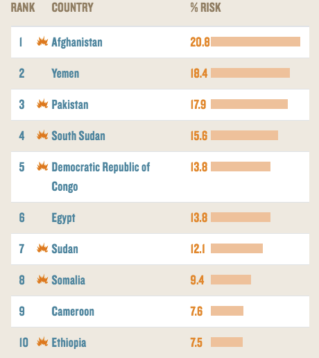]

.center[<https://earlywarningproject.ushmm.org/ranking-of-all-countries>]

---

# Early Warning Project updates

.center[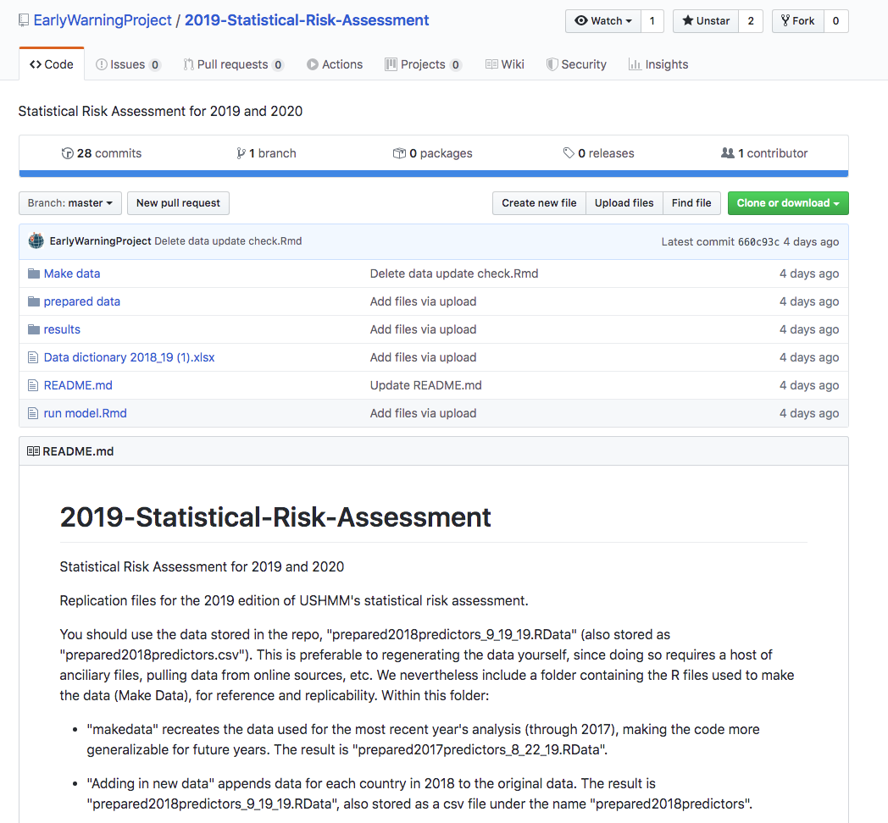]


.center[<https://github.com/EarlyWarningProject/2019-Statistical-Risk-Assessment>]

---

class: inverse, center, middle

# The rational terrorist
<html><div style='float:left'></div><hr color='#EB811B' size=1px width=800px></html> 
---

# Andrew Kydd and Barbara Walter

.center[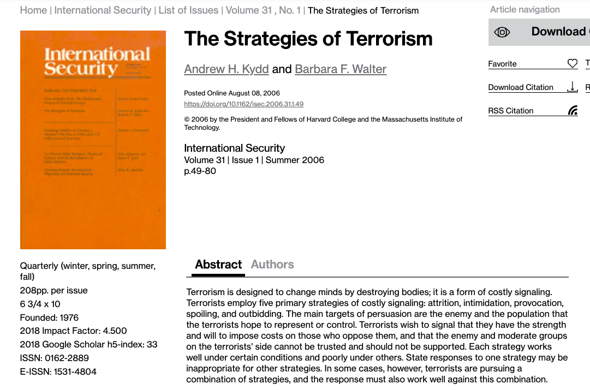]

---

# The strategies of terrorism

.font150[
* "Terrorism often works."  

* Between 1980 and 2003, half of all suicide terrorism campaigns resulted in concessions by the government 

* "Hijacking planes, blowing up buses, and kidnapping individuals [...] can be surprisingly effective"

* For counter-terrorism strategies to work it is important to understand what those groups want and whether/how they achieve their goals
]

---

# The strategies of terrorism 

.font150[
* The authors seek to answer four questions:
  - What types of goals do terrorists seek to achieve?
  - What strategies do they pursue to achieve these goals?
  - Why do these strategies work in some cases but not in others?  
  - What are the targeted governments’ best responses to prevent terrorism and protect their countries from future attacks?

* Main explanatory variable: _costly signalling_
]

---

# The goals of terrorism   

.font150[
* The press usually portraits terrorist groups as crazy extremists

* This is particularly true for _suicide terrorists_

* Individuals have different motivations from their groups
  - Suicide bombers may seek financial benefits for their family or a pleasant afterlife
  - But the leaders have rational political goals
]

---

# The goals of terrorism 

.font150[
* The authors argues that terrorist groups have five goals:
  - Regime change (Sendero Luminoso, Hezbollah, Taliban)
  - Territorial change (Tamil Tigers, Lashkar-e Tayyiba in Kashmir)
  - Policy change (Al-Qaeda, Hamas)
  - Social control (KKK, Fascist regimes)
  - Status quo maintenance (LatAm paramilitaries, IRA)

* Regime change is the most common, followed by territorial change

* Many organisations have multiples goals at the same time
]

---

# The strategies of terrorist violence

.font150[
* So how do terrorist groups try to achieve their goals?

* The authors argue that _uncertainty_ and _costly signalling_ provide a good explanation]
--
.font150[
* **Uncertainty**: groups don't know what their enemies can do or how committed they are to a given policy 
 
* This setting of incomplete information leads to miscalculations and under- or over-estimation of the enemy's capabilities  
]

---

# The strategies of terrorist violence

.font150[
* How to reduce uncertainty? _Provide reliable communication_

* However, simple verbal statements are not credible: people lie and bluff 

* *How to convey reliable information?*
]
--
.font150[
* **Make that information costly to send**]

---

class: inverse, center, middle

# Brief digression on costly signalling
<html><div style='float:left'></div><hr color='#EB811B' size=1px width=800px></html> 
---

# Why do peacocks have such long tails?

.center[]

---

# Bird of paradise

.center[]

---

# Gazelles stotting 

.center[]

---

# Luxury goods 

.center[]

---

# Luxury goods 

.center[]

---

# Facial tattoos

.center[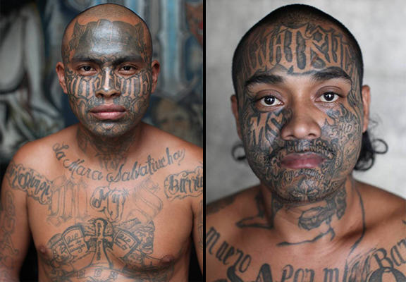]

---

# ... back to terrorism 

.font150[
* _Costly signalling_ indicates resolve and commitment

* Violence, mainly _suicidal violence_, is an extreme form of costly signalling 

* How do terrorists use violence? According to five strategies, the authors argue
]

---

# Five strategies 

.center[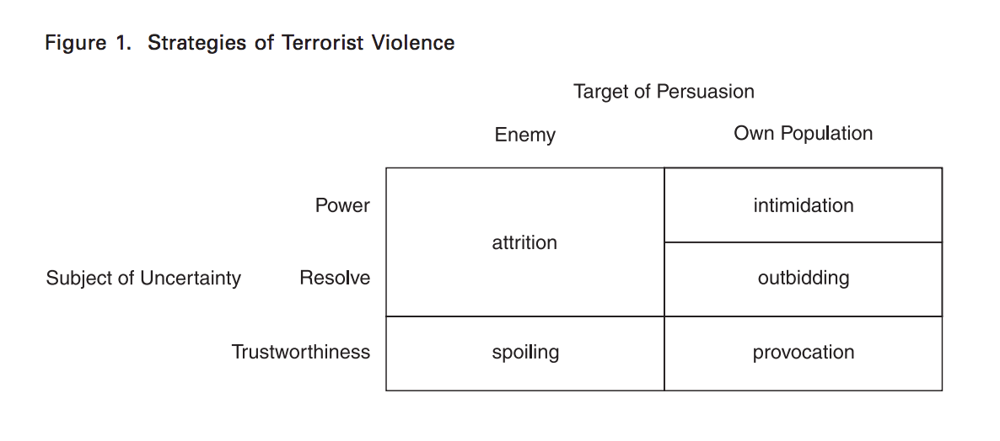]

---

# Attrition

.font140[
* Attrition campaign: to persuade the enemy that the group is strong

* The greater the costs terrorists inflict today, the stronger the signal that they will inflict _even greater_ costs in the future

* Anti-colonial terrorism, Hamas, Hezbollah, Al Qaeda

* Democracies are particularly _unlikely_ to retaliate and faces higher audience costs, thus they are the favourite target of attrition strategies
]

---

# Responses to attrition 

.font150[
* Governments can make some concessions in non-crucial areas (fiscal autonomy, etc)

* Retaliation is a better strategy if the terrorists threaten core competences of the state

* Harden likely targets (additional security checkpoints, etc)

* Deny access to most destructive weapons (biological, nuclear, etc)

* Minimise psychological damage (keep calm and carry on)
]

---

# Intimidation 

.font150[
* Similar to deterrence: preventing undesired social behaviour with threats of, and actual, violence

* Targeted at the population terrorists are trying to control

* Left-wing groups, KKK, state terrorism

* Weak states facilitate intimidation strategies
]

---

# Responses to intimidation

.font150[
* Territorial claims: state should retake control over the territory

* "Clear, hold, and build": invest in state capacity

* Social control: better law enforcement 

* Bypass local leaders 
]

---

# Provocation

.font150[
* Used in pursuit of regime change and territorial gains 

* Designed to persuade the domestic audience that the target of attacks is evil

* The goal is to shift citizen support away from the incumbent regime

* ETA: Spanish government reacted very strongly, so the population was shocked by the violence

* Democracies, again, are likely targets of provocation
]

---

# Reactions to provocation

.font150[
* "Seek and destroy", but try to isolate civilians

* Gathering information about the group

* Targeted killings
]

---

# Spoiling

.font150[
* Terrorists use violence to force the government to negotiate or increase their bargaining power 

* Often used when two enemies are close to reaching an agreement
  - Israel and PLO, Hamas spoiled the Camp David Agreements

* More likely to happen when moderates of a given groups are unlikely to hold extremists, or merely when the other party thinks that this is the case
]

---

# Responses to spoiling

.font150[
* If mutual trust is high, negotiations should continue regardless of the terrorist attacks

* Since trust is often scarce, trust-building initiatives might work

* Power-sharing agreements, post-treaty reconciliation commissions, etc

* Effective protection of minority rights
]

---

# Outbidding

.font150[
* "[...] when two or more domestic parties are competing for leadership of their side, and the general population is uncertain about which of the groups best represents their interests"
  - Hamas versus Fatah

* Moderates can actually _prefer_ the radicals to gain more prominence close to negotiations with the enemy: lower margin for bargain

* Citizens might believe their representatives will "sell out", so they might prefer the zealots to step in 

* As expected, outbidding is more likely to happen when many groups are competing for power
]

---

# Responses to outbidding

.font150[
* Encourage competing groups to form a coalition

* If not possible, grant them concessions

* Favour one of the groups?
]

---

# Conclusion

.font150[
* States and terrorists groups don't know the capabilities of their respective enemies

* Terrorists use violence to signal that they are committed to their causes

* (States can do the same too!)

* Five strategies: 
  - Attrition, Intimidation, Provocation, Spoiling, and Outbidding
]

---

class: inverse, center, middle

# Questions?
<html><div style='float:left'></div><hr color='#EB811B' size=1px width=800px></html> 

---

# Robert Pape  

.center[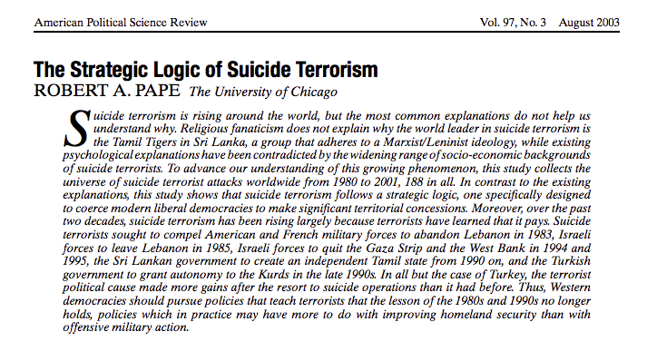]

---

# Introduction

.font140[
* Terrorist groups increasingly rely on suicide attacks

* Before the 1980s, suicide attacks were rare 

* First wave explanations: 
  - Religious fanaticism, psychological dispositions

* The world's leaders in suicide attacks are the Tamil Tigers (Sri Lanka)

* Large variation in terrorist characteristics (gender, education, age, etc) 

* Pape argues that terrorism follows a _strategic logic_
]

---

# How can suicide be rational?

.font150[
* Even if the person who commits a suicide attack is not rational, _the leaders probably are_

* Thomas Schelling: "rationality of irrationality" (The Strategy of Conflict)
  
* Niccolò Machiavelli: "it is a very wise thing to simulate madness" (Discourses on Livy, 3:2)

* Suicide terrorism is analogous to international coercion (madman theory) 
]

---

# Defining suicide terrorism

.font140[
* Suicide terrorism is an attack in which the death of the perpetrator is required for the attack to succeed 

* Usually, the goal is to the highest number of people as possible 

* This forces the government to consider the demands of the terrorist group

* It is a coercive strategy: 
  - While the military coerces people because it is strong, terrorists coerce people because they are weak

* However, this coercion might alienate potential supporters, too
]

---

# Defining suicide terrorism 

.font150[
* Suicide attacks increase the coercive effect of terrorism  

* They are generally much more destructive (suicide vests, hijacking planes); 

* Very strong costly signal: if terrorists are willing to die for the cause, what _can't_ they do?

* Better able to communicate commitment and increasing levels of violence in the future 
]

---

# The record of terrorism  

.center[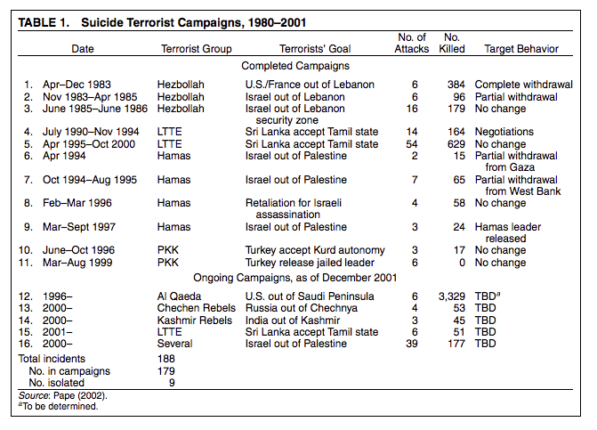]

---

# The record of terrorism  
 
 .font150[
* _Timing_: From 188 attacks, 179 (95%) were part of a campaign

* End of the campaigns determined by the leaders when they believe some of their demands have been achieved

* _Nationalist goals_: since costs of suicide attacks are high, groups resort to them only when stakes are very high, too

* Every campaign from 1980 to 2001 has been directed to take "foreign invaders out of the homeland" 
]

---

# The record of terrorism  

.center[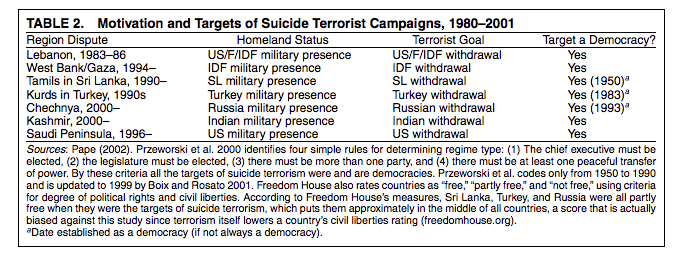]

---

# The record of terrorism

.font150[
* _Democracies as targets_: all groups in the sample attacked democratic regimes 

* **Why?**
]
--
.font150[
* Democracies are less likely to use force domestically

* Democracies make more concessions to opposition groups

* Democracies have free press and uncensored social media, which publicise the attacks 
]

---

# Terrorists' assessment of suicide terrorism 

.font150[
* Suicide attacks have become more common because they often work

* In the case of Hezbollah, Hamas, and the Tamil Tigers, they were able to force the state to negotiate in about 50% of the cases

* But this also implies that the attacks often failed, too

* The most successful group which uses suicide terrorism is Hamas
]

---

# The limits of suicide terrorism 

.font150[
* In the 1980s, terrorist leaders thought that moderate punished led to moderate concessions; but do harsh punishments lead to greater concessions?

* _Apparently not_

* Suicide terrorism campaigns are only modestly more successful than their alternatives

* Suicide terrorism is unlikely to make states change policies that are crucial to their survival 
]

---

# Policy recommendations

.font150[
* Concessions might be useful in the beginning, but this strategy has clear limitations

* Pape proposes demographic separation to deal with terrorism. What do you think?
]

---

# Conclusion

.font150[
* Suicide attacks follow a strategic logic and are clustered over time and across space

* They are more destructive and show stronger resolve

* Democracies are often targeted by terrorist groups 

* Suicide terrorism often works, but can't change important issues in the enemy state 

* Hamas, the Tamil Tigers, and Al Qaeda are the most significant examples of suicide terrorists
]

---

# John Horgan

.center[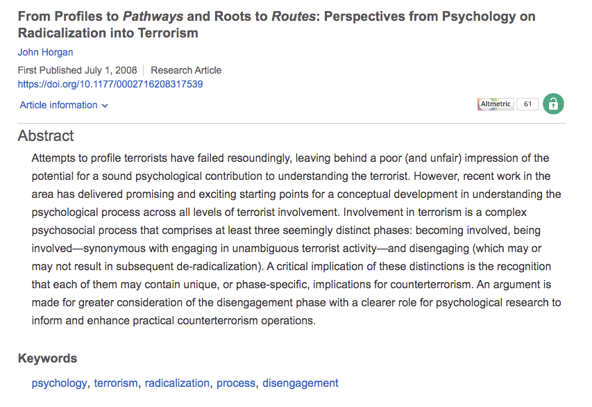]

---

# Introduction 

.font150[
* Why do people join terrorist groups?

* Very few people engage in terrorism, so all generalisations are made from a small sample

* Another issue is that of profiling: treating terrorists as pathological cases

* For instance, 2 million Muslims live in the UK, many sharing similar social, political, economic, and religious conditions
  - Why do only very few radicalise?
]

---

# Openness to socialisation into terrorism

.font150[
* While avoiding profiling, the author lists some factors that increase the risk of radicalisation

* Feelings of anger, alienation, and disenfranchisement

* The perception that conventional political activity does not work

* Identification with victims, either real or in more abstract terms

* Beliefs that violence against the state or against fellow citizens is not immoral
]

---

# Openness to socialisation into terrorism

.font150[
* Sense of reward, either in this or in the afterlife

* Kinship and social ties, sense of belonging

* **Question**: which one do you think is the most important? Is there any factor that he missed?
]

---

# Terrorist pathways  

.font150[
* Terrorist organisations have a myriad of positions, so many members don't have the same role for a long time
  - People involved in violent attacks participate in political negotiations, etc

* Qualitative interviews highlight some similarities in the pathways:
  - Role models (the Prophet, Wahabi leaders, Che, Fidel)
  - Families involved in the community 
  - Sense of respect for terrorists
  - Material incentives
]

---

# Implications for counter-terrorism

.font150[
* Since it hard to fix the "push factors" (general conditions), states should focus on the "pull factors"

* Expose activities of the leaders that other members find immoral

* Invest in counter-propaganda showing the impact of terrorism on the victims 

* Use the most credible sources at their disposal 
]

---

# Conclusion

.font150[
* Since there number of terrorists is very small, current conclusions are conditional on particular characteristics of each case

* Some factors do appear to be correlated with engagement in terrorist activities:
  - emotional vulnerability, dissatisfaction with politics, identification with the victims, belief that violence is morally justified, sense of belonging, social ties

* Terrorists occupy different positions in their careers

* Counter-propaganda can be used to dissuade terrorists
]

---

# Diego Gambetta and Steffen Hertog

.center[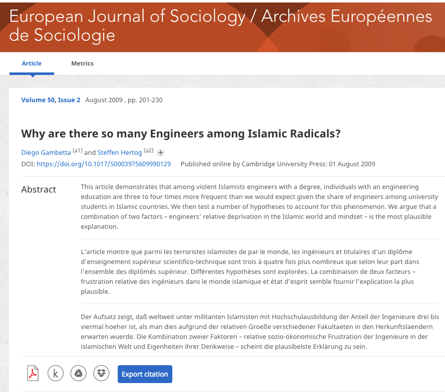]

---

# Introduction

.font150[
* A large number of Islamic terrorists have engineering degrees

* While there is indeed a correlation between years of education and militancy in left-wing and Islamist groups, it is unclear why engineers comprise such a big share of radical Muslims

* Although the authors also agree that terrorist profiles vary substantially, some particular cognitive and personality traits might be similar

* Education choices might be a proxy for some of them 
]

---

#  Islamic extremists in Muslin countries  

.center[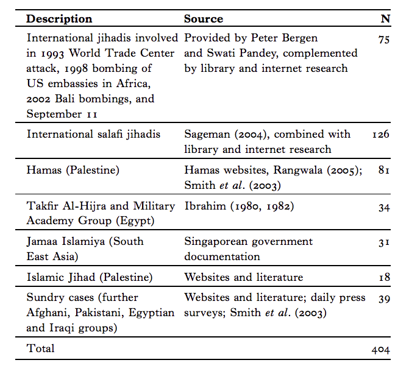]

---

#  Islamic extremists in Muslim countries  
 
 .font150[
* Sample of 404 terrorists

* They found educational information for 284 individuals 
  
* 196 (69%) had higher education, whereas university enrolment rates in the Arab world was around 12%

* 44% of them were engineers, in contrast with 2-3% in the general population

* Saudi Arabia is an exception
]

---

# Islamic extremists in Muslim countries 

.center[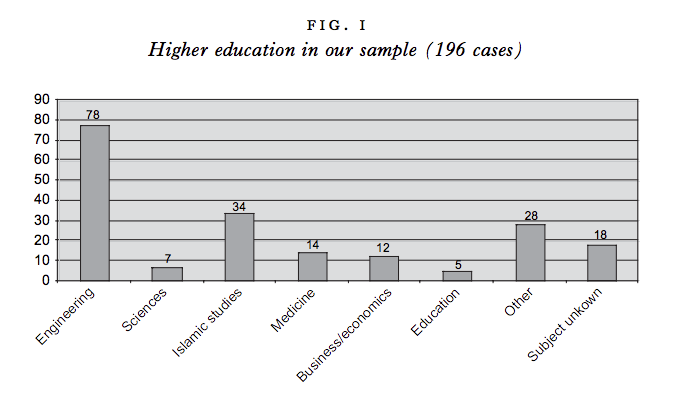]

---

# Islamic extremists in Western countries

.font150[
* 265 terrorists, the authors found educational information for 54 cases. 21 had university degrees]
  
.center[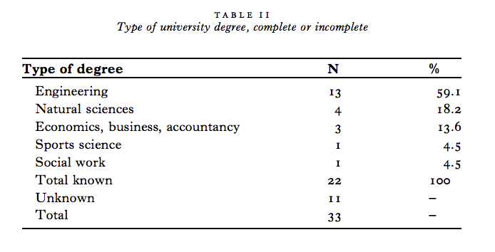]

---

# Non-violent Islamists

.center[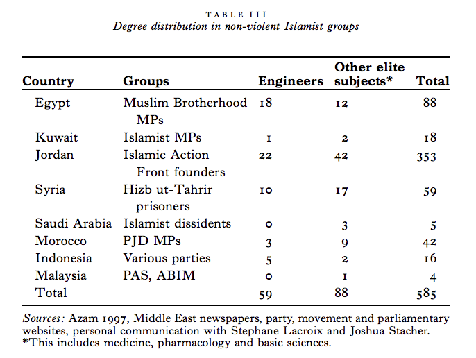]

---

# Non-Islamic extremists

.font150[
* What if engineers are more likely to be extremists _in general_?

* Not the case: the RAF, the Japanese Red Army, the Italian Red Brigades, and Latin American urban guerrilla groups included almost no engineers

* Among right-wing extremists, who generally had much lower levels of education, engineers if not over-represented are at least clearly present

* Right-wing engineers do not stand out as strikingly as Islamic radical engineers
]

---

# Hypotheses 

.font140[
* Network diffusion 
  - Social ties are crucial for the success of illegal networks
  - If the first movers were engineers, they tend to continue recruiting engineers to join the groups
  - They find out this is not the case 

* Technical skills
  - No evidence this was the major recruitment criterion 
  - No need for high technical expertise

* Both are unconvincing
]

---

# The engineering "mindset" 

.font140[
* Do engineers have more radical views?

* US data: about 58% of engineers declare that they are conservative, more than any other group

* Science (1972): "No other variable differentiates politically among American academics as effectively as their professional field"

* Engineers are also the most religious group of academics: 66%

* They are also more likely to be both conservative and religious in other Western countries
]

---

# Mechanisms

.font150[
* The authors then explore some _possible_ mechanisms

* Dislike for ambiguity and an appreciation for "the most efficient way" to solve problems

* This is probably due to self-selection, not education

* Also, engineering has high prestige in Muslim countries, so individuals might be more ambitious than average, too

* Technocratic idea of development, but lack of opportunities
]

---

# Mechanisms and conclusion 

.font140[
* Result: _frustration_ and _relative deprivation_

* An explosive mix:
  - A conservative and religious group;
  - Who sees the world as an ordered cosmos, where everyone has their own place; 
  - With largely frustrated professional and personal development expectations;
  - Without the possibility to express their concerns in authoritarian regimes
  - _Radicalisation_

* **Question**: does that seem convincing to you?
]

---

class: inverse, center, middle

# See you next week!
<html><div style='float:left'></div><hr color='#EB811B' size=1px width=800px></html> 
