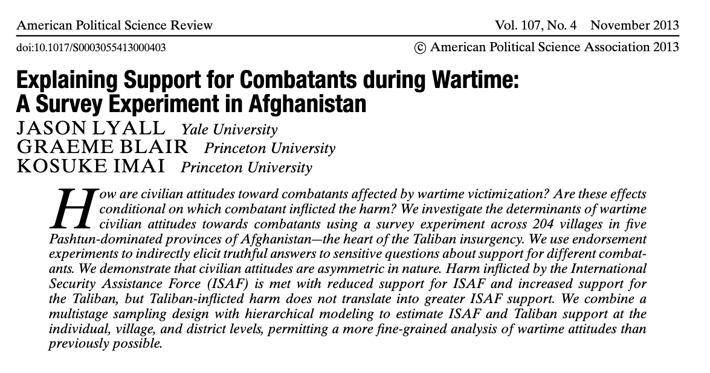
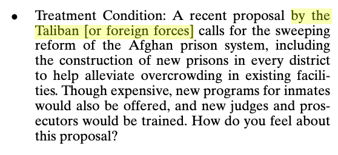
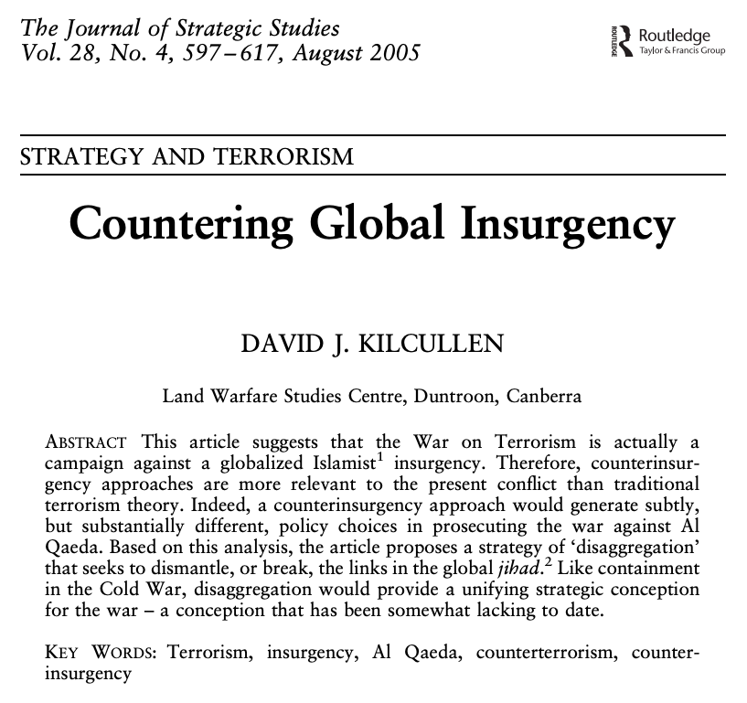
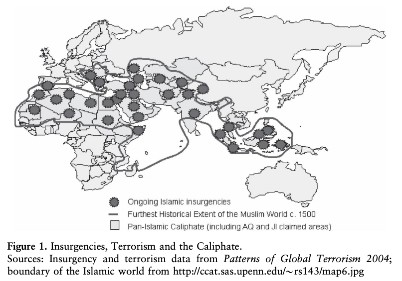

```{r setup, include=FALSE}
options(htmltools.dir.version = FALSE)
```

<style>

.remark-slide-number {
  position: inherit;
}

.remark-slide-number .progress-bar-container {
  position: absolute;
  bottom: 0;
  height: 6px;
  display: block;
  left: 0;
  right: 0;
}

.remark-slide-number .progress-bar {
  height: 100%;
  background-color: #EB811B;
}

.orange {
  color: #EB811B;
}
</style>

# Last week we saw that

.font150[
* Terrorism is less effective than people think it is

* If terrorists have limited goals, it is difficult to signal them to leaders, as violent actions induce others to think terrorist groups have maximalist goals

* Also, the public is not willing to make concessions to terrorist groups after a certain threshold

* Terrorism is also associated with higher support for right-wing parties
]

---

# Last week we saw that 

.font140[
* Non-violent resistance is a better strategy for groups that want political change

* Peaceful protests are more likely to:
	- Gather support from other citizens; 
	- Attract the attention of the international community;
	- Cause divisions within the government

* Several examples of successful non-violent movements and leaders (Gandhi, MLK, Mandela, Ramos-Horta, etc)

* Currently, the Hong Kong 2019 protests are the most signficant non-violent (?) campaign
]
---
class: inverse, center, middle

# Counter-terrorism
<html><div style='float:left'></div><hr color='#EB811B' size=1px width=800px></html> 

---

# Winning hearts and minds in Afghanistan

.center[]

---

# Introduction

.font150[
* The relative success of a guerrilla or a terrorist group relies on the amount of support they can get from the local population

* Counter-terrorism is based on the same idea: troops are required to win "the hearts and minds" of the public

* But how to do so? Or even worse, is it even _possible_ to do so?

* Lyall and his colleagues run a series of experiments in Afghanistan to find out
]

---

# The rational peasant

.font150[
* The literature has assumed that the population follows the group that is winning the combat

* Since they are often coerced by such groups, the public allegedly tries to minimise exposure to harm and to maximise benefits

* But, at least in theory, they are treated as having no clear preference of rulers: the public only makes cost-effective decisions

* This is a simplistic assumption: it does not hold well in practice

* _Identity matters even in wars_
]

---

# Intergroup bias and support for combatants 

.font150[
* The authors claim that ethnic biases does not disappear even under extreme circumstances

* Civilians evaluate the actions of their own group as motivated by necessity, while foreigners are motivated by less noble goals, such as greed

* Ethnicity is a major source of in-group bias:
	- Ethnicity serves as a proxy for unobservable characteristics, mainly trust
	- Moderates believes about _past actions_ too, such as previous acts of violence

* But how can we measure in-group bias if the public is not allowed to speak freely? 
]

---

# Methods: endorsement experiments 

.font150[
* Observational data, such as interviews of survey questionnaires, tend to be biased when there is risk for the respondent to be honest

* For instance, if a respondent knows she will be retaliated by telling to truth, all measures will overestimate the support for the local/national leader

* This is an expected, and rational, strategy used by civilians in many situations where confrontation is costly

* Example: voting in authoritarian countries
]

---

# Methods: endorsement experiments  

.font150[
* Endorsement experiments evaluate civilian support indirectly

* Instead of asking respondents if they are in favour or against a certain group, the interviewer asks their support for a _policy sponsored by the group_

* The interviewer then contrasts the endorsed policy with a baseline (no group mentioned)

* The difference between the treatment group (endorsement) and the control group (no mention) provides evidence of support for the endorsing group
]

---

# Example

.pull-left[]
.pull-right[]

---

# Methods: endorsement experiments 

* The authors asks 4 questions to measure the support for the American forces and for the Taliban
	- Prison reform; direct voting for district councils; support for reform of Afghanistan’s Independent Election Committee; support for strengthening the Office of Oversight for Anti-Corruption

* Respondents used a standard 5-point Likert scale ("strongly agree" to "strongly disagree")


--- 


# Countering Global Insurgency

.center[]

---

# Introduction

.font150[
* Kilcullen is very pragmatic: it doesn't matter how we call the "war on terrorism": _it must be won_

* When the article was published (2005), Al Qaeda was still operating with cells in about 40 countries

* Al Qaeda never had full control of all "theatre of operations"; rather, other Islamist groups adopted their goals and tactics

* "Nine principal Islamist theatres have been identified, including the Americas; Western Europe; Australasia; the Iberian Peninsula and Maghreb (Muslim Northwest Africa); the Greater Middle East; East Africa; South and Central Asia; the Caucasus and European Russia; and South-east Asia" (p. 599)

* America, Western Europe, and Australia had active insurgents
]

---

# Introduction

* Terrorist attacks occur on the "civilisational frontiers" (Huntington?)

.center[]

---

# Introduction

.font150[
* Islamist groups are connected through family or social ties

* The groups also provide financial and logistic support for others in their network, with Al Qaeda being the main source of support and expertise

* Many groups have little to do with the recent wave of Pan-Islamism, sometimes predating it by centuries

* According to Kilcullen, this network of interconnected groups form a _global jihadist insurgency_

* But jihadist activities are only a part of larger patron-client alliances
]

---

# Global Islamist insurgency 

.font150[

* Jihadists are not regular terrorists, they represent _a global insurgency_

* Al Qaeda resembles the Communist International: a movement dedicated to world revolution

* They are _not_ morally flawed individuals or simple criminals: insurgencies reflect deeper grievances within society

* The methods they used are unacceptable, yet their demands are often seen as legitimate

* How to win the war on global terrorism? 
]

---

# Counterinsurgency _redux_

* "We seek to defeat insurgents through ‘winning the hearts and minds’ of the population, a process that involves compromise and negotiation." (p. 605)

* Counterinsurgency was originally designed to fight local guerrilla groups, not global insurgencies

* International coordination is not 
---

class: inverse, center, middle

# See you next week!
<html><div style='float:left'></div><hr color='#EB811B' size=1px width=800px></html> 

